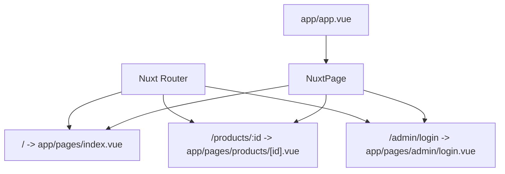
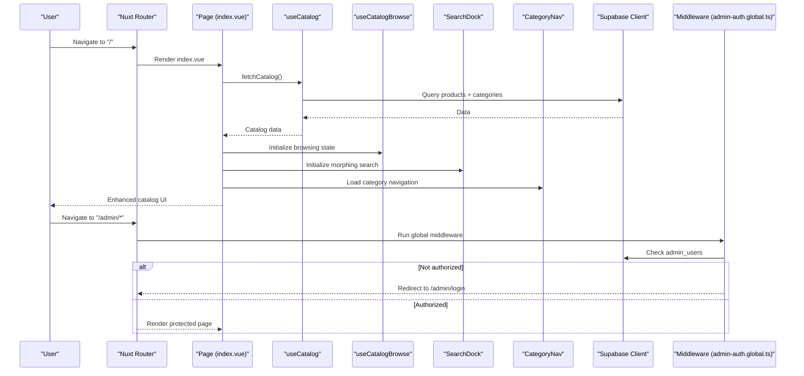
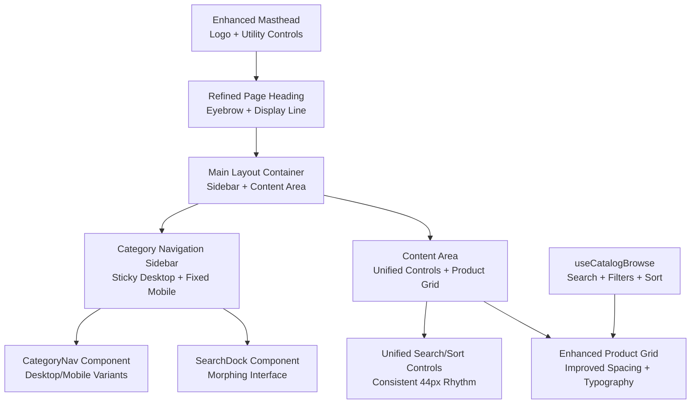
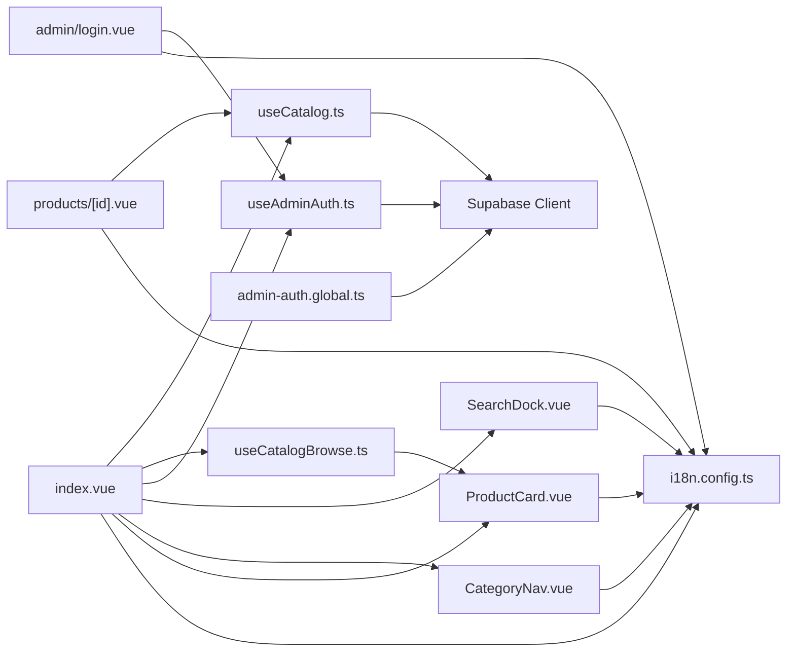

# Page Structure & Organization

<cite>
**Referenced Files in This Document**
- [index.vue](file://app/pages/index.vue)
- [products/[id].vue](file://app/pages/products/[id].vue)
- [admin/login.vue](file://app/pages/admin/login.vue)
- [CategoryNav.vue](file://app/components/CategoryNav.vue)
- [SearchDock.vue](file://app/components/SearchDock.vue)
- [ProductCard.vue](file://app/components/ProductCard.vue)
- [CategoryDesktop.vue](file://app/components/category/CategoryDesktop.vue)
- [CategoryMobile.vue](file://app/components/category/CategoryMobile.vue)
- [app.vue](file://app/app.vue)
- [nuxt.config.ts](file://nuxt.config.ts)
- [useCatalog.ts](file://app/composables/useCatalog.ts)
- [useCatalogBrowse.ts](file://app/composables/useCatalogBrowse.ts)
- [useAdminAuth.ts](file://app/composables/useAdminAuth.ts)
- [admin-auth.global.ts](file://app/middleware/admin-auth.global.ts)
- [i18n.config.ts](file://i18n.config.ts)
</cite>

## Update Summary
**Changes Made**
- Updated catalog page section to reflect simplified architecture with composition-focused implementation
- Added detailed documentation for new useCatalogBrowse composable that manages browsing state
- Enhanced description of how data fetching is delegated to composables, eliminating duplicate query logic
- Updated component interaction patterns to show cleaner separation of concerns
- Revised performance considerations to highlight improved maintainability and reduced complexity

## Table of Contents
1. Introduction
2. Project Structure
3. Core Components
4. Architecture Overview
5. Detailed Component Analysis
6. Dependency Analysis
7. Performance Considerations
8. Troubleshooting Guide
9. Conclusion

## Introduction
This document explains the Nuxt.js page structure and organization patterns used in the project. It covers file-based routing, directory conventions, and how pages map to routes. It focuses on:
- The main catalog landing page (index.vue) for browsing products with enhanced visual design and simplified architecture
- The dynamic product detail page (products/[id].vue) for individual product views
- The admin login page (admin/login.vue) for administrative access
It also describes script setup patterns, template organization, styling approaches, integration with data fetching and state management, SEO considerations, and performance strategies.

## Project Structure
The application uses Nuxt's file-based routing under app/pages. Each Vue SFC maps directly to a route path:
- app/pages/index.vue → /
- app/pages/products/[id].vue → /products/:id
- app/pages/admin/login.vue → /admin/login

Global layout is minimal; app.vue renders NuxtPage, delegating rendering to matched pages. Routing configuration and modules are declared in nuxt.config.ts.

**Diagram sources**
- [app.vue:1-4](file://app/app.vue#L1-L4)
- [nuxt.config.ts:1-52](file://nuxt.config.ts#L1-L52)

**Section sources**
- [app.vue:1-4](file://app/app.vue#L1-L4)
- [nuxt.config.ts:1-52](file://nuxt.config.ts#L1-L52)

## Core Components
- Pages:
  - index.vue: Simplified catalog landing with composition-focused architecture, delegating data fetching to useCatalog() and browsing state to useCatalogBrowse()
  - products/[id].vue: Dynamic product detail with image gallery, specs, and stock status
  - admin/login.vue: Admin authentication form with validation and error handling
- Advanced UI Components:
  - SearchDock.vue: Morphing search interface with animated transitions and scroll-aware behavior
  - CategoryNav.vue: Responsive category navigation with desktop and mobile variants
  - ProductCard.vue: Enhanced product cards with hover effects and admin controls
- Composables:
  - useCatalog.ts: Data fetching for products, categories, and mapping to typed models
  - useCatalogBrowse.ts: Browsing state management including search, filtering, and sorting
  - useAdminAuth.ts: Authentication helpers for sign-in/sign-out and role checks
- Middleware:
  - admin-auth.global.ts: Guards /admin/* routes, redirects unauthenticated users to /admin/login
- Internationalization:
  - i18n.config.ts: Locale definitions and messages used across pages

Key responsibilities:
- Routing and navigation via Nuxt's file system
- Data fetching through Supabase client within composables or pages
- Clean separation of concerns with dedicated composables for data and state management
- Sophisticated UI composition using advanced components with complex interactions
- Global behavior via middleware and config

**Section sources**
- [index.vue:1-404](file://app/pages/index.vue#L1-L404)
- [products/[id].vue:1-177](file://app/pages/products/[id].vue#L1-L177)
- [admin/login.vue:1-121](file://app/pages/admin/login.vue#L1-L121)
- [SearchDock.vue:1-628](file://app/components/SearchDock.vue#L1-L628)
- [CategoryNav.vue:1-37](file://app/components/CategoryNav.vue#L1-L37)
- [ProductCard.vue:1-68](file://app/components/ProductCard.vue#L1-L68)
- [useCatalog.ts:1-116](file://app/composables/useCatalog.ts#L1-L116)
- [useCatalogBrowse.ts:1-40](file://app/composables/useCatalogBrowse.ts#L1-L40)
- [useAdminAuth.ts:1-79](file://app/composables/useAdminAuth.ts#L1-L79)
- [admin-auth.global.ts:1-28](file://app/middleware/admin-auth.global.ts#L1-L28)
- [i18n.config.ts:1-14](file://i18n.config.ts#L1-L14)

## Architecture Overview
Pages integrate with Supabase via composables and utilities. Authentication is handled by Supabase Auth and enforced by middleware. Internationalization is provided by i18n. Styling uses Tailwind classes and global CSS with sophisticated animations and transitions.

**Diagram sources**
- [index.vue:23-40](file://app/pages/index.vue#L23-L40)
- [useCatalog.ts:109-112](file://app/composables/useCatalog.ts#L109-L112)
- [useCatalogBrowse.ts:13-39](file://app/composables/useCatalogBrowse.ts#L13-L39)
- [SearchDock.vue:288-352](file://app/components/SearchDock.vue#L288-L352)
- [CategoryNav.vue:20-36](file://app/components/CategoryNav.vue#L20-L36)
- [admin-auth.global.ts:1-28](file://app/middleware/admin-auth.global.ts#L1-L28)

## Detailed Component Analysis

### Simplified Landing Page: app/pages/index.vue
**Updated** The catalog page underwent significant architectural simplification, reducing from over 100 lines of data manipulation to a clean composition-focused implementation.

Responsibilities:
- Delegates data fetching to useCatalog().fetchCatalog() for concurrent loading of categories and products
- Manages browsing state through useCatalogBrowse() composable for search, filtering, and sorting
- Provides unified search/sort controls with improved UX patterns
- Implements responsive sidebar navigation with desktop and mobile variants
- Renders product grid with improved spacing and typography
- Offers admin mode: add/edit/delete products, manage images, and logout
- Sets page title via useHead with enhanced SEO

**Architectural Improvements:**
- **Composition-Focused Design**: All data manipulation logic moved to dedicated composables
- **State Management Separation**: useCatalogBrowse handles all browsing-related state (search, filters, sorting)
- **Data Fetching Delegation**: useCatalog provides centralized data fetching with proper error handling
- **Reduced Complexity**: Eliminated duplicate query logic and complex data transformation in the page component

Data flow:
- On mount, load catalog data via fetchCatalog() which returns both products and categories
- Initialize browsing state with useCatalogBrowse(products) for reactive filtering and sorting
- Computed filteredProducts automatically updates based on search, category selection, and sort order
- Persist changes via Supabase and refresh catalog

SEO:
- Title set dynamically with useHead for optimal search engine optimization

Performance:
- Parallel queries for categories and products through fetchCatalog()
- Client-side filtering and sorting through computed properties in useCatalogBrowse
- Loading skeletons improve perceived performance
- Optimized image loading with lazy loading

Styling:
- Tailwind utility classes for responsive layout and dark mode support
- Sophisticated animation transitions and micro-interactions
- Consistent spacing and typography system

**Section sources**
- [index.vue:1-404](file://app/pages/index.vue#L1-L404)

#### Enhanced Layout Structure

**Diagram sources**
- [index.vue:182-267](file://app/pages/index.vue#L182-L267)
- [useCatalogBrowse.ts:13-39](file://app/composables/useCatalogBrowse.ts#L13-L39)

### Advanced Search Interface: app/components/SearchDock.vue
**New** Sophisticated morphing search interface with advanced animations and scroll-aware behavior.

Responsibilities:
- Creates morphing transition between launcher icon and full search interface
- Implements scroll-aware visibility with hysteresis for smooth user experience
- Provides both desktop and mobile launcher interfaces
- Handles keyboard navigation and accessibility features
- Manages complex animation states and timing

**Advanced Features:**
- **Morphing Animation**: Smooth transition from launcher icon to search panel with precise timing
- **Scroll Awareness**: Automatically collapses when search field scrolls off-screen
- **Backdrop Management**: Animated backdrop with blur effects and proper z-index management
- **Keyboard Navigation**: Full keyboard support with focus trapping and escape key handling
- **Touch Support**: Mobile-optimized touch interactions and gesture handling

Animation System:
- Uses cubic-bezier easing functions for natural motion curves
- Implements requestAnimationFrame for smooth 60fps animations
- Manages multiple animation states with proper cleanup
- Handles resize events and viewport changes

Accessibility:
- Proper ARIA attributes and roles for screen readers
- Focus management and keyboard navigation
- Semantic HTML structure with proper labeling

**Section sources**
- [SearchDock.vue:1-628](file://app/components/SearchDock.vue#L1-L628)

### Enhanced Category Navigation: app/components/CategoryNav.vue
**Updated** Responsive category navigation with sophisticated desktop and mobile implementations.

Responsibilities:
- Provides dual implementation: desktop vertical nav and mobile bottom bar
- Handles category selection with enhanced visual feedback
- Integrates with parent component for two-way data binding
- Supports both database categories and predefined category sets

**Desktop Implementation (CategoryDesktop.vue):**
- **Magnification Effects**: Mouse proximity-based scaling for interactive feel
- **Drag-to-Select**: Advanced drag gestures with velocity detection
- **Sliding Indicator**: Smooth animated selection indicator with precise positioning
- **Z-index Management**: Dynamic layering based on mouse proximity

**Mobile Implementation (CategoryMobile.vue):**
- **Fixed Bottom Bar**: Persistent navigation accessible at all times
- **Horizontal Scrolling**: Smooth scrolling with active item auto-centering
- **Touch Gestures**: Drag-to-select with momentum and bounce effects
- **Scroll Detection**: Auto-hide/show based on page scroll position

Both implementations feature:
- Consistent category data structure and selection logic
- Enhanced visual feedback with smooth transitions
- Accessibility support with proper ARIA attributes
- Responsive design principles throughout

**Section sources**
- [CategoryNav.vue:1-37](file://app/components/CategoryNav.vue#L1-L37)
- [CategoryDesktop.vue:1-611](file://app/components/category/CategoryDesktop.vue#L1-L611)
- [CategoryMobile.vue:1-577](file://app/components/category/CategoryMobile.vue#L1-L577)

### Enhanced Product Cards: app/components/ProductCard.vue
**Updated** Product cards with improved hover effects, admin controls, and responsive design.

Responsibilities:
- Displays product information with enhanced visual hierarchy
- Provides hover-triggered edit buttons for admin mode
- Implements lazy loading for product images
- Shows stock status and pricing information

**Enhanced Features:**
- **Hover Effects**: Subtle scale transforms and shadow changes on hover
- **Admin Controls**: Contextual edit buttons that appear on hover in admin mode
- **Image Handling**: Graceful fallbacks for missing images with placeholder content
- **Responsive Typography**: Adaptive text sizing across different screen sizes

**Section sources**
- [ProductCard.vue:1-68](file://app/components/ProductCard.vue#L1-L68)

### Dynamic Product Detail: app/pages/products/[id].vue
Responsibilities:
- Reads route param id
- Fetches single product via useCatalog.fetchProduct
- Parses specifications into structured label/value pairs
- Displays image gallery with thumbnails and selected image
- Shows stock status, price, description, and specs
- Sets dynamic page title

Error states:
- Loading skeleton while fetching
- Alert on load errors
- "Product not found" view when missing

SEO:
- Title includes product name and app name

Performance:
- Single targeted query for product by id
- Lightweight parsing for specs

**Section sources**
- [products/[id].vue:1-177](file://app/pages/products/[id].vue#L1-L177)

### Admin Login: app/pages/admin/login.vue
Responsibilities:
- Validates email/password inputs
- Signs in user via useAdminAuth.signIn
- Verifies admin role by querying admin_users
- Redirects to catalog on success
- Displays localized error messages
- Sets page title

Security:
- Uses Supabase Auth
- Role verification prevents unauthorized access even if auth succeeds

UX:
- Loading state during submission
- Clear error alerts

**Section sources**
- [admin/login.vue:1-121](file://app/pages/admin/login.vue#L1-L121)

### Middleware: app/middleware/admin-auth.global.ts
Behavior:
- Guards all /admin/* routes except /admin/login
- Checks authenticated user via Supabase
- Verifies admin role in admin_users table
- Redirects to /admin/login if not authorized

Integration:
- Works globally with Nuxt's middleware pipeline
- Ensures consistent protection across admin features

**Section sources**
- [admin-auth.global.ts:1-28](file://app/middleware/admin-auth.global.ts#L1-L28)

### Composables: Data and State Management
- useCatalog.ts
  - Provides fetchCatalog, fetchProducts, fetchProduct, fetchCategories
  - Maps raw Supabase results to typed models with localization-aware names
  - Builds public URLs for product images
  - Centralizes all data fetching logic with proper error handling
- useCatalogBrowse.ts
  - Manages browsing state: search query, selected category, sort order
  - Computes filtered and sorted product lists reactively
  - Handles complex filtering logic for categories and search queries
  - Provides clean API for pages to consume browsing state
- useAdminAuth.ts
  - Exposes getCurrentUser, isAdmin, isSuperAdmin, signIn, signOut
  - Queries admin_users to determine roles

These composables centralize logic and reduce duplication across pages, following the principle of separation of concerns.

**Section sources**
- [useCatalog.ts:1-116](file://app/composables/useCatalog.ts#L1-L116)
- [useCatalogBrowse.ts:1-40](file://app/composables/useCatalogBrowse.ts#L1-L40)
- [useAdminAuth.ts:1-79](file://app/composables/useAdminAuth.ts#L1-L79)

## Dependency Analysis
Pages depend on:
- Supabase client for data and auth
- i18n for localized strings
- Advanced UI components for sophisticated interactions
- Middleware for route guards
- Dedicated composables for data fetching and state management

**Diagram sources**
- [index.vue:23-40](file://app/pages/index.vue#L23-L40)
- [products/[id].vue:1-177](file://app/pages/products/[id].vue#L1-L177)
- [admin/login.vue:1-121](file://app/pages/admin/login.vue#L1-L121)
- [SearchDock.vue:1-628](file://app/components/SearchDock.vue#L1-L628)
- [CategoryNav.vue:1-37](file://app/components/CategoryNav.vue#L1-L37)
- [ProductCard.vue:1-68](file://app/components/ProductCard.vue#L1-L68)
- [useCatalog.ts:1-116](file://app/composables/useCatalog.ts#L1-L116)
- [useCatalogBrowse.ts:1-40](file://app/composables/useCatalogBrowse.ts#L1-L40)
- [useAdminAuth.ts:1-79](file://app/composables/useAdminAuth.ts#L1-L79)
- [admin-auth.global.ts:1-28](file://app/middleware/admin-auth.global.ts#L1-L28)
- [i18n.config.ts:1-14](file://i18n.config.ts#L1-L14)

**Section sources**
- [index.vue:1-404](file://app/pages/index.vue#L1-L404)
- [products/[id].vue:1-177](file://app/pages/products/[id].vue#L1-L177)
- [admin/login.vue:1-121](file://app/pages/admin/login.vue#L1-L121)
- [SearchDock.vue:1-628](file://app/components/SearchDock.vue#L1-L628)
- [CategoryNav.vue:1-37](file://app/components/CategoryNav.vue#L1-L37)
- [ProductCard.vue:1-68](file://app/components/ProductCard.vue#L1-L68)
- [useCatalog.ts:1-116](file://app/composables/useCatalog.ts#L1-L116)
- [useCatalogBrowse.ts:1-40](file://app/composables/useCatalogBrowse.ts#L1-L40)
- [useAdminAuth.ts:1-79](file://app/composables/useAdminAuth.ts#L1-L79)
- [admin-auth.global.ts:1-28](file://app/middleware/admin-auth.global.ts#L1-L28)
- [i18n.config.ts:1-14](file://i18n.config.ts#L1-L14)

## Performance Considerations
- Parallel data loading: The landing page loads categories and products concurrently through fetchCatalog() to minimize total load time.
- Client-side filtering and sorting: Reduces server round-trips by computing derived lists reactively through useCatalogBrowse.
- Skeleton loaders: Provide immediate feedback during async operations.
- Image handling: Public URLs are generated per storage path; consider caching strategies at CDN level.
- Route-level concerns:
  - Use head meta tags for SEO titles per page
  - Keep payloads lean by selecting only needed fields
- Middleware efficiency: Minimal checks and early redirects prevent unnecessary work.
- **Composability Benefits**: 
  - Separation of concerns reduces component complexity
  - Reusable state management through dedicated composables
  - Easier testing and maintenance of business logic
- **Advanced Animation Performance**: 
  - Efficient animation state management with proper cleanup
  - RequestAnimationFrame usage for smooth 60fps animations
  - Optimized DOM manipulation and event handling
- **Component Optimization**:
  - Lazy loading for heavy components like SearchDock
  - Virtual scrolling considerations for large product lists
  - Debounced event handlers for scroll and resize events

[No sources needed since this section provides general guidance]

## Troubleshooting Guide
Common issues and where to inspect:
- Catalog load failures:
  - Check error state and message in the landing page; verify Supabase connectivity and permissions
  - See error handling paths in the catalog loader
- Product detail not found:
  - Ensure product exists and is published; review fetch logic and error display
- Admin login errors:
  - Validate credentials and check admin role presence in admin_users
  - Review sign-in flow and redirection logic
- Middleware redirects:
  - If stuck on /admin/login, confirm user session and admin role lookup
- **Search Dock Issues**:
  - Verify animation state cleanup and event listener removal
  - Check scroll event handling and position calculations
- **Category Navigation Problems**:
  - Ensure proper component mounting and lifecycle hooks
  - Verify touch event handling on mobile devices
  - Check responsive breakpoint behavior
- **Browsing State Issues**:
  - Verify useCatalogBrowse initialization with proper product data
  - Check computed property dependencies for search and filtering
  - Ensure reactivity is maintained when products array changes

Relevant locations:
- Catalog load error handling and retry
- Product detail error and not-found states
- Admin login validation and error messaging
- Middleware authorization checks
- Search dock animation and event management
- Category navigation component lifecycle
- useCatalogBrowse composable state management

**Section sources**
- [index.vue:46-56](file://app/pages/index.vue#L46-L56)
- [products/[id].vue:10-20](file://app/pages/products/[id].vue#L10-L20)
- [admin/login.vue:15-54](file://app/pages/admin/login.vue#L15-L54)
- [admin-auth.global.ts:1-28](file://app/middleware/admin-auth.global.ts#L1-L28)
- [SearchDock.vue:429-445](file://app/components/SearchDock.vue#L429-L445)
- [CategoryDesktop.vue:379-412](file://app/components/category/CategoryDesktop.vue#L379-L412)
- [CategoryMobile.vue:343-391](file://app/components/category/CategoryMobile.vue#L343-L391)
- [useCatalogBrowse.ts:18-36](file://app/composables/useCatalogBrowse.ts#L18-L36)

## Conclusion
The project follows Nuxt's file-based routing with clear separation of concerns and significantly enhanced user experience through architectural simplification:
- Pages handle presentation and orchestration with sophisticated visual design and clean composition patterns
- Advanced components provide rich interactions including morphing animations and drag gestures
- Dedicated composables encapsulate data fetching (useCatalog) and state management (useCatalogBrowse)
- Middleware enforces security for admin areas
- Internationalization and styling are consistently applied with modern design principles
- Enhanced responsive design ensures optimal experience across all device types

The recent architectural improvements have made the codebase more maintainable, testable, and scalable by eliminating complex data manipulation logic from pages and delegating it to focused composables. This separation of concerns improves code organization, reduces duplication, and makes the application easier to understand and modify while maintaining high performance and excellent user experience.