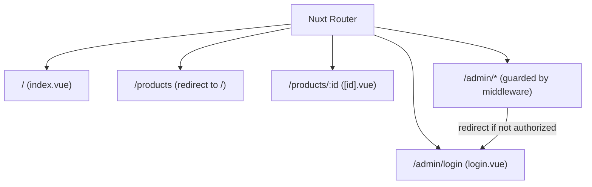
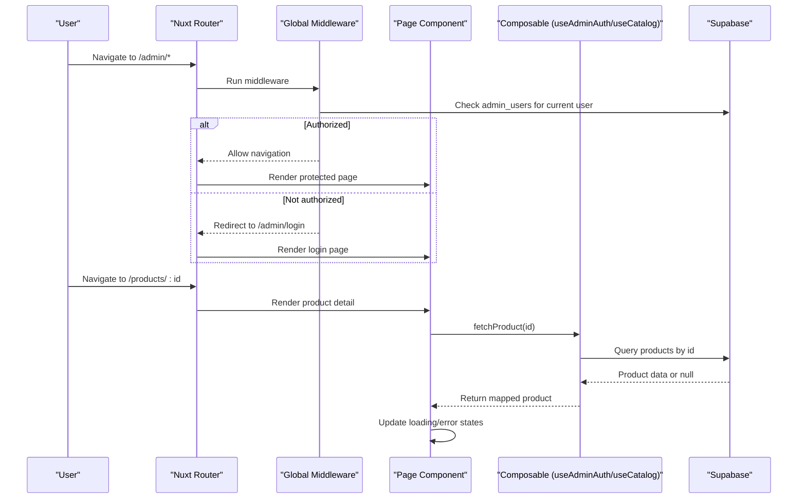
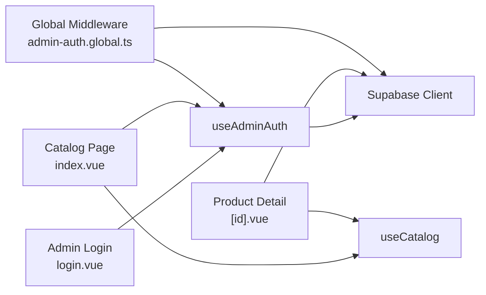

# Pages & Routing

<cite>
**Referenced Files in This Document**
- [nuxt.config.ts](file://nuxt.config.ts)
- [app/pages/index.vue](file://app/pages/index.vue)
- [app/pages/products/[id].vue](file://app/pages/products/[id].vue)
- [app/pages/products/index.vue](file://app/pages/products/index.vue)
- [app/pages/admin/login.vue](file://app/pages/admin/login.vue)
- [app/middleware/admin-auth.global.ts](file://app/middleware/admin-auth.global.ts)
- [app/composables/useAdminAuth.ts](file://app/composables/useAdminAuth.ts)
- [app/composables/useCatalog.ts](file://app/composables/useCatalog.ts)
</cite>

## Table of Contents
1. [Introduction](#introduction)
2. [Project Structure](#project-structure)
3. [Core Components](#core-components)
4. [Architecture Overview](#architecture-overview)
5. [Detailed Component Analysis](#detailed-component-analysis)
6. [Dependency Analysis](#dependency-analysis)
7. [Performance Considerations](#performance-considerations)
8. [Troubleshooting Guide](#troubleshooting-guide)
9. [Conclusion](#conclusion)
10. [Appendices](#appendices)

## Introduction
This document explains the Nuxt.js file-based routing and dynamic route handling for this project. It covers how pages are organized, how middleware protects admin routes, and how authentication state is managed. You will find guidance on creating new pages, implementing route guards, managing page-specific layouts, SEO meta tags, performance optimization, error handling patterns, and loading states for asynchronous data fetching.

## Project Structure
The application uses Nuxt’s file-system router under app/pages:
- Root catalog page at app/pages/index.vue
- Product listing redirect at app/pages/products/index.vue
- Dynamic product detail page at app/pages/products/[id].vue
- Admin login page at app/pages/admin/login.vue
- Global route middleware at app/middleware/admin-auth.global.ts
- Shared composables for auth and catalog data at app/composables/useAdminAuth.ts and useCatalog.ts
- Nuxt configuration at nuxt.config.ts

**Diagram sources**
- [nuxt.config.ts:1-52](file://nuxt.config.ts#L1-L52)
- [app/pages/index.vue:1-465](file://app/pages/index.vue#L1-L465)
- [app/pages/products/index.vue:1-8](file://app/pages/products/index.vue#L1-L8)
- [app/pages/products/[id].vue:1-177](file://app/pages/products/[id].vue#L1-L177)
- [app/pages/admin/login.vue:1-121](file://app/pages/admin/login.vue#L1-L121)
- [app/middleware/admin-auth.global.ts:1-28](file://app/middleware/admin-auth.global.ts#L1-L28)

**Section sources**
- [nuxt.config.ts:1-52](file://nuxt.config.ts#L1-L52)
- [app/pages/index.vue:1-465](file://app/pages/index.vue#L1-L465)
- [app/pages/products/index.vue:1-8](file://app/pages/products/index.vue#L1-L8)
- [app/pages/products/[id].vue:1-177](file://app/pages/products/[id].vue#L1-L177)
- [app/pages/admin/login.vue:1-121](file://app/pages/admin/login.vue#L1-L121)
- [app/middleware/admin-auth.global.ts:1-28](file://app/middleware/admin-auth.global.ts#L1-L28)

## Core Components
- File-based routes:
  - Root catalog page: app/pages/index.vue
  - Product listing redirect: app/pages/products/index.vue
  - Dynamic product detail: app/pages/products/[id].vue
  - Admin login: app/pages/admin/login.vue
- Middleware:
  - Global admin guard: app/middleware/admin-auth.global.ts
- Composables:
  - Authentication helpers: app/composables/useAdminAuth.ts
  - Catalog data access: app/composables/useCatalog.ts
- Configuration:
  - Nuxt modules and runtime config: nuxt.config.ts

Key responsibilities:
- Routing maps directly from file paths to URLs.
- Middleware intercepts navigation to /admin/* and enforces authorization.
- Composables encapsulate Supabase client usage and business logic.
- Pages handle UI, loading states, errors, and SEO via useHead.

**Section sources**
- [app/pages/index.vue:1-465](file://app/pages/index.vue#L1-L465)
- [app/pages/products/[id].vue:1-177](file://app/pages/products/[id].vue#L1-L177)
- [app/pages/admin/login.vue:1-121](file://app/pages/admin/login.vue#L1-L121)
- [app/middleware/admin-auth.global.ts:1-28](file://app/middleware/admin-auth.global.ts#L1-L28)
- [app/composables/useAdminAuth.ts:1-79](file://app/composables/useAdminAuth.ts#L1-L79)
- [app/composables/useCatalog.ts:1-61](file://app/composables/useCatalog.ts#L1-L61)
- [nuxt.config.ts:1-52](file://nuxt.config.ts#L1-L52)

## Architecture Overview
The routing architecture combines Nuxt’s file-based routing with a global middleware that protects admin routes. Data fetching is centralized in composables, while pages focus on presentation and user interactions.

**Diagram sources**
- [app/middleware/admin-auth.global.ts:1-28](file://app/middleware/admin-auth.global.ts#L1-L28)
- [app/pages/products/[id].vue:1-177](file://app/pages/products/[id].vue#L1-L177)
- [app/composables/useCatalog.ts:1-61](file://app/composables/useCatalog.ts#L1-L61)
- [app/composables/useAdminAuth.ts:1-79](file://app/composables/useAdminAuth.ts#L1-L79)

## Detailed Component Analysis

### Root Catalog Page (/)
Responsibilities:
- Fetches categories and published products using composable and direct Supabase calls.
- Provides search, category filtering, sorting, and admin CRUD operations when authenticated.
- Manages loading and error states, and sets SEO title via useHead.

Data flow:
- On mount, load catalog data concurrently for categories and products.
- Map raw database rows into typed product objects with localized names and images.
- Expose filtered/sorted lists through computed properties.

Error handling and loading:
- Displays alerts for load and action errors.
- Shows skeleton placeholders during loading.

SEO:
- Sets page title using useHead.

Programmatic navigation:
- Uses navigateTo for redirects and form submissions where needed.

**Section sources**
- [app/pages/index.vue:1-465](file://app/pages/index.vue#L1-L465)
- [app/composables/useCatalog.ts:1-61](file://app/composables/useCatalog.ts#L1-L61)

### Dynamic Product Detail Page (/products/:id)
Responsibilities:
- Reads the dynamic route parameter id from the route.
- Fetches a single product using useCatalog.fetchProduct.
- Renders gallery, price, stock status, description, and structured specifications.
- Handles loading, not found, and error states.
- Updates page title dynamically based on product name.

Route parameters:
- The id segment is accessed via the route object and passed to fetchProduct.

Error handling and loading:
- Shows skeletons while loading.
- Displays an alert on error or a “not found” section when product is missing.

SEO:
- Dynamically sets title using useHead with product name and app name.

**Section sources**
- [app/pages/products/[id].vue:1-177](file://app/pages/products/[id].vue#L1-L177)
- [app/composables/useCatalog.ts:1-61](file://app/composables/useCatalog.ts#L1-L61)

### Product Listing Redirect (/products)
Behavior:
- Redirects to the root catalog page to consolidate browsing experience.

Implementation note:
- Uses programmatic navigation to replace the current route.

**Section sources**
- [app/pages/products/index.vue:1-8](file://app/pages/products/index.vue#L1-L8)

### Admin Login Page (/admin/login)
Responsibilities:
- Authenticates users via Supabase password sign-in.
- Validates that the user has an admin record before allowing access.
- Redirects to the catalog upon successful login.
- Displays validation and error messages.
- Sets page title via useHead.

Flow:
- Collect email/password, validate required fields.
- Call signIn composable.
- Verify admin record exists; otherwise sign out and show unauthorized message.
- Navigate back to catalog.

**Section sources**
- [app/pages/admin/login.vue:1-121](file://app/pages/admin/login.vue#L1-L121)
- [app/composables/useAdminAuth.ts:1-79](file://app/composables/useAdminAuth.ts#L1-L79)

### Global Admin Route Guard (/admin/*)
Responsibilities:
- Protects all routes under /admin except the login page.
- Checks current user identity and verifies admin role in admin_users table.
- Redirects unauthenticated or non-admin users to /admin/login.

Middleware behavior:
- Skips guard for non-/admin paths and for /admin/login.
- Uses Supabase client to query admin_users for the current user.
- On failure or missing admin record, navigates to login with replace.

**Section sources**
- [app/middleware/admin-auth.global.ts:1-28](file://app/middleware/admin-auth.global.ts#L1-L28)
- [app/composables/useAdminAuth.ts:1-79](file://app/composables/useAdminAuth.ts#L1-L79)

### Composables

#### useAdminAuth
Provides:
- getCurrentUser: resolves current user from Supabase auth or reactive user store.
- isAdmin: checks existence of admin record for current user.
- isSuperAdmin: checks specific role value.
- signIn/signOut: wraps Supabase auth methods.

Usage:
- Used by admin login page and catalog page to manage admin mode UI and actions.

**Section sources**
- [app/composables/useAdminAuth.ts:1-79](file://app/composables/useAdminAuth.ts#L1-L79)

#### useCatalog
Provides:
- fetchProducts: retrieves published products with translations and images.
- fetchProduct: retrieves a single published product by id.
- fetchCategories: retrieves active categories with localized names.
- Helper functions to map DB rows to typed models and generate public image URLs.

Usage:
- Consumed by product detail page and used within the catalog page for consistent data mapping.

**Section sources**
- [app/composables/useCatalog.ts:1-61](file://app/composables/useCatalog.ts#L1-L61)

## Dependency Analysis
High-level dependencies between routing, middleware, and composables:

**Diagram sources**
- [app/middleware/admin-auth.global.ts:1-28](file://app/middleware/admin-auth.global.ts#L1-L28)
- [app/composables/useAdminAuth.ts:1-79](file://app/composables/useAdminAuth.ts#L1-L79)
- [app/composables/useCatalog.ts:1-61](file://app/composables/useCatalog.ts#L1-L61)
- [app/pages/products/[id].vue:1-177](file://app/pages/products/[id].vue#L1-L177)
- [app/pages/index.vue:1-465](file://app/pages/index.vue#L1-L465)
- [app/pages/admin/login.vue:1-121](file://app/pages/admin/login.vue#L1-L121)

**Section sources**
- [app/middleware/admin-auth.global.ts:1-28](file://app/middleware/admin-auth.global.ts#L1-L28)
- [app/composables/useAdminAuth.ts:1-79](file://app/composables/useAdminAuth.ts#L1-L79)
- [app/composables/useCatalog.ts:1-61](file://app/composables/useCatalog.ts#L1-L61)
- [app/pages/products/[id].vue:1-177](file://app/pages/products/[id].vue#L1-L177)
- [app/pages/index.vue:1-465](file://app/pages/index.vue#L1-L465)
- [app/pages/admin/login.vue:1-121](file://app/pages/admin/login.vue#L1-L121)

## Performance Considerations
- Concurrent data loading: The catalog page loads categories and products in parallel to reduce total load time.
- Selective queries: Product detail page fetches a single product by id with a focused select clause.
- Image URL generation: Public URLs are derived efficiently; ensure storage bucket permissions are configured.
- Reactive updates: Use computed properties for filtering and sorting to avoid unnecessary re-renders.
- Navigation: Prefer programmatic navigation with replace to avoid extra history entries where appropriate.
- SEO: Set titles per page using useHead to improve indexing and user experience.

[No sources needed since this section provides general guidance]

## Troubleshooting Guide
Common issues and resolutions:
- Unauthorized access to /admin/*:
  - Ensure the user is signed in and has a record in admin_users.
  - Middleware will redirect to /admin/login if checks fail.
- Missing product details:
  - If fetchProduct returns null, display a “not found” state and provide a link back to the catalog.
- Errors during data fetching:
  - Show user-friendly alerts and log detailed errors for debugging.
- Admin login failures:
  - Validate required fields before submission.
  - Handle invalid credentials and unauthorized cases by showing clear messages.

**Section sources**
- [app/middleware/admin-auth.global.ts:1-28](file://app/middleware/admin-auth.global.ts#L1-L28)
- [app/pages/products/[id].vue:1-177](file://app/pages/products/[id].vue#L1-L177)
- [app/pages/admin/login.vue:1-121](file://app/pages/admin/login.vue#L1-L121)

## Conclusion
This project leverages Nuxt’s file-based routing for clean URL-to-page mapping, a global middleware to protect admin routes, and composables to centralize data and auth logic. Pages implement robust loading and error states, set SEO metadata, and support programmatic navigation. Following the patterns here will help you add new pages, implement route guards, and maintain consistent UX across the application.

[No sources needed since this section summarizes without analyzing specific files]

## Appendices

### Creating New Pages
- Add a Vue file under app/pages following the desired path structure.
- For dynamic segments, use bracket notation (e.g., [slug].vue).
- Use useHead to set page-specific titles and meta tags.
- Use composables for data fetching and shared logic.

**Section sources**
- [app/pages/products/[id].vue:1-177](file://app/pages/products/[id].vue#L1-L177)
- [app/pages/index.vue:1-465](file://app/pages/index.vue#L1-L465)

### Implementing Route Guards
- Create a middleware file under app/middleware.
- Use defineNuxtRouteMiddleware to check conditions and redirect as needed.
- Apply globally or per-route depending on requirements.

**Section sources**
- [app/middleware/admin-auth.global.ts:1-28](file://app/middleware/admin-auth.global.ts#L1-L28)

### Managing Page-Specific Layouts
- While no custom layout files are present, each page defines its own main wrapper and header/footer elements.
- To introduce a shared layout, create a layout file under app/layouts and reference it via definePageMeta or Nuxt configuration.

[No sources needed since this section doesn't analyze specific files]

### SEO and Meta Tags
- Use useHead in each page to set title and other meta information.
- Keep titles concise and descriptive, including product names where applicable.

**Section sources**
- [app/pages/index.vue:1-465](file://app/pages/index.vue#L1-L465)
- [app/pages/products/[id].vue:1-177](file://app/pages/products/[id].vue#L1-L177)
- [app/pages/admin/login.vue:1-121](file://app/pages/admin/login.vue#L1-L121)

### Programmatic Navigation Examples
- Redirects: Use navigateTo with replace to avoid extra history entries.
- Example locations:
  - Product listing redirect to root catalog.
  - Admin login success redirect to catalog.

**Section sources**
- [app/pages/products/index.vue:1-8](file://app/pages/products/index.vue#L1-L8)
- [app/pages/admin/login.vue:1-121](file://app/pages/admin/login.vue#L1-L121)

### Error Handling Patterns
- Wrap async operations in try/catch blocks.
- Display user-facing alerts for errors.
- Log detailed errors for debugging.

**Section sources**
- [app/pages/index.vue:1-465](file://app/pages/index.vue#L1-L465)
- [app/pages/products/[id].vue:1-177](file://app/pages/products/[id].vue#L1-L177)
- [app/pages/admin/login.vue:1-121](file://app/pages/admin/login.vue#L1-L121)

### Loading States
- Use boolean flags to indicate loading phases.
- Render skeleton placeholders while data is being fetched.
- Clear loading state in finally blocks to ensure UI consistency.

**Section sources**
- [app/pages/index.vue:1-465](file://app/pages/index.vue#L1-L465)
- [app/pages/products/[id].vue:1-177](file://app/pages/products/[id].vue#L1-L177)
- [app/pages/admin/login.vue:1-121](file://app/pages/admin/login.vue#L1-L121)