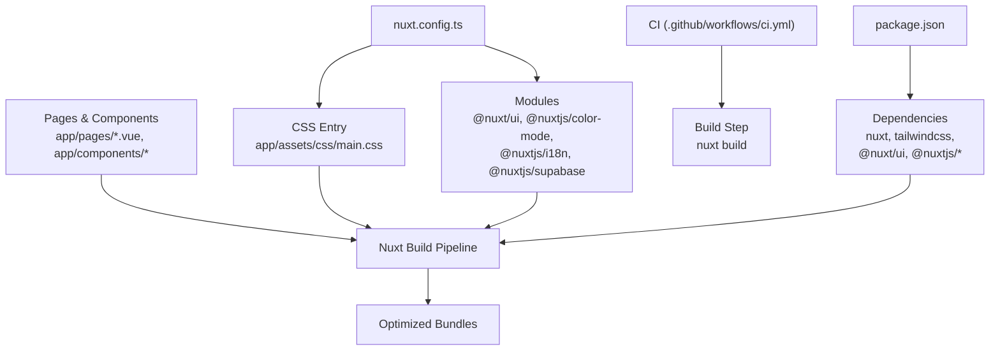
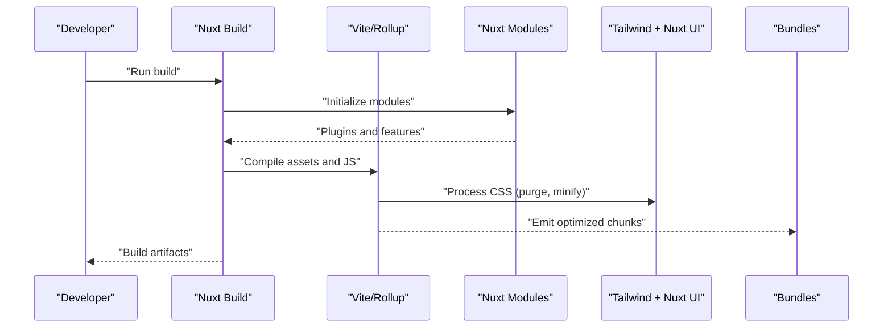
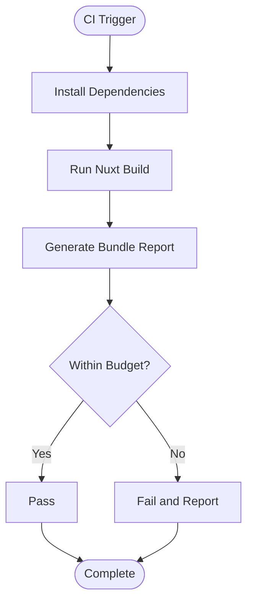
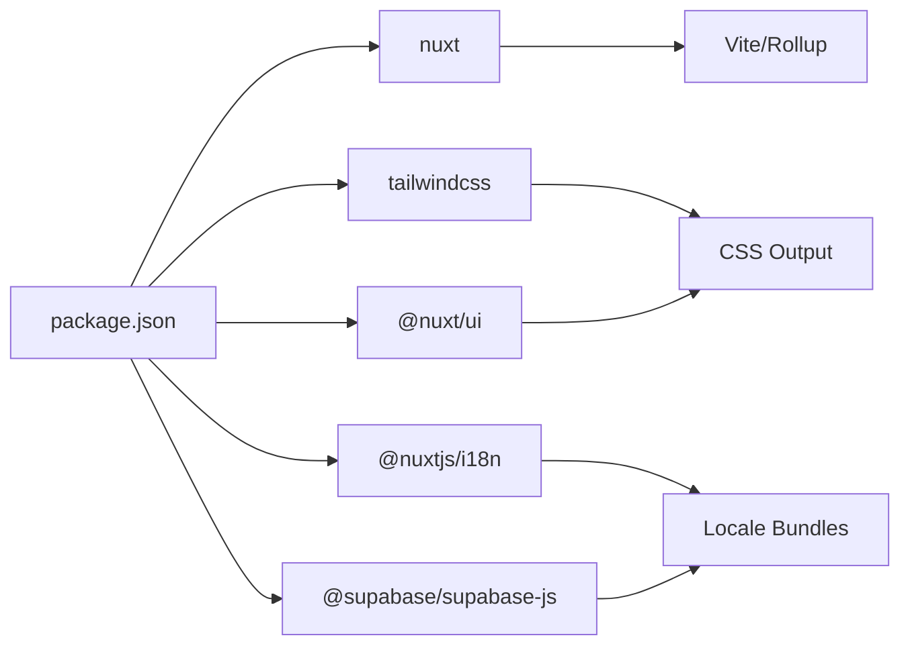

# Bundle Optimization

<cite>
**Referenced Files in This Document**
- [nuxt.config.ts](file://nuxt.config.ts)
- [package.json](file://package.json)
- [main.css](file://app/assets/css/main.css)
- [index.vue](file://app/pages/index.vue)
- [ci.yml](file://.github/workflows/ci.yml)
</cite>

## Table of Contents
1. [Introduction](#introduction)
2. [Project Structure](#project-structure)
3. [Core Components](#core-components)
4. [Architecture Overview](#architecture-overview)
5. [Detailed Component Analysis](#detailed-component-analysis)
6. [Dependency Analysis](#dependency-analysis)
7. [Performance Considerations](#performance-considerations)
8. [Troubleshooting Guide](#troubleshooting-guide)
9. [Conclusion](#conclusion)
10. [Appendices](#appendices)

## Introduction
This document explains bundle optimization techniques for the Raccoon-Gear-Bin project, focusing on Nuxt.js build configuration and practical strategies to minimize bundle size. It covers tree shaking, dead code elimination, module optimization, CSS and font handling, static asset compression, code splitting via dynamic imports, conditional loading patterns, performance budgets, automated analysis in CI/CD, and team workflows.

## Project Structure
The project is a Nuxt 4 application with:
- A single global CSS entry that imports Tailwind and Nuxt UI
- Page-level components and composables
- Modules for UI, color mode, i18n, and Supabase integration
- A GitHub Actions workflow that installs dependencies and builds the app

**Diagram sources**
- [nuxt.config.ts:1-52](file://nuxt.config.ts#L1-L52)
- [package.json:1-26](file://package.json#L1-L26)
- [ci.yml:1-26](file://.github/workflows/ci.yml#L1-L26)

**Section sources**
- [nuxt.config.ts:1-52](file://nuxt.config.ts#L1-L52)
- [package.json:1-26](file://package.json#L1-L26)
- [ci.yml:1-26](file://.github/workflows/ci.yml#L1-L26)

## Core Components
- Nuxt configuration defines modules, runtime config, UI theme, color mode, and i18n settings. These choices influence what gets included in the client bundle.
- The CSS entry imports Tailwind and Nuxt UI, which can significantly impact CSS bundle size if not scoped or purged correctly.
- Pages and components are built by Nuxt’s bundler; page-level code splitting is automatic, while heavy features should be dynamically imported when appropriate.

Key areas to optimize:
- Module selection and usage (UI framework, i18n locales, color mode)
- CSS strategy (Tailwind usage, unused styles removal)
- Code splitting and lazy loading (components, plugins, large libraries)
- Asset handling (fonts, images, static files)

**Section sources**
- [nuxt.config.ts:1-52](file://nuxt.config.ts#L1-L52)
- [main.css:1-106](file://app/assets/css/main.css#L1-L106)
- [index.vue:1-403](file://app/pages/index.vue#L1-L403)

## Architecture Overview
At build time, Nuxt compiles pages, components, and modules into optimized bundles. The current setup uses:
- Tailwind CSS via a single CSS entry
- Nuxt UI component library
- i18n with locale detection and cookie-based language preference
- Supabase client configured via runtime config

[No sources needed since this diagram shows conceptual workflow, not actual code structure]

## Detailed Component Analysis

### Nuxt Configuration and Module Impact
- Modules registered include UI, color mode, i18n, and Supabase. Each contributes to the bundle based on usage.
- Runtime config exposes public Supabase endpoints and keys, enabling client-side access without embedding secrets.
- UI theme colors are defined; ensure only used tokens are included by relying on Tailwind’s utility-first approach and avoiding unused UI components.

Optimization notes:
- Prefer importing only the UI components you use (if applicable) or rely on Nuxt UI’s auto-imports and tree-shaking.
- Keep i18n locales minimal; only include necessary translations to reduce payload.
- Use environment variables for sensitive configuration to avoid bundling secrets.

**Section sources**
- [nuxt.config.ts:1-52](file://nuxt.config.ts#L1-L52)

### CSS Strategy and Font Loading
- The global CSS imports Tailwind and Nuxt UI. Tailwind’s JIT engine removes unused utilities at build time, minimizing CSS output.
- Fonts are referenced via CSS variables and body rules. Ensure fonts are loaded efficiently using preload hints and subset selection where possible.

Recommendations:
- Audit Tailwind usage to ensure only required classes are present.
- Avoid importing entire UI style sheets; prefer scoped styles or component-specific overrides.
- Preload critical fonts and defer non-critical ones.

**Section sources**
- [main.css:1-106](file://app/assets/css/main.css#L1-L106)

### Code Splitting and Dynamic Imports
- Nuxt automatically splits code per route/page. Heavy logic or third-party libraries should be dynamically imported within components or composables to avoid shipping them on every page.
- Conditional loading patterns (e.g., admin-only features) can be implemented via dynamic imports guarded by feature flags or user roles.

Example pattern:
- Import a large charting library only when rendering charts.
- Load admin editor functionality conditionally after verifying admin privileges.

**Section sources**
- [index.vue:1-403](file://app/pages/index.vue#L1-L403)

### Static Assets and Compression
- Place static assets under the public directory for direct serving.
- Configure image optimization and compression through your hosting or CDN pipeline.
- Enable gzip/ Brotli compression at the server level for text-based assets (JS, CSS, JSON).

[No sources needed since this section provides general guidance]

### Dependency Analysis Tools and Bundle Size Monitoring
Recommended tools:
- rollup-plugin-visualizer or vite-bundle-analyzer to visualize chunk sizes and dependency graphs
- Bundlephobia for quick dependency size checks
- Lighthouse for runtime performance insights

Integration ideas:
- Add an analyzer step to the build script to generate reports
- Store reports as artifacts in CI for review

[No sources needed since this section provides general guidance]

### Performance Budgets and Automated Checks
- Define budgets for total bundle size, JS/CSS limits, and specific large dependencies
- Fail CI builds when budgets are exceeded to prevent regressions
- Track trends over time using CI artifacts and dashboards

[No sources needed since this section provides general guidance]

### CI/CD Integration
The existing GitHub Actions workflow installs dependencies and runs the build. Extend it to:
- Generate bundle analysis reports
- Enforce performance budgets
- Upload artifacts for review

**Diagram sources**
- [ci.yml:1-26](file://.github/workflows/ci.yml#L1-L26)

**Section sources**
- [ci.yml:1-26](file://.github/workflows/ci.yml#L1-L26)

## Dependency Analysis
Current dependencies include Nuxt, Tailwind CSS, Nuxt UI, i18n, and Supabase clients. These contribute to both JS and CSS payloads.

**Diagram sources**
- [package.json:1-26](file://package.json#L1-L26)

**Section sources**
- [package.json:1-26](file://package.json#L1-L26)

## Performance Considerations
- Tree shaking: Ensure libraries support ES modules and avoid default imports of entire packages
- Dead code elimination: Remove unused modules and features; leverage conditional imports
- Module optimization: Prefer lightweight alternatives for heavy features; split routes and components
- CSS optimization: Use Tailwind utilities, remove unused styles, and avoid full UI style imports
- Font optimization: Subset fonts, preload critical fonts, and defer non-critical ones
- Asset compression: Enable gzip/Brotli at the server; optimize images and SVGs

[No sources needed since this section provides general guidance]

## Troubleshooting Guide
Common issues and resolutions:
- Large CSS bundle: Verify Tailwind purge is active and avoid importing full UI stylesheets
- Unexpected JS growth: Identify heavy dependencies via bundle analyzer; replace or lazy-load them
- i18n payload too large: Limit locales and remove unused translation files
- Fonts increasing load time: Use preload for critical fonts and defer others; consider system fonts where appropriate

[No sources needed since this section provides general guidance]

## Conclusion
By configuring Nuxt modules thoughtfully, leveraging Tailwind’s utility-first CSS, applying code splitting and dynamic imports, and integrating bundle analysis and budgets into CI/CD, the Raccoon-Gear-Bin project can maintain small, fast-loading bundles. Continuous monitoring and disciplined dependency management will sustain performance as the application grows.

[No sources needed since this section summarizes without analyzing specific files]

## Appendices

### Recommended CI Enhancements
- Add a bundle analysis step to produce visual reports
- Integrate budget checks to fail builds on regressions
- Archive reports for historical tracking

[No sources needed since this section provides general guidance]