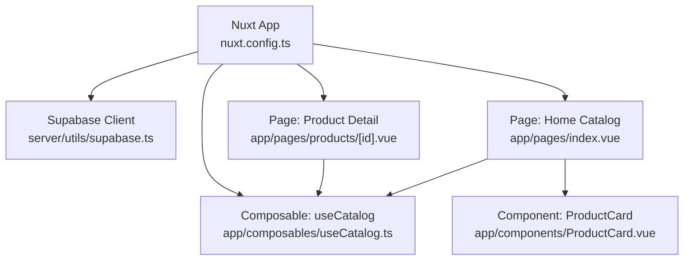
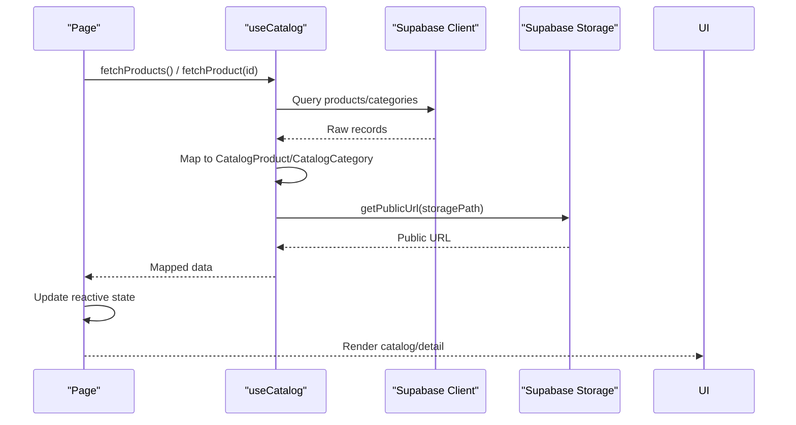
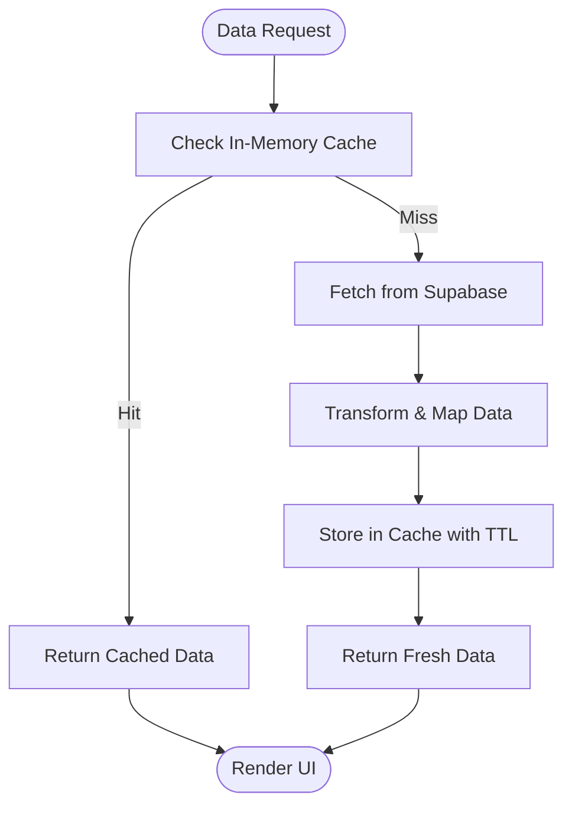
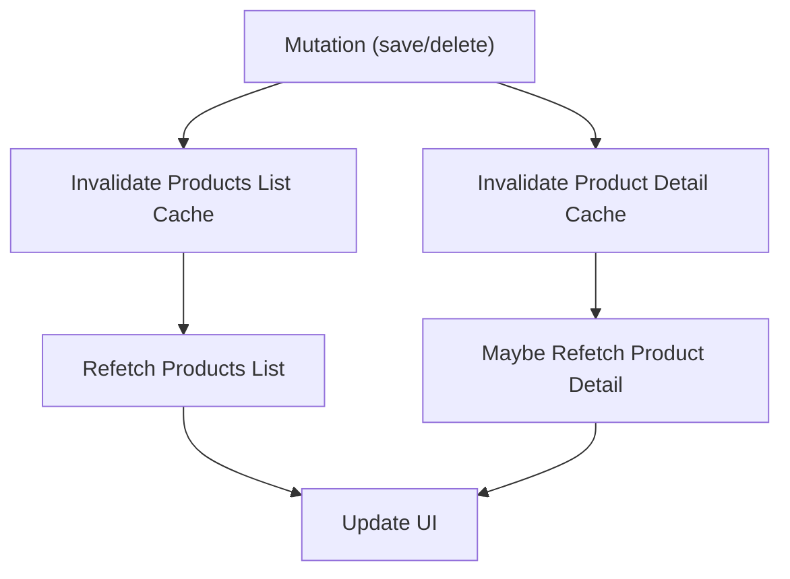
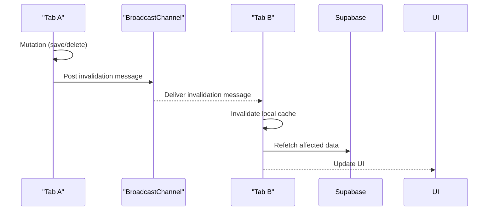
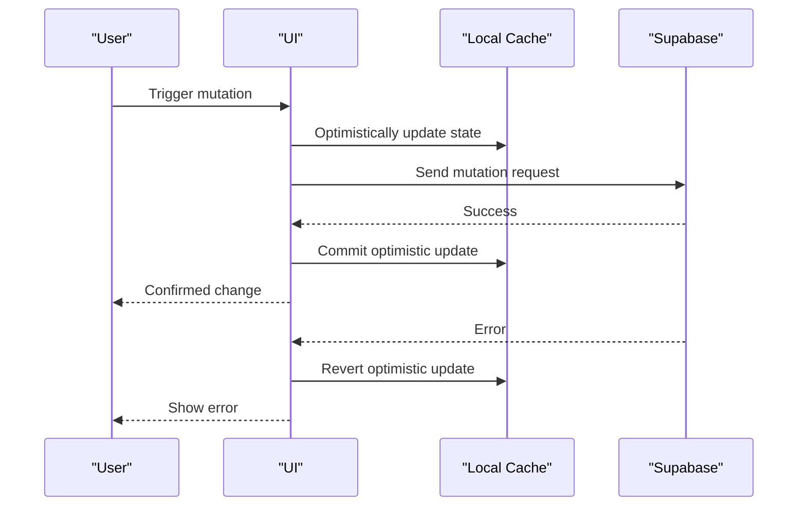
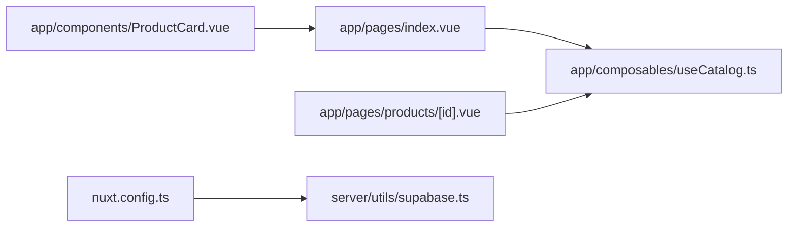

# Caching Patterns

<cite>
**Referenced Files in This Document**
- [nuxt.config.ts](file://nuxt.config.ts)
- [server/utils/supabase.ts](file://server/utils/supabase.ts)
- [app/composables/useCatalog.ts](file://app/composables/useCatalog.ts)
- [app/pages/index.vue](file://app/pages/index.vue)
- [app/pages/products/[id].vue](file://app/pages/products/[id].vue)
- [app/components/ProductCard.vue](file://app/components/ProductCard.vue)
</cite>

## Table of Contents
1. [Introduction](#introduction)
2. [Project Structure](#project-structure)
3. [Core Components](#core-components)
4. [Architecture Overview](#architecture-overview)
5. [Detailed Component Analysis](#detailed-component-analysis)
6. [Dependency Analysis](#dependency-analysis)
7. [Performance Considerations](#performance-considerations)
8. [Troubleshooting Guide](#troubleshooting-guide)
9. [Conclusion](#conclusion)

## Introduction
This document explains the caching patterns implemented across the Raccoon-Gear-Bin application, focusing on:
- Client-side caching strategies for API responses and computed values
- Cache invalidation policies and data freshness
- Storage mechanisms using browser storage (localStorage/sessionStorage) where applicable
- Cross-tab synchronization considerations
- Server-side configuration relevant to caching and Supabase client behavior
- Practical examples for optimistic UI updates, background refetching, and cache warming
- Debugging tools, performance monitoring, and troubleshooting guidance

The current codebase implements lightweight client-side state management with reactive components and composables. There is no explicit persistent cache layer yet; this guide identifies opportunities to introduce robust caching while preserving existing behavior.

## Project Structure
The application uses Nuxt 3 with Vue 3, Supabase integration, and a small set of composables and pages that fetch catalog data. Key areas related to caching are:
- Configuration for Supabase client and runtime settings
- Composables that encapsulate data fetching and mapping
- Pages that render product listings and detail views
- Components that display images and status information

**Diagram sources**
- [nuxt.config.ts:1-52](file://nuxt.config.ts#L1-L52)
- [server/utils/supabase.ts:1-20](file://server/utils/supabase.ts#L1-L20)
- [app/composables/useCatalog.ts:1-61](file://app/composables/useCatalog.ts#L1-L61)
- [index.vue:1-403](file://app/pages/index.vue#L1-L403)
- [app/pages/products/[id].vue:1-177](file://app/pages/products/[id].vue#L1-L177)
- [app/components/ProductCard.vue:1-68](file://app/components/ProductCard.vue#L1-L68)

**Section sources**
- [nuxt.config.ts:1-52](file://nuxt.config.ts#L1-L52)
- [server/utils/supabase.ts:1-20](file://server/utils/supabase.ts#L1-L20)
- [app/composables/useCatalog.ts:1-61](file://app/composables/useCatalog.ts#L1-L61)
- [index.vue:1-403](file://app/pages/index.vue#L1-L403)
- [app/pages/products/[id].vue:1-177](file://app/pages/products/[id].vue#L1-L177)
- [app/components/ProductCard.vue:1-68](file://app/components/ProductCard.vue#L1-L68)

## Core Components
- useCatalog composable: Encapsulates Supabase queries for products, categories, and single product retrieval. It maps raw database rows into typed catalog objects and resolves public image URLs.
- Home page: Loads categories and products concurrently, applies local filtering and sorting, and manages admin mode interactions.
- Product detail page: Loads a single product by ID and computes derived specifications.
- ProductCard component: Displays product thumbnails and metadata, leveraging lazy loading for images.

Key responsibilities:
- Data fetching via Supabase client
- Data transformation and localization-aware mapping
- Reactive UI state management within components

**Section sources**
- [app/composables/useCatalog.ts:1-61](file://app/composables/useCatalog.ts#L1-L61)
- [index.vue:1-403](file://app/pages/index.vue#L1-L403)
- [app/pages/products/[id].vue:1-177](file://app/pages/products/[id].vue#L1-L177)
- [app/components/ProductCard.vue:1-68](file://app/components/ProductCard.vue#L1-L68)

## Architecture Overview
The current architecture relies on direct Supabase calls from composables and pages without an intermediate cache layer. The flow is straightforward:
- Pages invoke composables or directly call Supabase
- Data is mapped and stored in reactive refs
- UI renders based on reactive state

**Diagram sources**
- [app/composables/useCatalog.ts:1-61](file://app/composables/useCatalog.ts#L1-L61)
- [index.vue:46-56](file://app/pages/index.vue#L46-L56)
- [app/pages/products/[id].vue:10-20](file://app/pages/products/[id].vue#L10-L20)

## Detailed Component Analysis

### Client-Side Caching Strategies
Current state:
- No explicit in-memory cache wrapper around Supabase queries
- Data is held in component-level reactive refs during navigation
- Image URLs are resolved via Supabase Storage API per item

Opportunities:
- Introduce an in-memory cache keyed by query signatures (e.g., table + filters + locale)
- Add TTL-based expiration for frequently accessed datasets (categories, published products)
- Provide a cache-first strategy with network fallback for improved perceived performance

Recommended approach:
- Create a composable cache manager that wraps Supabase calls
- Store results in a Map keyed by stable identifiers
- Expose methods to read/write/evict entries and subscribe to invalidations

[No sources needed since this diagram shows conceptual workflow, not actual code structure]

### Computed Values and Derived State
Examples:
- Local filtering and sorting of products on the home page
- Parsing and formatting of product specifications into structured lists

These computed values are efficient because they derive from reactive state and avoid unnecessary re-renders when inputs do not change.

Best practices:
- Keep derived computations pure and memoized via Vue’s computed
- Avoid heavy transformations inside render loops; precompute where possible

**Section sources**
- [app/pages/index.vue:46-63](file://app/pages/index.vue#L46-L63)
- [app/pages/products/[id].vue:22-43](file://app/pages/products/[id].vue#L22-L43)

### Cache Invalidation Policies
Current behavior:
- After saving or deleting a product, the home page reloads the catalog to reflect changes
- No global cache invalidation mechanism exists

Recommended policies:
- On mutations (create/update/delete), invalidate related caches:
  - Invalidate product list cache
  - Invalidate specific product detail cache if present
- Use event-driven invalidation (e.g., custom events or a simple pub/sub) to notify subscribers

[No sources needed since this diagram shows conceptual workflow, not actual code structure]

### Storage Mechanisms (localStorage and sessionStorage)
Current state:
- No explicit usage of localStorage or sessionStorage for caching data
- Admin authentication cookies are configured via Supabase module options

Recommendations:
- Persist user preferences (locale, theme) using localStorage
- Optionally persist recent searches or last viewed product IDs using sessionStorage
- Avoid storing sensitive data in browser storage; rely on Supabase Auth for session management

Note:
- Cookie configuration is defined in the Nuxt config for Supabase auth, not used as a general-purpose cache store

**Section sources**
- [nuxt.config.ts:16-26](file://nuxt.config.ts#L16-L26)

### Cross-Tab Synchronization
Current state:
- No cross-tab synchronization for cached data
- Each tab maintains its own reactive state

Recommendations:
- Use BroadcastChannel or window.storage events to synchronize cache invalidation across tabs
- Publish invalidation messages when mutations occur and listen for them to refresh data

[No sources needed since this diagram shows conceptual workflow, not actual code structure]

### Server-Side Caching Configurations
Current state:
- Server-side Supabase client is created with session persistence disabled and token auto-refresh disabled
- No explicit static asset caching headers or CDN configuration in the provided files

Implications:
- Admin operations bypass client-side session persistence, which is appropriate for server-only contexts
- Static assets may benefit from CDN caching headers at the hosting layer (not shown here)

Recommendations:
- Configure CDN caching headers for static assets (images, fonts, CSS/JS bundles)
- Consider edge caching for read-heavy endpoints if exposing server functions
- Ensure Supabase Storage public URLs leverage CDN caching through proper headers

**Section sources**
- [server/utils/supabase.ts:1-20](file://server/utils/supabase.ts#L1-L20)

### Optimistic UI Updates
Current state:
- Save and delete operations update the UI after successful network responses
- No immediate UI feedback before network confirmation

Recommendations:
- Implement optimistic updates by temporarily updating local state before network calls
- Roll back changes on error and show user-friendly messages
- Debounce rapid mutations to prevent inconsistent states

[No sources needed since this diagram shows conceptual workflow, not actual code structure]

### Background Data Refetching
Current state:
- Data is loaded on mount and after mutations
- No periodic background refetching

Recommendations:
- Introduce background refetching for stale data using timers or IntersectionObserver
- Refetch categories and products periodically or when the page becomes visible
- Respect user preferences and network conditions

**Section sources**
- [app/pages/index.vue:186-188](file://app/pages/index.vue#L186-L188)

### Cache Warming Strategies
Current state:
- No explicit cache warming

Recommendations:
- Preload critical data (categories, top products) during app initialization
- Warm caches for likely next routes (e.g., popular product details)
- Use prefetching techniques to reduce initial load latency

**Section sources**
- [index.vue:46-56](file://app/pages/index.vue#L46-L56)

## Dependency Analysis
The following diagram illustrates dependencies among key modules involved in data fetching and rendering:

**Diagram sources**
- [index.vue:1-403](file://app/pages/index.vue#L1-L403)
- [app/composables/useCatalog.ts:1-61](file://app/composables/useCatalog.ts#L1-L61)
- [app/pages/products/[id].vue:1-177](file://app/pages/products/[id].vue#L1-L177)
- [app/components/ProductCard.vue:1-68](file://app/components/ProductCard.vue#L1-L68)
- [nuxt.config.ts:1-52](file://nuxt.config.ts#L1-L52)
- [server/utils/supabase.ts:1-20](file://server/utils/supabase.ts#L1-L20)

**Section sources**
- [index.vue:1-403](file://app/pages/index.vue#L1-L403)
- [app/composables/useCatalog.ts:1-61](file://app/composables/useCatalog.ts#L1-L61)
- [app/pages/products/[id].vue:1-177](file://app/pages/products/[id].vue#L1-L177)
- [app/components/ProductCard.vue:1-68](file://app/components/ProductCard.vue#L1-L68)
- [nuxt.config.ts:1-52](file://nuxt.config.ts#L1-L52)
- [server/utils/supabase.ts:1-20](file://server/utils/supabase.ts#L1-L20)

## Performance Considerations
- Prefer computed properties for derived data to minimize recomputation
- Use lazy loading for images to improve initial paint performance
- Batch network requests where possible (already done with Promise.all for categories and products)
- Introduce in-memory caching to reduce redundant network calls
- Optimize image delivery via CDN and proper caching headers
- Monitor memory usage and avoid retaining large datasets indefinitely

[No sources needed since this section provides general guidance]

## Troubleshooting Guide
Common issues and resolutions:
- Stale data after mutations:
  - Ensure cache invalidation occurs after successful mutations
  - Verify that refetch logic runs post-mutation
- Slow initial loads:
  - Implement cache warming for critical datasets
  - Enable CDN caching for static assets and images
- Cross-tab inconsistencies:
  - Implement BroadcastChannel or storage events to synchronize invalidations
- Authentication-related errors:
  - Confirm Supabase client configuration and cookie settings
  - Validate environment variables for Supabase URL and keys

Debugging tips:
- Log cache hits/misses to identify inefficiencies
- Measure network request frequency and payload sizes
- Use browser DevTools to inspect storage and network activity
- Monitor Supabase logs for query performance and errors

**Section sources**
- [nuxt.config.ts:16-26](file://nuxt.config.ts#L16-L26)
- [server/utils/supabase.ts:1-20](file://server/utils/supabase.ts#L1-L20)

## Conclusion
The Raccoon-Gear-Bin application currently relies on reactive state and direct Supabase calls without a dedicated caching layer. To enhance performance and user experience:
- Introduce an in-memory cache with TTL-based expiration
- Implement cache invalidation policies tied to mutations
- Add cross-tab synchronization for consistent state
- Configure CDN caching for static assets and images
- Adopt optimistic UI updates and background refetching strategies
- Continuously monitor performance and debug cache-related issues

These improvements will reduce network overhead, improve perceived responsiveness, and provide a more robust user experience across sessions and tabs.