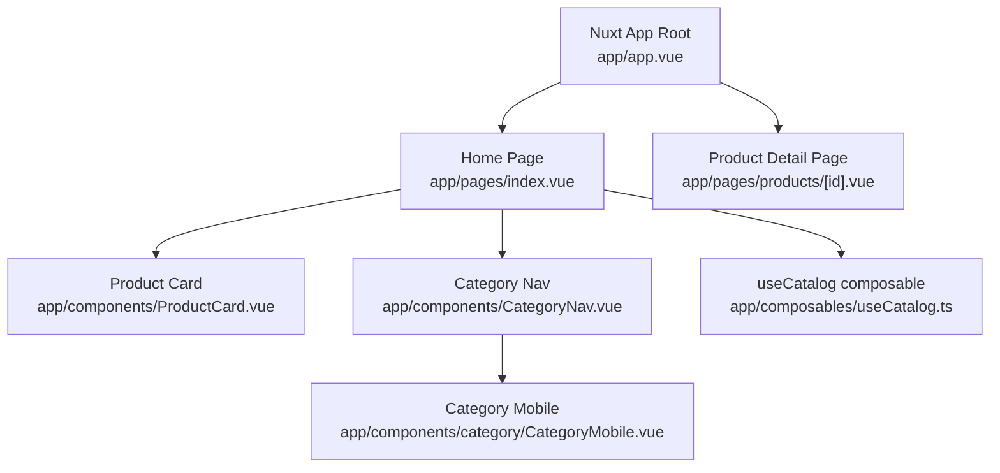
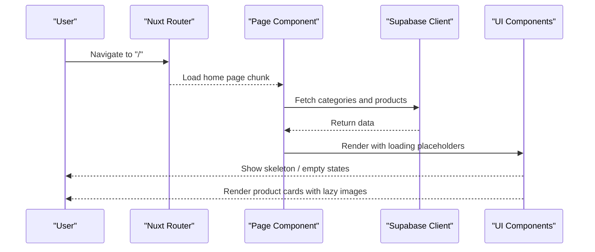
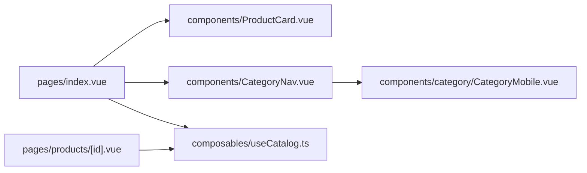

# Lazy Loading Strategies

<cite>
**Referenced Files in This Document**
- [nuxt.config.ts](file://nuxt.config.ts)
- [package.json](file://package.json)
- [app/app.vue](file://app/app.vue)
- [app/pages/index.vue](file://app/pages/index.vue)
- [app/pages/products/[id].vue](file://app/pages/products/[id].vue)
- [app/components/ProductCard.vue](file://app/components/ProductCard.vue)
- [app/components/CategoryNav.vue](file://app/components/CategoryNav.vue)
- [app/components/category/CategoryMobile.vue](file://app/components/category/CategoryMobile.vue)
- [app/composables/useCatalog.ts](file://app/composables/useCatalog.ts)
</cite>

## Table of Contents
1. Introduction
2. Project Structure
3. Core Components
4. Architecture Overview
5. Detailed Component Analysis
6. Dependency Analysis
7. Performance Considerations
8. Troubleshooting Guide
9. Conclusion

## Introduction
This document explains how lazy loading is implemented and can be extended in the Raccoon-Gear-Bin application built with Nuxt 4 and Vue 3. It covers:
- Route-based code splitting for pages and nested components
- Component-level lazy loading patterns using defineAsyncComponent
- Image lazy loading strategies
- Font loading optimization
- Third-party script deferral
- Nuxt build configuration for optimal code splitting and bundle size reduction
- Measuring effectiveness and troubleshooting common issues such as flash of unstyled content (FOUC) and loading state management

## Project Structure
The application uses a feature-oriented layout under app/:
- Pages are auto-imported by Nuxt and split into route-level chunks by default
- Shared UI lives in components/ and composables/
- Global configuration is centralized in nuxt.config.ts

**Diagram sources**
- [app/app.vue:1-4](file://app/app.vue#L1-L4)
- [app/pages/index.vue:1-465](file://app/pages/index.vue#L1-L465)
- [app/pages/products/[id].vue:1-177](file://app/pages/products/[id].vue#L1-L177)
- [app/components/ProductCard.vue:1-68](file://app/components/ProductCard.vue#L1-L68)
- [app/components/CategoryNav.vue:1-37](file://app/components/CategoryNav.vue#L1-L37)
- [app/components/category/CategoryMobile.vue:1-577](file://app/components/category/CategoryMobile.vue#L1-L577)
- [app/composables/useCatalog.ts:1-61](file://app/composables/useCatalog.ts#L1-L61)

**Section sources**
- [nuxt.config.ts:1-52](file://nuxt.config.ts#L1-L52)
- [package.json:1-26](file://package.json#L1-L26)

## Core Components
- Home page loads catalog data and renders product cards, category navigation, and search dock. It manages loading states and error states for a smooth user experience.
- Product detail page fetches a single product and displays images, specs, and stock status.
- ProductCard renders product images with native lazy loading to defer offscreen image requests.
- CategoryNav delegates rendering to desktop/mobile variants; mobile variant includes advanced interactions and font readiness handling.
- useCatalog centralizes Supabase queries and mapping logic used across pages.

Key lazy-loading touchpoints:
- Route-based code splitting via Nuxt file-based routing
- Native image lazy loading on product thumbnails
- Conditional rendering of heavy UI panels (e.g., search overlay) only when needed
- Data fetching deferred until component mounts or route activates

**Section sources**
- [app/pages/index.vue:101-120](file://app/pages/index.vue#L101-L120)
- [app/pages/products/[id].vue:10-20](file://app/pages/products/[id].vue#L10-L20)
- [app/components/ProductCard.vue:14-20](file://app/components/ProductCard.vue#L14-L20)
- [app/components/CategoryNav.vue:20-35](file://app/components/CategoryNav.vue#L20-L35)
- [app/composables/useCatalog.ts:37-57](file://app/composables/useCatalog.ts#L37-L57)

## Architecture Overview
Nuxt automatically splits code at route boundaries. Each page becomes its own chunk and is loaded on demand. Within pages, heavy subcomponents can be lazily loaded using defineAsyncComponent. Images are loaded lazily by the browser when they enter the viewport.

**Diagram sources**
- [app/pages/index.vue:101-120](file://app/pages/index.vue#L101-L120)
- [app/pages/products/[id].vue:10-20](file://app/pages/products/[id].vue#L10-L20)
- [app/components/ProductCard.vue:14-20](file://app/components/ProductCard.vue#L14-L20)

## Detailed Component Analysis

### Route-Based Code Splitting
- Nuxt’s file-based routing automatically creates separate chunks per page. The root app shell renders <NuxtPage />, which dynamically resolves and loads the matching route chunk.
- The home page and product detail page are independent chunks, reducing initial payload.

Implementation references:
- Root page container: [app/app.vue:1-4](file://app/app.vue#L1-L4)
- Home page entry: [app/pages/index.vue:1-465](file://app/pages/index.vue#L1-L465)
- Product detail entry: [app/pages/products/[id].vue:1-177](file://app/pages/products/[id].vue#L1-L177)

**Section sources**
- [app/app.vue:1-4](file://app/app.vue#L1-L4)
- [app/pages/index.vue:1-465](file://app/pages/index.vue#L1-L465)
- [app/pages/products/[id].vue:1-177](file://app/pages/products/[id].vue#L1-L177)

### Component-Level Lazy Loading with defineAsyncComponent
While not currently used in this codebase, you can apply defineAsyncComponent to defer heavy components until they are needed. Typical usage:
- Wrap a large charting library component
- Defer complex modals or editors
- Combine with Suspense to show fallbacks during async resolution

Guidelines:
- Use defineAsyncComponent for components that are not immediately visible
- Provide a small placeholder while the component loads
- Keep the component’s dependencies minimal to maximize chunk isolation

[No sources needed since this section provides general guidance]

### Image Lazy Loading
- ProductCard uses native lazy loading on product thumbnails to avoid loading offscreen images.
- This reduces bandwidth and improves Time to Interactive on list-heavy pages.

References:
- Thumbnail lazy loading attribute: [app/components/ProductCard.vue:14-20](file://app/components/ProductCard.vue#L14-L20)

Enhancement ideas:
- Add decoding="async" to images for smoother rendering
- Use IntersectionObserver-based lazy loading for very long lists or virtualized grids
- Preload critical hero images and defer non-critical ones

**Section sources**
- [app/components/ProductCard.vue:14-20](file://app/components/ProductCard.vue#L14-L20)

### Font Loading Optimization
- The mobile category nav waits for fonts to be ready before recalculating layout-sensitive indicators, preventing reflows caused by font swaps.

Reference:
- Font readiness hook: [app/components/category/CategoryMobile.vue:371-375](file://app/components/category/CategoryMobile.vue#L371-L375)

Best practices:
- Use display=swap for web fonts to minimize FOIT
- Measure font load impact and consider preloading critical fonts
- Avoid layout shifts by reserving space for expected font sizes

**Section sources**
- [app/components/category/CategoryMobile.vue:371-375](file://app/components/category/CategoryMobile.vue#L371-L375)

### Third-Party Script Deferral
- No third-party scripts are currently loaded in this project. When adding analytics or chat widgets:
  - Load them asynchronously after main content is interactive
  - Use dynamic imports or script tags with defer/async
  - Respect user privacy preferences and provide opt-out mechanisms

[No sources needed since this section provides general guidance]

### Data Fetching and Loading States
- Home page fetches categories and products concurrently and shows skeleton placeholders while loading.
- Product detail page fetches a single product and handles errors gracefully.

References:
- Concurrent data fetch and loading flags: [app/pages/index.vue:101-120](file://app/pages/index.vue#L101-L120)
- Single product fetch with loading/error states: [app/pages/products/[id].vue:10-20](file://app/pages/products/[id].vue#L10-L20)

**Section sources**
- [app/pages/index.vue:101-120](file://app/pages/index.vue#L101-L120)
- [app/pages/products/[id].vue:10-20](file://app/pages/products/[id].vue#L10-L20)

## Dependency Analysis
The following diagram maps runtime dependencies between pages, components, and composables.

**Diagram sources**
- [app/pages/index.vue:1-465](file://app/pages/index.vue#L1-L465)
- [app/components/ProductCard.vue:1-68](file://app/components/ProductCard.vue#L1-L68)
- [app/components/CategoryNav.vue:1-37](file://app/components/CategoryNav.vue#L1-L37)
- [app/components/category/CategoryMobile.vue:1-577](file://app/components/category/CategoryMobile.vue#L1-L577)
- [app/pages/products/[id].vue:1-177](file://app/pages/products/[id].vue#L1-L177)
- [app/composables/useCatalog.ts:1-61](file://app/composables/useCatalog.ts#L1-L61)

**Section sources**
- [app/pages/index.vue:1-465](file://app/pages/index.vue#L1-L465)
- [app/components/ProductCard.vue:1-68](file://app/components/ProductCard.vue#L1-L68)
- [app/components/CategoryNav.vue:1-37](file://app/components/CategoryNav.vue#L1-L37)
- [app/components/category/CategoryMobile.vue:1-577](file://app/components/category/CategoryMobile.vue#L1-L577)
- [app/pages/products/[id].vue:1-177](file://app/pages/products/[id].vue#L1-L177)
- [app/composables/useCatalog.ts:1-61](file://app/composables/useCatalog.ts#L1-L61)

## Performance Considerations
- Leverage Nuxt’s automatic route-based code splitting to keep initial payloads small.
- Prefer native image lazy loading for lists; consider IntersectionObserver for advanced scenarios.
- Defer heavy UI features behind user interaction (e.g., open overlays only when triggered).
- Use concurrent data fetching where possible to reduce waterfall delays.
- Monitor bundle size and chunk distribution using Nuxt’s devtools and production builds.

[No sources needed since this section provides general guidance]

## Troubleshooting Guide

### Flash of Unstyled Content (FOUC)
Symptoms:
- Layout shifts or unstyled elements briefly appear before CSS loads.

Mitigations:
- Ensure global CSS is loaded early via Nuxt config.
- Use skeleton loaders while data is being fetched.
- Apply CSS containment and stable dimensions to prevent reflow.

References:
- Global CSS registration: [nuxt.config.ts:4-4](file://nuxt.config.ts#L4-L4)
- Skeleton placeholders during loading: [app/pages/index.vue:313-315](file://app/pages/index.vue#L313-L315)

**Section sources**
- [nuxt.config.ts:4-4](file://nuxt.config.ts#L4-L4)
- [app/pages/index.vue:313-315](file://app/pages/index.vue#L313-L315)

### Loading State Management
- Maintain explicit isLoading flags to render skeletons or empty states.
- Handle network errors with user-friendly messages and retry options.

References:
- Loading and error states on home page: [app/pages/index.vue:101-120](file://app/pages/index.vue#L101-L120)
- Loading and error states on product detail: [app/pages/products/[id].vue:10-20](file://app/pages/products/[id].vue#L10-L20)

**Section sources**
- [app/pages/index.vue:101-120](file://app/pages/index.vue#L101-L120)
- [app/pages/products/[id].vue:10-20](file://app/pages/products/[id].vue#L10-L20)

### Measuring Lazy Loading Effectiveness
Recommended metrics:
- First Contentful Paint (FCP) and Largest Contentful Paint (LCP)
- Time to Interactive (TTI)
- Total Blocking Time (TBT)
- Chunk sizes and number of network requests
- Image load timing and cache hit rates

Tools:
- Browser DevTools Performance panel
- Lighthouse audits
- Nuxt devtools for runtime insights

[No sources needed since this section provides general guidance]

### Common Issues and Fixes
- Images not lazy loading: ensure the loading attribute is present and images are offscreen initially.
- Fonts causing layout shift: use display=swap and reserve space for text.
- Heavy components blocking interactivity: wrap with defineAsyncComponent and show a lightweight placeholder.
- Excessive network requests: batch or debounce data fetches and leverage caching strategies.

[No sources needed since this section provides general guidance]

## Conclusion
Raccoon-Gear-Bin benefits from Nuxt’s built-in route-based code splitting and native image lazy loading. To further optimize performance:
- Introduce component-level lazy loading for heavy UI pieces
- Optimize fonts and defer third-party scripts
- Configure Nuxt’s build system to tailor chunking and asset handling
- Continuously measure and iterate based on real-world metrics

[No sources needed since this section summarizes without analyzing specific files]