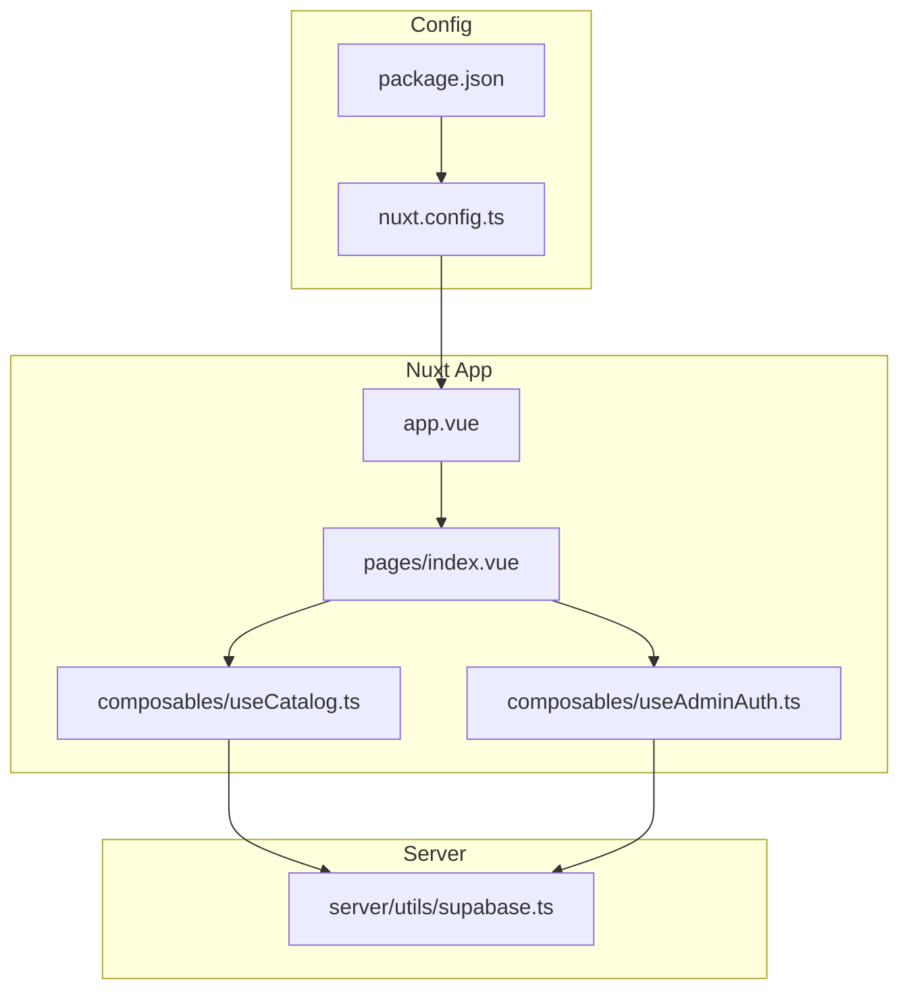
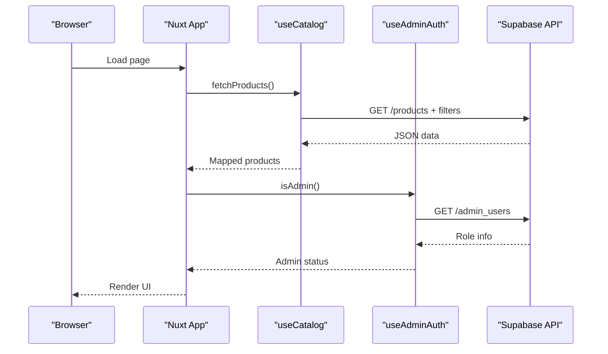
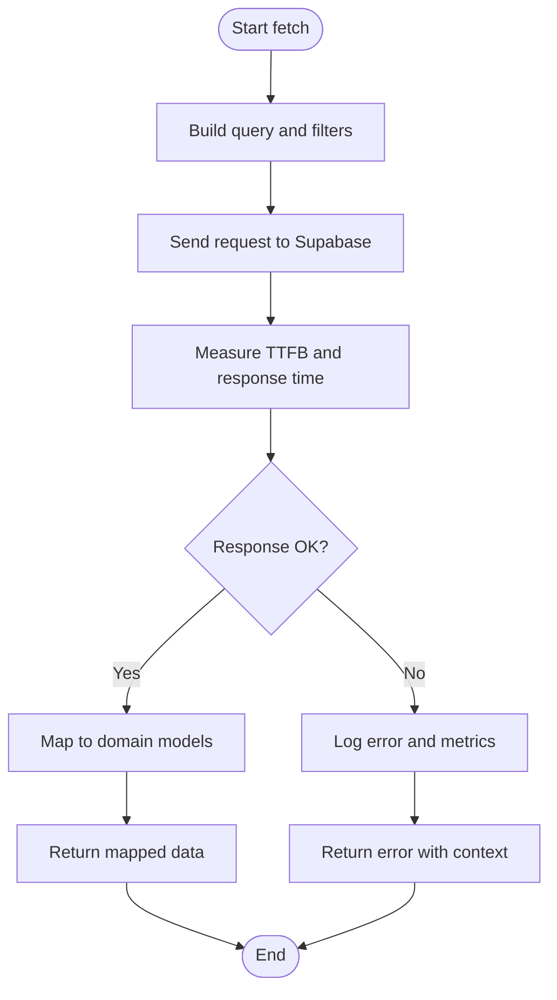
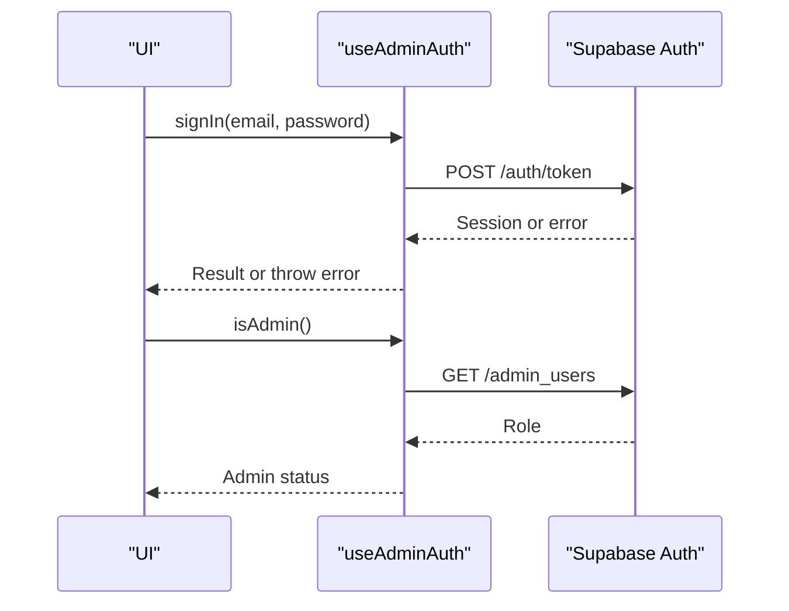
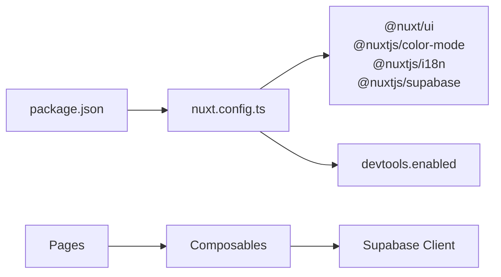

# Performance Monitoring & Profiling

<cite>
**Referenced Files in This Document**
- [README.md](file://README.md)
- [package.json](file://package.json)
- [nuxt.config.ts](file://nuxt.config.ts)
- [app.vue](file://app/app.vue)
- [index.vue](file://app/pages/index.vue)
- [useCatalog.ts](file://app/composables/useCatalog.ts)
- [useAdminAuth.ts](file://app/composables/useAdminAuth.ts)
- [supabase.ts](file://server/utils/supabase.ts)
</cite>

## Table of Contents
1. [Introduction](#introduction)
2. [Project Structure](#project-structure)
3. [Core Components](#core-components)
4. [Architecture Overview](#architecture-overview)
5. [Detailed Component Analysis](#detailed-component-analysis)
6. [Dependency Analysis](#dependency-analysis)
7. [Performance Considerations](#performance-considerations)
8. [Troubleshooting Guide](#troubleshooting-guide)
9. [Conclusion](#conclusion)
10. [Appendices](#appendices)

## Introduction
This document provides a comprehensive guide to performance monitoring and profiling for the Raccoon-Gear-Bin application. It covers how to implement Core Web Vitals tracking, collect custom performance metrics, monitor user experience, integrate profiling tools (Chrome DevTools, Lighthouse, Nuxt devtools), set up error tracking, detect performance regressions, define SLIs/SLOs, build dashboards, run A/B tests for performance improvements, and address mobile performance, network optimization, and memory leak detection.

The application is a Nuxt 4 project with Supabase integration for data and storage. The current codebase includes configuration for Nuxt devtools and modules, composables for catalog and admin authentication, and pages that fetch and render product data. There is no built-in analytics or performance SDK yet; this guide shows where and how to add them effectively.

## Project Structure
At a high level:
- Nuxt app root and configuration live under nuxt.config.ts and package.json.
- UI components and pages are under app/components and app/pages.
- Business logic is encapsulated in composables under app/composables.
- Server utilities for Supabase are under server/utils.

**Diagram sources**
- [nuxt.config.ts:1-52](file://nuxt.config.ts#L1-L52)
- [package.json:1-26](file://package.json#L1-L26)
- [app.vue:1-4](file://app/app.vue#L1-L4)
- [index.vue:1-403](file://app/pages/index.vue#L1-L403)
- [useCatalog.ts:1-61](file://app/composables/useCatalog.ts#L1-L61)
- [useAdminAuth.ts:1-79](file://app/composables/useAdminAuth.ts#L1-L79)
- [supabase.ts:1-200](file://server/utils/supabase.ts#L1-L200)

**Section sources**
- [nuxt.config.ts:1-52](file://nuxt.config.ts#L1-L52)
- [package.json:1-26](file://package.json#L1-L26)
- [app.vue:1-4](file://app/app.vue#L1-L4)
- [index.vue:1-403](file://app/pages/index.vue#L1-L403)
- [useCatalog.ts:1-61](file://app/composables/useCatalog.ts#L1-L61)
- [useAdminAuth.ts:1-79](file://app/composables/useAdminAuth.ts#L1-L79)
- [supabase.ts:1-200](file://server/utils/supabase.ts#L1-L200)

## Core Components
Key areas relevant to performance monitoring and profiling:
- Nuxt configuration enables devtools and sets runtime config for Supabase.
- Pages and composables perform network requests to Supabase for products, categories, and auth checks.
- Storage operations retrieve public URLs for images.

These are the primary integration points for adding performance instrumentation:
- Global app entry (app.vue) for initializing analytics and performance SDKs.
- Data fetching in useCatalog.ts and index.vue for measuring network latency and errors.
- Auth flows in useAdminAuth.ts for tracking login performance and failures.
- Nuxt devtools enabled by default for local debugging.

**Section sources**
- [nuxt.config.ts:1-52](file://nuxt.config.ts#L1-L52)
- [useCatalog.ts:1-61](file://app/composables/useCatalog.ts#L1-L61)
- [useAdminAuth.ts:1-79](file://app/composables/useAdminAuth.ts#L1-L79)
- [index.vue:46-56](file://app/pages/index.vue#L46-L56)

## Architecture Overview
The runtime flow involves client-side rendering via Nuxt, data retrieval from Supabase REST/Realtime APIs, and optional storage access for images. Performance instrumentation should be added at these boundaries:
- Application bootstrap for global metrics and error handling.
- Network layer for request timing, retries, and failure rates.
- UI interactions for user-centric metrics like interaction readiness and input responsiveness.

**Diagram sources**
- [useCatalog.ts:37-41](file://app/composables/useCatalog.ts#L37-L41)
- [useAdminAuth.ts:16-34](file://app/composables/useAdminAuth.ts#L16-L34)
- [index.vue:46-56](file://app/pages/index.vue#L46-L56)

## Detailed Component Analysis

### Global Initialization and Devtools
- Nuxt devtools are enabled in configuration, which is essential for local profiling and inspection.
- The app root component is minimal; it is an ideal place to initialize performance SDKs and global error handlers.

Recommendations:
- Initialize Core Web Vitals measurement in app.vue during bootstrap.
- Configure a global error boundary to capture unhandled exceptions and report to your error tracking service.
- Use Nuxt devtools to inspect component tree, state, and network calls during development.

**Section sources**
- [nuxt.config.ts:1-10](file://nuxt.config.ts#L1-L10)
- [app.vue:1-4](file://app/app.vue#L1-L4)

### Data Fetching and Network Metrics
- useCatalog.ts performs Supabase queries for products and categories, mapping results into typed structures.
- index.vue orchestrates parallel loading of categories and products, handling errors and loading states.

Recommendations:
- Wrap Supabase calls with timing instrumentation to measure TTFB, response time, and total load duration.
- Track request success/failure rates and categorize errors (network vs. server).
- Add retry/backoff for transient failures and log outcomes for regression detection.

**Diagram sources**
- [useCatalog.ts:37-41](file://app/composables/useCatalog.ts#L37-L41)
- [index.vue:46-56](file://app/pages/index.vue#L46-L56)

**Section sources**
- [useCatalog.ts:1-61](file://app/composables/useCatalog.ts#L1-L61)
- [index.vue:46-56](file://app/pages/index.vue#L46-L56)

### Authentication Flow and UX Timing
- useAdminAuth.ts retrieves current user, checks admin roles, and handles sign-in/sign-out. Errors are logged or thrown.

Recommendations:
- Measure time-to-interactive for authenticated routes.
- Track login success rate and average latency; alert on spikes.
- Capture error contexts (e.g., invalid credentials, network issues) for troubleshooting.

**Diagram sources**
- [useAdminAuth.ts:56-69](file://app/composables/useAdminAuth.ts#L56-L69)
- [useAdminAuth.ts:16-34](file://app/composables/useAdminAuth.ts#L16-L34)

**Section sources**
- [useAdminAuth.ts:1-79](file://app/composables/useAdminAuth.ts#L1-L79)

### Image Loading and Storage
- Public image URLs are constructed via Supabase storage; heavy images can impact performance.

Recommendations:
- Implement responsive images (srcset, sizes) and lazy loading.
- Monitor Largest Contentful Paint (LCP) per route and optimize critical images.
- Cache images via CDN and set appropriate headers.

**Section sources**
- [index.vue:65-68](file://app/pages/index.vue#L65-L68)
- [useCatalog.ts:8-11](file://app/composables/useCatalog.ts#L8-L11)

## Dependency Analysis
Dependencies relevant to performance:
- Nuxt modules and devtools enable enhanced debugging and UI features.
- Supabase client is used across composables for data and auth.
- i18n module affects initial payload size and routing behavior.

**Diagram sources**
- [package.json:12-24](file://package.json#L12-L24)
- [nuxt.config.ts:1-20](file://nuxt.config.ts#L1-L20)

**Section sources**
- [package.json:1-26](file://package.json#L1-L26)
- [nuxt.config.ts:1-52](file://nuxt.config.ts#L1-L52)

## Performance Considerations
- Core Web Vitals: Track LCP, FID/INP, CLS, and Long Tasks. Focus on optimizing images and third-party scripts.
- Custom Metrics: Measure time-to-first-byte, network latency, and API error rates. Instrument key user journeys (catalog load, product detail load, admin login).
- Mobile Performance: Prefer smaller images, defer non-critical JS, minimize layout shifts, and test on low-end devices.
- Network Optimization: Use caching strategies, reduce payload sizes, and batch requests where possible.
- Memory Leaks: Use Chrome DevTools Memory tab to record heap snapshots; look for retained nodes after navigation and event listener cleanup.

[No sources needed since this section provides general guidance]

## Troubleshooting Guide
Common issues and diagnostics:
- Network errors: Log error messages and stack traces; correlate with endpoint and payload.
- Auth failures: Check token validity, session state, and server responses.
- Slow queries: Use Supabase logs and database query analysis to identify bottlenecks.

Integration points in code:
- Error logging in auth composable and page-level error handling.
- Centralized error reporting can be added in app.vue or a dedicated plugin.

**Section sources**
- [useAdminAuth.ts:28-31](file://app/composables/useAdminAuth.ts#L28-L31)
- [useAdminAuth.ts:48-51](file://app/composables/useAdminAuth.ts#L48-L51)
- [index.vue:117-120](file://app/pages/index.vue#L117-L120)

## Conclusion
To achieve robust performance monitoring and profiling for Raccoon-Gear-Bin:
- Add global initialization for Core Web Vitals and error tracking in app.vue.
- Instrument network calls in composables to capture latency and errors.
- Use Nuxt devtools locally and Lighthouse in CI for continuous evaluation.
- Define SLIs/SLOs around CWV and API reliability; set alerts for regressions.
- Optimize images and network payloads; monitor mobile performance.
- Establish dashboards and A/B testing workflows to validate improvements.

[No sources needed since this section summarizes without analyzing specific files]

## Appendices

### Implementation Checklist
- Initialize performance SDK in app.vue.
- Wrap Supabase calls in useCatalog.ts and useAdminAuth.ts with timing and error telemetry.
- Add global error boundary and reporting in app.vue.
- Enable Lighthouse CI and track CWV trends.
- Set up dashboards for CWV, API latency, and error rates.
- Define SLIs/SLOs and configure alerts.
- Profile on mobile devices and optimize images/network.
- Record memory snapshots to detect leaks.

[No sources needed since this section provides general guidance]