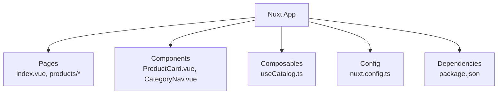
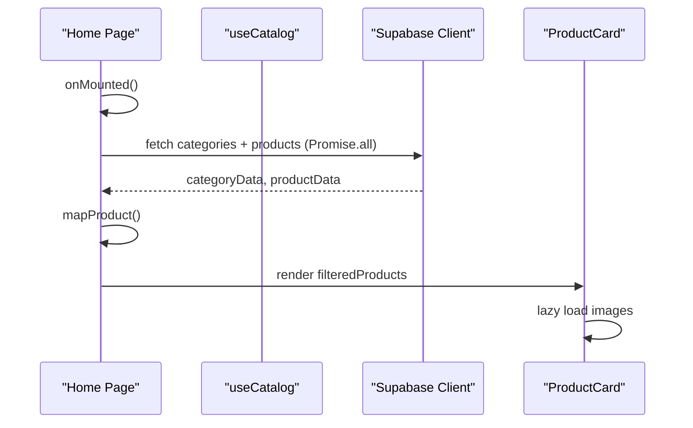
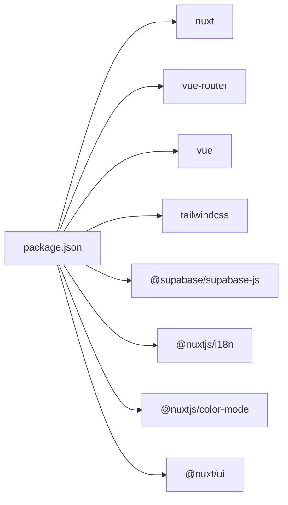

# Performance Optimization

<cite>
**Referenced Files in This Document**
- [README.md](file://README.md)
- [package.json](file://package.json)
- [nuxt.config.ts](file://nuxt.config.ts)
- [app/pages/index.vue](file://app/pages/index.vue)
- [app/composables/useCatalog.ts](file://app/composables/useCatalog.ts)
- [app/components/ProductCard.vue](file://app/components/ProductCard.vue)
- [app/components/CategoryNav.vue](file://app/components/CategoryNav.vue)
- [app/pages/products/[id].vue](file://app/pages/products/[id].vue)
- [app/pages/products/index.vue](file://app/pages/products/index.vue)
</cite>

## Table of Contents
1. Introduction
2. Project Structure
3. Core Components
4. Architecture Overview
5. Detailed Component Analysis
6. Dependency Analysis
7. Performance Considerations
8. Troubleshooting Guide
9. Conclusion

## Introduction
This document provides performance optimization strategies tailored to this Nuxt.js application. It focuses on improving application speed and efficiency through lazy loading, bundle optimization, code splitting, caching patterns, image and font strategies, resource prefetching, monitoring and profiling, server-side rendering (SSR) optimizations, hydration performance, static site generation (SSG), metrics measurement, budgets, and workflows. Where applicable, it references concrete files in the repository to ground recommendations in the actual implementation.

## Project Structure
The project is a Nuxt 4 application using TypeScript, Tailwind CSS, Supabase, i18n, and UI components. Key directories:
- app/pages: route-based pages with data fetching and UI logic
- app/components: reusable UI components
- app/composables: shared composables for data access and mapping
- nuxt.config.ts: Nuxt configuration including modules, runtime config, and global settings
- package.json: scripts and dependencies

**Diagram sources**
- [nuxt.config.ts:1-52](file://nuxt.config.ts#L1-L52)
- [package.json:1-26](file://package.json#L1-L26)
- [app/pages/index.vue:1-465](file://app/pages/index.vue#L1-L465)
- [app/components/ProductCard.vue:1-68](file://app/components/ProductCard.vue#L1-L68)
- [app/components/CategoryNav.vue:1-37](file://app/components/CategoryNav.vue#L1-L37)
- [app/composables/useCatalog.ts:1-61](file://app/composables/useCatalog.ts#L1-L61)

**Section sources**
- [README.md:1-36](file://README.md#L1-L36)
- [package.json:1-26](file://package.json#L1-L26)
- [nuxt.config.ts:1-52](file://nuxt.config.ts#L1-L52)

## Core Components
- Pages:
  - Home page loads catalog data, manages search/filter/sort state, and renders product cards.
  - Product detail page displays individual product information.
  - Redirect page at /products/index routes to home.
- Composables:
  - useCatalog encapsulates Supabase queries and product/category mapping.
- Components:
  - ProductCard renders product images and metadata; uses lazy loading for images.
  - CategoryNav delegates to desktop/mobile variants.

Key performance-relevant behaviors:
- Data fetching via Supabase client within pages and composables.
- Image URLs computed from storage paths.
- Client-side filtering and sorting over fetched data.

**Section sources**
- [app/pages/index.vue:101-120](file://app/pages/index.vue#L101-L120)
- [app/composables/useCatalog.ts:37-57](file://app/composables/useCatalog.ts#L37-L57)
- [app/components/ProductCard.vue:14-20](file://app/components/ProductCard.vue#L14-L20)
- [app/components/CategoryNav.vue:19-35](file://app/components/CategoryNav.vue#L19-L35)
- [app/pages/products/index.vue:1-7](file://app/pages/products/index.vue#L1-L7)

## Architecture Overview
High-level flow for catalog loading and rendering:

**Diagram sources**
- [app/pages/index.vue:101-120](file://app/pages/index.vue#L101-L120)
- [app/composables/useCatalog.ts:37-57](file://app/composables/useCatalog.ts#L37-L57)
- [app/components/ProductCard.vue:14-20](file://app/components/ProductCard.vue#L14-L20)

## Detailed Component Analysis

### Lazy Loading Implementations
- Images:
  - ProductCard uses native lazy loading for images to defer offscreen image downloads.
- Route-level lazy loading:
  - The routing structure allows Nuxt to split code by route automatically. Ensure heavy features remain in their respective pages or components to benefit from automatic code splitting.

Recommendations:
- Keep large components co-located with routes that need them.
- Use dynamic imports for heavy third-party libraries only when necessary.

**Section sources**
- [app/components/ProductCard.vue:14-20](file://app/components/ProductCard.vue#L14-L20)

### Bundle Optimization Techniques
- Modules:
  - The app includes several modules (@nuxt/ui, color-mode, i18n, supabase). Review usage to ensure only needed parts are imported.
- CSS:
  - Global CSS is included via nuxt.config.ts. Prefer scoped styles and avoid importing unused CSS.
- Tree-shaking:
  - Avoid default imports of entire libraries; import named exports where possible.

Recommendations:
- Audit module usage and remove unused plugins.
- Configure CSS extraction and purge unused styles if not already handled by Tailwind.

**Section sources**
- [nuxt.config.ts:1-52](file://nuxt.config.ts#L1-L52)
- [package.json:12-24](file://package.json#L12-L24)

### Code Splitting Strategies
- Route-based splitting:
  - Each page under app/pages is a potential chunk. Heavy admin flows should be isolated into dedicated routes.
- Component-level splitting:
  - Large modals or complex editors can be dynamically imported to reduce initial payload.

Recommendations:
- Move admin-only logic to separate pages and guard with middleware.
- Use dynamic imports for non-critical UI features.

**Section sources**
- [app/pages/admin/login.vue](file://app/pages/admin/login.vue)
- [app/pages/index.vue:332-434](file://app/pages/index.vue#L332-L434)

### Caching Patterns
- API responses:
  - Currently, data is fetched on mount without explicit caching. Introduce a composable cache layer (e.g., in-memory cache keyed by query parameters) to avoid redundant requests during navigation or re-renders.
- Static assets:
  - Leverage browser caching headers via hosting configuration for public assets.
- Computed values:
  - Vue’s computed properties already memoize derived state. Ensure expensive computations are wrapped in computed and depend on minimal reactive inputs.

Recommendations:
- Add a simple cache wrapper around Supabase calls in useCatalog to deduplicate identical requests.
- Cache category lists and product lists separately with TTLs appropriate to content freshness.

**Section sources**
- [app/composables/useCatalog.ts:37-57](file://app/composables/useCatalog.ts#L37-L57)
- [app/pages/index.vue:46-63](file://app/pages/index.vue#L46-L63)

### Image Optimization
- Current behavior:
  - Images are loaded lazily and displayed directly from storage URLs.
- Recommendations:
  - Use an image optimization pipeline (e.g., Nuxt image module or CDN transforms) to serve responsive sizes, modern formats (WebP/AVIF), and compressed variants.
  - Provide explicit width/height or aspect-ratio hints to prevent layout shifts.
  - Preload hero images and defer others.

**Section sources**
- [app/components/ProductCard.vue:14-20](file://app/components/ProductCard.vue#L14-L20)

### Font Loading Strategies
- Recommendations:
  - Use preload for critical fonts and display=swap to avoid FOIT/FOUT.
  - Subset fonts to include only required glyphs.
  - Host fonts locally or via a fast CDN with proper caching.

[No sources needed since this section provides general guidance]

### Resource Prefetching
- Recommendations:
  - Prefetch likely next-route resources using <link rel="prefetch"> for critical JS/CSS chunks.
  - Use Nuxt’s built-in prefetching for links and navigateTo where appropriate.

[No sources needed since this section provides general guidance]

### Monitoring and Profiling Tools
- Browser DevTools:
  - Use Performance panel to identify long tasks, layout thrashing, and slow paint sequences.
  - Memory panel to detect leaks and excessive allocations.
- Nuxt DevTools:
  - Enabled in nuxt.config.ts for runtime inspection.
- Server-side diagnostics:
  - For database performance, enable pg_stat_statements and EXPLAIN ANALYZE to analyze slow queries.

Recommendations:
- Instrument key user journeys and capture metrics in CI previews.
- Set up error tracking and performance alerts.

**Section sources**
- [nuxt.config.ts:1-52](file://nuxt.config.ts#L1-L52)

### SSR Optimizations and Hydration Performance
- SSR benefits:
  - Faster initial paint and SEO improvements.
- Hydration:
  - Minimize client-only branches that differ from server output to reduce hydration mismatches.
  - Defer heavy client-only work until after first paint.

Recommendations:
- Avoid large synchronous computations during setup/onMounted.
- Use Suspense boundaries to progressively hydrate heavy sections.

[No sources needed since this section provides general guidance]

### Static Site Generation Benefits
- SSG advantages:
  - Pre-rendered pages reduce server load and improve TTFB.
- When to use:
  - Content-heavy pages with infrequent updates (e.g., marketing pages).
- Trade-offs:
  - Dynamic catalogs may require ISR or SSR depending on update frequency.

[No sources needed since this section provides general guidance]

### Measuring Performance Metrics and Budgets
- Metrics:
  - Track LCP, INP, CLS, TBT, and FID equivalents using web-vitals.
- Budgets:
  - Enforce bundle size limits in CI using tools like webpack-bundle-analyzer or vite-plugin-analyzer.
- Workflows:
  - Run performance audits in CI against preview builds.
  - Fail builds when budgets are exceeded.

[No sources needed since this section provides general guidance]

### Nuxt-specific Optimization Techniques
- Configuration:
  - devtools enabled for debugging.
  - Global CSS defined in nuxt.config.ts.
- Routing:
  - Automatic code splitting per route.
- i18n:
  - Locale detection and cookie-based preferences configured.

Recommendations:
- Disable devtools in production builds.
- Optimize i18n bundles by loading only active locales.

**Section sources**
- [nuxt.config.ts:1-52](file://nuxt.config.ts#L1-L52)

## Dependency Analysis
The application depends on Nuxt ecosystem packages, Supabase client, Tailwind, and UI components. Dependencies influence bundle size and runtime performance.

**Diagram sources**
- [package.json:12-24](file://package.json#L12-L24)

**Section sources**
- [package.json:1-26](file://package.json#L1-L26)

## Performance Considerations
- Data Fetching:
  - Parallelize independent requests (already used Promise.all for categories and products).
  - Deduplicate repeated requests with caching.
- Rendering:
  - Avoid unnecessary re-renders by keeping reactive state minimal.
  - Use computed properties for derived data (already used for filteredProducts).
- Images:
  - Optimize image delivery and sizes.
- Network:
  - Enable HTTP/2 or HTTP/3, gzip/brotli compression, and CDN caching.
- JavaScript:
  - Reduce main-thread work; defer non-critical scripts.
- CSS:
  - Minify and purge unused styles; avoid large inline styles.

[No sources needed since this section provides general guidance]

## Troubleshooting Guide
Common issues and resolutions:
- Slow initial load:
  - Check bundle size; split heavy routes and components.
  - Verify images are lazy-loaded and optimized.
- Jank during scrolling:
  - Profile with Performance panel; eliminate long tasks and layout thrash.
- Stale data:
  - Implement request caching and invalidation strategies.
- Hydration mismatches:
  - Ensure consistent DOM between server and client; defer client-only logic.
- Database bottlenecks:
  - Use pg_stat_statements and EXPLAIN ANALYZE to identify slow queries.

Actionable steps:
- Measure baseline metrics and set budgets.
- Add caching layers for API responses.
- Optimize images and fonts.
- Monitor with DevTools and integrate performance checks in CI.

**Section sources**
- [app/pages/index.vue:101-120](file://app/pages/index.vue#L101-L120)
- [app/composables/useCatalog.ts:37-57](file://app/composables/useCatalog.ts#L37-L57)

## Conclusion
By applying lazy loading, bundle optimization, code splitting, caching, image/font strategies, and robust monitoring, this Nuxt application can achieve significant performance gains. Establish clear metrics and budgets, automate audits in CI, and continuously refine based on real-user measurements.

[No sources needed since this section summarizes without analyzing specific files]