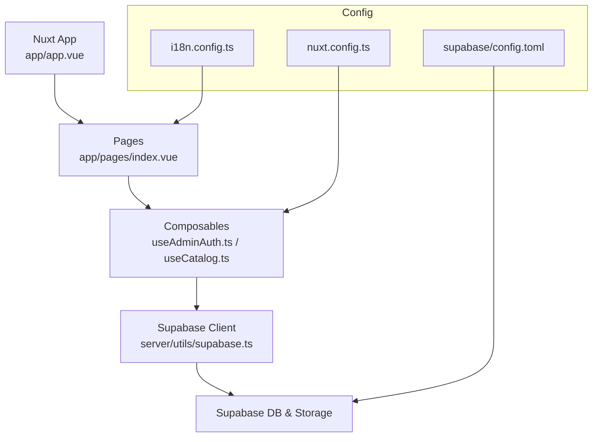
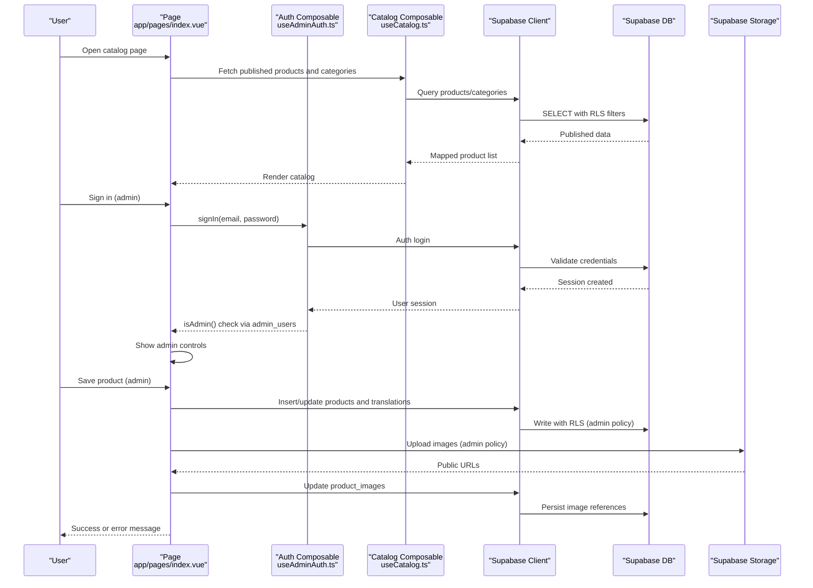
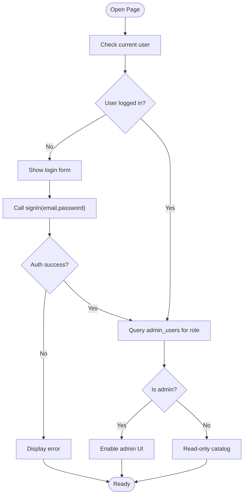
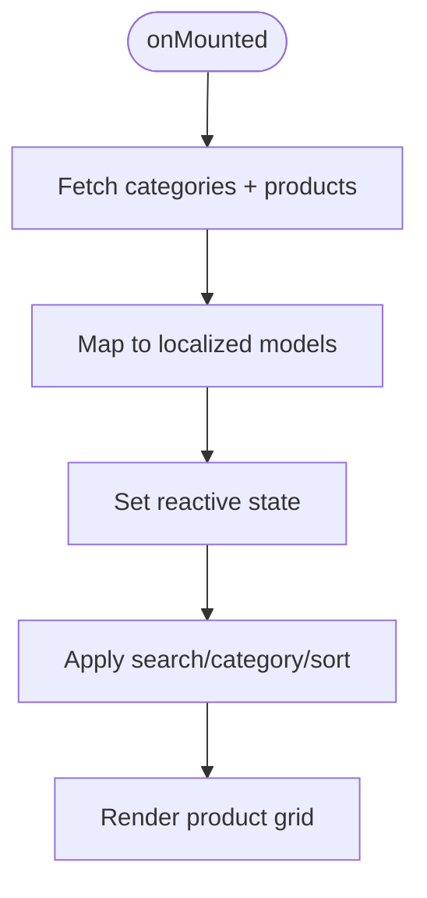
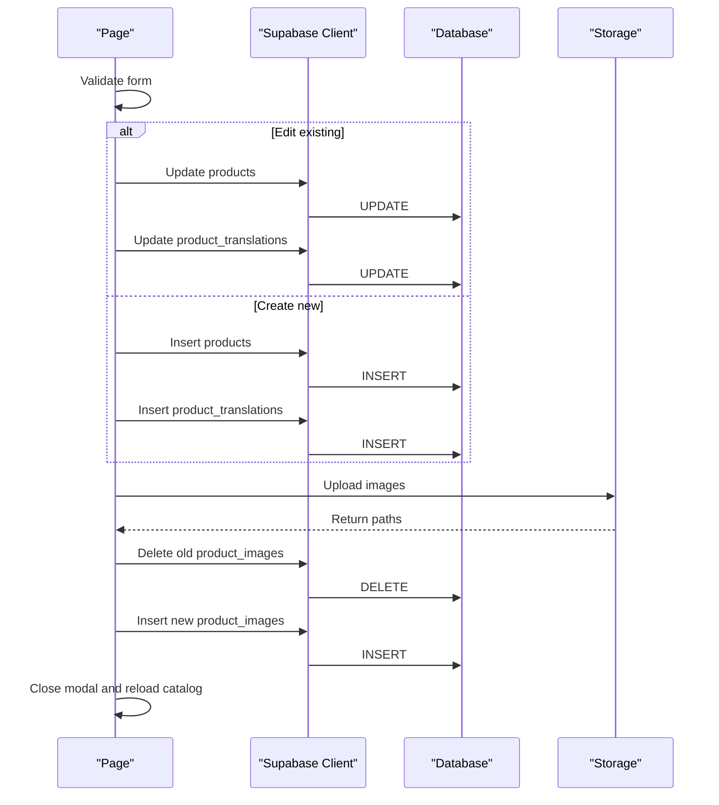
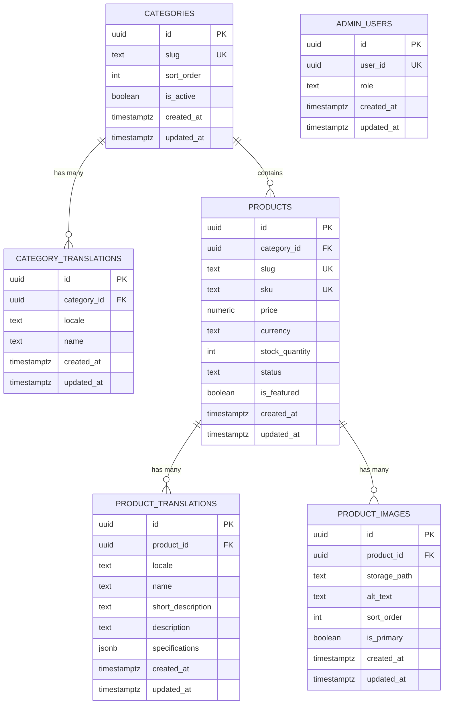
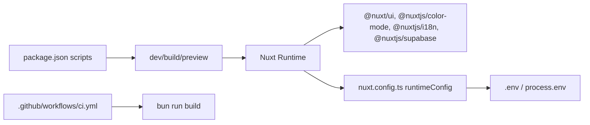

# Development Workflow

<cite>
**Referenced Files in This Document**
- [README.md](file://README.md)
- [package.json](file://package.json)
- [nuxt.config.ts](file://nuxt.config.ts)
- [.github/workflows/ci.yml](file://.github/workflows/ci.yml)
- [app/app.vue](file://app/app.vue)
- [app/pages/index.vue](file://app/pages/index.vue)
- [app/composables/useAdminAuth.ts](file://app/composables/useAdminAuth.ts)
- [app/composables/useCatalog.ts](file://app/composables/useCatalog.ts)
- [server/utils/supabase.ts](file://server/utils/supabase.ts)
- [supabase/config.toml](file://supabase/config.toml)
- [supabase/migrations/20260922_000001_create_catalog_schema.sql](file://supabase/migrations/20260922_000001_create_catalog_schema.sql)
- [supabase/migrations/20260922000002_storage_and_rls.sql](file://supabase/migrations/20260922000002_storage_and_rls.sql)
- [i18n.config.ts](file://i18n.config.ts)
</cite>

## Table of Contents
1. Introduction
2. Project Structure
3. Core Components
4. Architecture Overview
5. Detailed Component Analysis
6. Dependency Analysis
7. Performance Considerations
8. Troubleshooting Guide
9. Conclusion

## Introduction
This document describes the development workflow for a Nuxt 3 application that integrates Supabase for authentication, database, and storage. It explains how to set up the environment, run local development, build for production, and execute CI checks. It also maps the runtime data flow from UI components through composables to Supabase, including admin-only operations and catalog browsing.

## Project Structure
The project follows a standard Nuxt 3 layout:
- app/: Vue pages, components, composables, types, and middleware
- server/utils/: Server-side utilities (e.g., Supabase admin client)
- supabase/: Database migrations and local Supabase configuration
- i18n.config.ts: Internationalization messages
- nuxt.config.ts: Nuxt modules, runtime config, and feature flags
- package.json: Scripts and dependencies
- .github/workflows/ci.yml: GitHub Actions CI pipeline

**Diagram sources**
- [app/app.vue:1-4](file://app/app.vue#L1-L4)
- [app/pages/index.vue:1-189](file://app/pages/index.vue#L1-L189)
- [app/composables/useAdminAuth.ts:1-79](file://app/composables/useAdminAuth.ts#L1-L79)
- [app/composables/useCatalog.ts:1-61](file://app/composables/useCatalog.ts#L1-L61)
- [server/utils/supabase.ts:1-20](file://server/utils/supabase.ts#L1-L20)
- [nuxt.config.ts:1-52](file://nuxt.config.ts#L1-L52)
- [i18n.config.ts:1-14](file://i18n.config.ts#L1-L14)
- [supabase/config.toml:1-32](file://supabase/config.toml#L1-L32)

**Section sources**
- [README.md:5-33](file://README.md#L5-L33)
- [package.json:5-11](file://package.json#L5-L11)
- [nuxt.config.ts:1-52](file://nuxt.config.ts#L1-L52)

## Core Components
- Nuxt entry and routing: app/app.vue renders NuxtPage; app/pages/index.vue hosts the main catalog view and admin editor modal.
- Admin authentication: app/composables/useAdminAuth.ts provides sign-in/sign-out and role checks against Supabase auth and admin_users table.
- Catalog data access: app/composables/useCatalog.ts fetches published products and categories with localization-aware mapping.
- Server-side Supabase client: server/utils/supabase.ts creates an admin client using runtime config values.
- Configuration: nuxt.config.ts wires modules, runtime config, Supabase client options, color mode, and i18n.
- Data schema and policies: supabase/migrations define tables, indexes, triggers, and Row Level Security policies for public read and admin write access.

Key responsibilities:
- Pages orchestrate UI state and user actions.
- Composables encapsulate business logic and data fetching.
- Migrations enforce data integrity and security at the database layer.
- Config centralizes environment-sensitive settings.

**Section sources**
- [app/pages/index.vue:1-189](file://app/pages/index.vue#L1-L189)
- [app/composables/useAdminAuth.ts:1-79](file://app/composables/useAdminAuth.ts#L1-L79)
- [app/composables/useCatalog.ts:1-61](file://app/composables/useCatalog.ts#L1-L61)
- [server/utils/supabase.ts:1-20](file://server/utils/supabase.ts#L1-L20)
- [nuxt.config.ts:1-52](file://nuxt.config.ts#L1-L52)
- [supabase/migrations/20260922_000001_create_catalog_schema.sql:1-113](file://supabase/migrations/20260922_000001_create_catalog_schema.sql#L1-L113)
- [supabase/migrations/20260922000002_storage_and_rls.sql:1-205](file://supabase/migrations/20260922000002_storage_and_rls.sql#L1-L205)

## Architecture Overview
The application uses a client-first approach with Supabase JS SDK for most operations, plus a server utility for privileged tasks. The UI composes reusable composables to handle auth and catalog queries. Database-level Row Level Security ensures only published content is visible publicly, while admins can manage records.

**Diagram sources**
- [app/pages/index.vue:101-189](file://app/pages/index.vue#L101-L189)
- [app/composables/useAdminAuth.ts:16-69](file://app/composables/useAdminAuth.ts#L16-L69)
- [app/composables/useCatalog.ts:37-57](file://app/composables/useCatalog.ts#L37-L57)
- [supabase/migrations/20260922000002_storage_and_rls.sql:11-38](file://supabase/migrations/20260922000002_storage_and_rls.sql#L11-L38)
- [supabase/migrations/20260922000002_storage_and_rls.sql:45-153](file://supabase/migrations/20260922000002_storage_and_rls.sql#L45-L153)
- [supabase/migrations/20260922000002_storage_and_rls.sql:162-205](file://supabase/migrations/20260922000002_storage_and_rls.sql#L162-L205)

## Detailed Component Analysis

### Authentication Flow (Admin Mode)
- Sign-in: The page invokes sign-in via the auth composable, which calls Supabase auth. On success, the session is established.
- Role check: isAdmin queries admin_users by current user id to determine if admin features should be shown.
- Logout: Clears the session and resets admin mode.

**Diagram sources**
- [app/composables/useAdminAuth.ts:16-69](file://app/composables/useAdminAuth.ts#L16-L69)
- [app/pages/index.vue:185-187](file://app/pages/index.vue#L185-L187)

**Section sources**
- [app/composables/useAdminAuth.ts:1-79](file://app/composables/useAdminAuth.ts#L1-L79)
- [app/pages/index.vue:185-187](file://app/pages/index.vue#L185-L187)

### Catalog Loading and Filtering
- Data fetch: The page loads categories and published products concurrently, then maps results into localized structures.
- Filtering and sorting: Client-side filtering by search text, category selection, and sort order (newest, price low/high, name).
- Image URLs: Public URLs are resolved via Supabase storage helper.

**Diagram sources**
- [index.vue:46-56](file://app/pages/index.vue#L46-L56)
- [app/pages/index.vue:46-68](file://app/pages/index.vue#L46-L68)
- [app/composables/useCatalog.ts:37-57](file://app/composables/useCatalog.ts#L37-L57)

**Section sources**
- [app/pages/index.vue:46-120](file://app/pages/index.vue#L46-L120)
- [app/composables/useCatalog.ts:1-61](file://app/composables/useCatalog.ts#L1-L61)

### Product Save Workflow (Admin Only)
- Validation: Ensures required fields like category are present.
- Upsert: Updates existing product or inserts new one, then writes translations.
- Images: Uploads selected files to storage, deletes previous images, and re-inserts updated image references.
- Refresh: Reloads catalog after successful save.

**Diagram sources**
- [app/pages/index.vue:134-172](file://app/pages/index.vue#L134-L172)

**Section sources**
- [app/pages/index.vue:134-172](file://app/pages/index.vue#L134-L172)

### Data Model and Security Policies
- Tables: categories, category_translations, products, product_translations, product_images, admin_users.
- Indexes: Optimized lookups on category_id, status, featured, locale, product_id, slug.
- Triggers: Auto-update timestamps on updates.
- RLS: Public read for active categories and published products; admin-only write across tables; storage bucket policies restrict uploads/updates/deletes to admins.

**Diagram sources**
- [supabase/migrations/20260922_000001_create_catalog_schema.sql:3-67](file://supabase/migrations/20260922_000001_create_catalog_schema.sql#L3-L67)
- [supabase/migrations/20260922_000001_create_catalog_schema.sql:69-113](file://supabase/migrations/20260922_000001_create_catalog_schema.sql#L69-L113)
- [supabase/migrations/20260922000002_storage_and_rls.sql:1-160](file://supabase/migrations/20260922000002_storage_and_rls.sql#L1-L160)

**Section sources**
- [supabase/migrations/20260922_000001_create_catalog_schema.sql:1-113](file://supabase/migrations/20260922_000001_create_catalog_schema.sql#L1-L113)
- [supabase/migrations/20260922000002_storage_and_rls.sql:1-205](file://supabase/migrations/20260922000002_storage_and_rls.sql#L1-L205)

## Dependency Analysis
- Nuxt modules: UI, color mode, i18n, Supabase integration are configured centrally.
- Runtime config: Supabase URL and keys are provided via environment variables; service role key is server-only.
- CI: GitHub Actions installs dependencies with Bun and runs the build step.

**Diagram sources**
- [package.json:5-11](file://package.json#L5-L11)
- [nuxt.config.ts:9-26](file://nuxt.config.ts#L9-L26)
- [.github/workflows/ci.yml:1-26](file://.github/workflows/ci.yml#L1-L26)

**Section sources**
- [package.json:1-26](file://package.json#L1-L26)
- [nuxt.config.ts:1-52](file://nuxt.config.ts#L1-L52)
- [.github/workflows/ci.yml:1-26](file://.github/workflows/ci.yml#L1-L26)

## Performance Considerations
- Use concurrent queries for categories and products to reduce load time.
- Leverage database indexes on frequently filtered columns (category_id, status, locale).
- Keep client-side filtering minimal; rely on server-side RLS to limit returned rows.
- Avoid unnecessary re-renders by memoizing computed lists where appropriate.
- Optimize image handling by uploading once and updating references efficiently.

[No sources needed since this section provides general guidance]

## Troubleshooting Guide
Common issues and resolutions:
- Missing Supabase configuration: Ensure NUXT_PUBLIC_SUPABASE_URL, NUXT_PUBLIC_SUPABASE_ANON_KEY, and SUPABASE_SERVICE_ROLE_KEY are set. The server utility validates these and throws an error if missing.
- Admin access denied: Verify the user exists in admin_users and has the correct role. RLS policies restrict writes to admins.
- Storage upload failures: Confirm the product-images bucket exists and policies allow authenticated admins to upload.
- Catalog not loading: Check network errors and ensure published products exist; RLS hides non-published items.

Operational tips:
- Use browser dev tools to inspect Supabase client requests and responses.
- Review console logs for auth and query errors surfaced by composables.
- Validate migrations locally with the Supabase CLI before pushing changes.

**Section sources**
- [server/utils/supabase.ts:3-11](file://server/utils/supabase.ts#L3-L11)
- [supabase/migrations/20260922000002_storage_and_rls.sql:162-205](file://supabase/migrations/20260922000002_storage_and_rls.sql#L162-L205)
- [app/composables/useAdminAuth.ts:22-34](file://app/composables/useAdminAuth.ts#L22-L34)

## Conclusion
This workflow combines a Nuxt frontend with Supabase-backed authentication, database, and storage. The design emphasizes clear separation between UI, composables, and data policies, enabling safe public reads and controlled admin writes. Follow the setup steps, run the development server, and use CI to validate builds. Apply migrations carefully and rely on RLS to maintain data integrity and security.