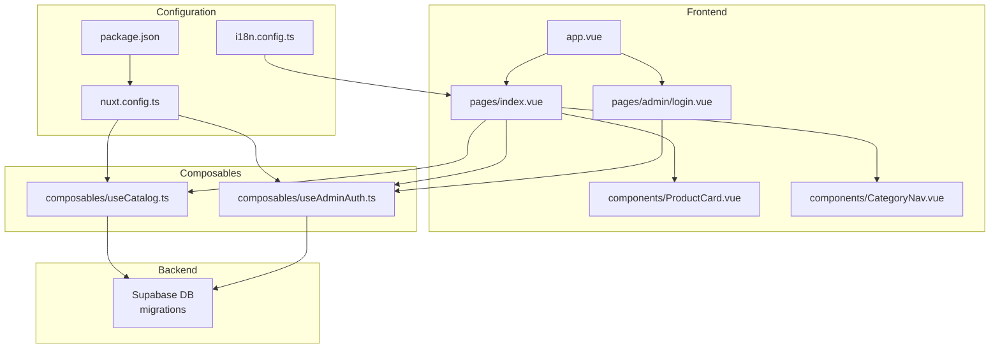
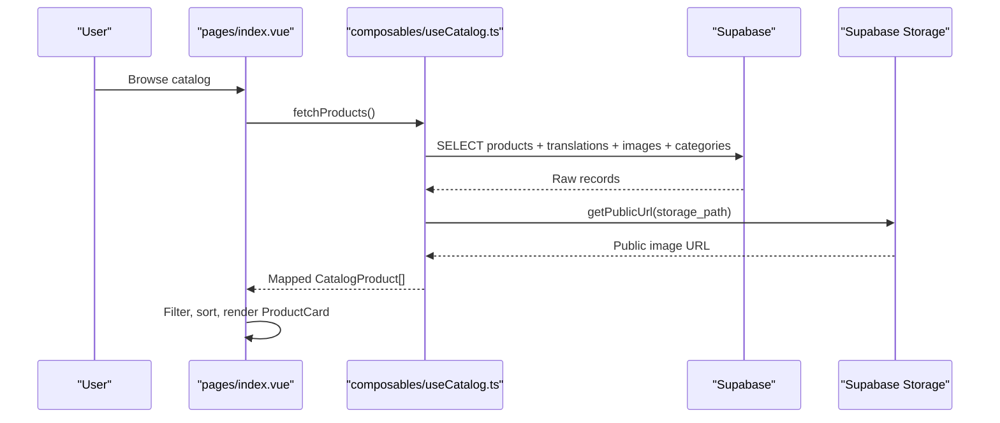
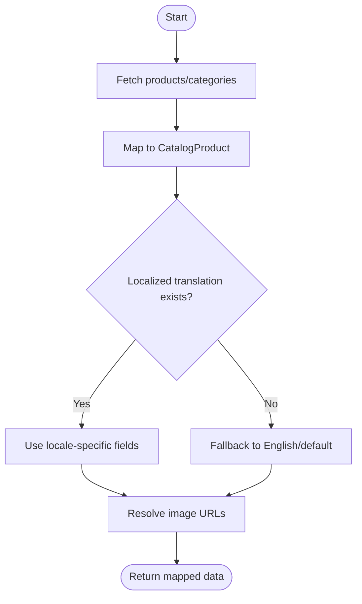
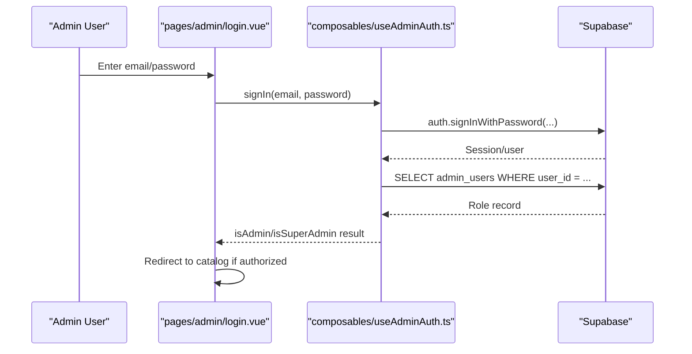
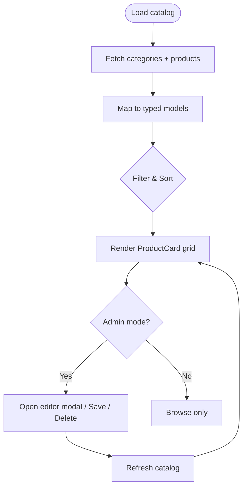
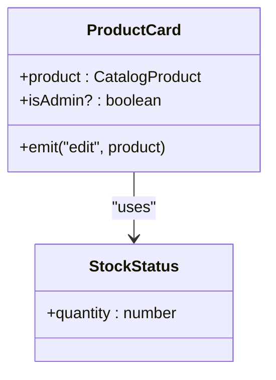
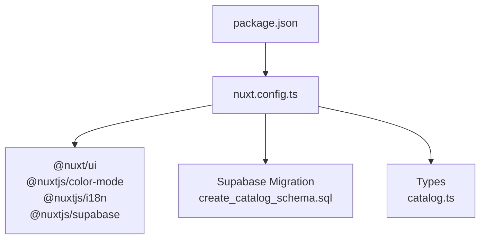

# Project Overview

<cite>
**Referenced Files in This Document**
- [README.md](file://README.md)
- [package.json](file://package.json)
- [nuxt.config.ts](file://nuxt.config.ts)
- [i18n.config.ts](file://i18n.config.ts)
- [app.vue](file://app/app.vue)
- [useCatalog.ts](file://app/composables/useCatalog.ts)
- [useAdminAuth.ts](file://app/composables/useAdminAuth.ts)
- [index.vue](file://app/pages/index.vue)
- [login.vue](file://app/pages/admin/login.vue)
- [catalog.ts](file://app/types/catalog.ts)
- [20260922_000001_create_catalog_schema.sql](file://supabase/migrations/20260922_000001_create_catalog_schema.sql)
</cite>

## Table of Contents
1. [Introduction](#introduction)
2. [Project Structure](#project-structure)
3. [Core Components](#core-components)
4. [Architecture Overview](#architecture-overview)
5. [Detailed Component Analysis](#detailed-component-analysis)
6. [Dependency Analysis](#dependency-analysis)
7. [Performance Considerations](#performance-considerations)
8. [Troubleshooting Guide](#troubleshooting-guide)
9. [Conclusion](#conclusion)

## Introduction
Raccoon-Gear-Bin is a modern e-commerce catalog application for gaming accessories, designed to showcase products and provide an admin interface for managing inventory and content. It emphasizes internationalization, responsive design, and real-time operational clarity through clear stock status indicators. The app is built on Nuxt.js with Vue 3 and TypeScript, styled with Tailwind CSS, and backed by Supabase for data, authentication, and storage.

Conceptually, the application serves two primary roles:
- Catalog browsing: Visitors explore products by category, search, sort, and view details.
- Admin management: Authorized users can add, edit, delete products, manage images, and control visibility via product status.

Key features include:
- Internationalization (i18n) supporting English and Khmer, with locale-aware translations for categories and product content.
- Real-time inventory tracking at the UI level via stock quantity and computed stock status components.
- Responsive layout that adapts from mobile to desktop, including adaptive navigation and grid layouts.
- Secure admin access using Supabase Auth and role checks against an admin_users table.

Practical use cases:
- Browsing products: Filter by category, search by name/SKU/description, sort by newest or price, and view product cards with pricing and stock status.
- Managing inventory: In admin mode, add new products, update descriptions/specifications, set prices and stock quantities, and upload images.
- Administrative operations: Sign in via the admin login page, confirm admin privileges, save changes, and delete products with confirmation dialogs.

**Section sources**
- [README.md:1-36](file://README.md#L1-L36)
- [package.json:1-26](file://package.json#L1-L26)
- [nuxt.config.ts:1-52](file://nuxt.config.ts#L1-L52)
- [i18n.config.ts:1-14](file://i18n.config.ts#L1-L14)

## Project Structure
The project follows a Nuxt 3 modular structure:
- Pages define routes and orchestrate data loading and user interactions.
- Composables encapsulate reusable logic such as catalog fetching and admin authentication.
- Components render UI elements like product cards and category navigation.
- Types define shared interfaces for catalog entities and database schemas.
- Supabase migrations define the relational schema and constraints.
- Configuration files set up modules, i18n, color mode, and runtime environment variables.

**Diagram sources**
- [app.vue:1-4](file://app/app.vue#L1-L4)
- [index.vue:1-403](file://app/pages/index.vue#L1-L403)
- [login.vue:1-121](file://app/pages/admin/login.vue#L1-L121)
- [ProductCard.vue:1-68](file://app/components/ProductCard.vue#L1-L68)
- [CategoryNav.vue:1-37](file://app/components/CategoryNav.vue#L1-L37)
- [useCatalog.ts:1-61](file://app/composables/useCatalog.ts#L1-L61)
- [useAdminAuth.ts:1-79](file://app/composables/useAdminAuth.ts#L1-L79)
- [nuxt.config.ts:1-52](file://nuxt.config.ts#L1-L52)
- [i18n.config.ts:1-14](file://i18n.config.ts#L1-L14)
- [package.json:1-26](file://package.json#L1-L26)
- [20260922_000001_create_catalog_schema.sql:1-113](file://supabase/migrations/20260922_000001_create_catalog_schema.sql#L1-L113)

**Section sources**
- [app.vue:1-4](file://app/app.vue#L1-L4)
- [nuxt.config.ts:1-52](file://nuxt.config.ts#L1-L52)
- [i18n.config.ts:1-14](file://i18n.config.ts#L1-L14)
- [package.json:1-26](file://package.json#L1-L26)

## Core Components
This section highlights the core building blocks that power the catalog and admin experiences.

- Catalog composable: Encapsulates fetching published products, categories, and mapping them into typed catalog entities with localized names and image URLs. It also resolves public image URLs from Supabase storage.
- Admin auth composable: Provides sign-in/sign-out, current user retrieval, and role checks (admin/super_admin) by querying the admin_users table.
- Catalog pages: The main index page orchestrates product listing, filtering, sorting, and admin editing workflows; the admin login page handles authentication and authorization before granting access to admin features.
- UI components: ProductCard displays product imagery, pricing, and stock status; CategoryNav provides responsive category selection.

These components work together to deliver a cohesive catalog experience with robust admin capabilities.

**Section sources**
- [useCatalog.ts:1-61](file://app/composables/useCatalog.ts#L1-L61)
- [useAdminAuth.ts:1-79](file://app/composables/useAdminAuth.ts#L1-L79)
- [index.vue:1-403](file://app/pages/index.vue#L1-L403)
- [login.vue:1-121](file://app/pages/admin/login.vue#L1-L121)
- [ProductCard.vue:1-68](file://app/components/ProductCard.vue#L1-L68)
- [CategoryNav.vue:1-37](file://app/components/CategoryNav.vue#L1-L37)

## Architecture Overview
Raccoon-Gear-Bin uses a client-side-first architecture powered by Nuxt.js and Vue 3, with Supabase providing the database, authentication, and storage services. The configuration enables i18n, color mode, and Supabase integration. Data flows from Supabase into composables, which transform raw records into domain models used by pages and components.

**Diagram sources**
- [index.vue:46-56](file://app/pages/index.vue#L46-L56)
- [useCatalog.ts:37-47](file://app/composables/useCatalog.ts#L37-L47)
- [useCatalog.ts:8-11](file://app/composables/useCatalog.ts#L8-L11)

**Section sources**
- [nuxt.config.ts:1-52](file://nuxt.config.ts#L1-L52)
- [i18n.config.ts:1-14](file://i18n.config.ts#L1-L14)
- [package.json:1-26](file://package.json#L1-L26)

## Detailed Component Analysis

### Catalog Composable (useCatalog)
The catalog composable centralizes data fetching and transformation:
- Fetches published products with related translations, images, and categories.
- Resolves localized names based on the current locale, falling back to English when necessary.
- Maps storage paths to public URLs via Supabase storage.
- Exposes functions for fetching all products, a single product, and active categories.

**Diagram sources**
- [useCatalog.ts:13-33](file://app/composables/useCatalog.ts#L13-L33)
- [useCatalog.ts:37-57](file://app/composables/useCatalog.ts#L37-L57)

**Section sources**
- [useCatalog.ts:1-61](file://app/composables/useCatalog.ts#L1-L61)

### Admin Authentication (useAdminAuth)
The admin auth composable manages authentication and authorization:
- Retrieves the current user and checks admin privileges by querying admin_users.
- Supports sign-in/sign-out flows using Supabase Auth.
- Provides helpers to determine admin vs super_admin roles.

**Diagram sources**
- [login.vue:15-54](file://app/pages/admin/login.vue#L15-L54)
- [useAdminAuth.ts:16-34](file://app/composables/useAdminAuth.ts#L16-L34)
- [useAdminAuth.ts:56-69](file://app/composables/useAdminAuth.ts#L56-L69)

**Section sources**
- [useAdminAuth.ts:1-79](file://app/composables/useAdminAuth.ts#L1-L79)
- [login.vue:1-121](file://app/pages/admin/login.vue#L1-L121)

### Main Catalog Page (pages/index.vue)
The main page orchestrates:
- Loading categories and published products concurrently.
- Filtering by category and search query, and sorting by newest, price, or name.
- Rendering product cards with stock status and detail links.
- Admin mode actions: adding/editing products, uploading images, deleting products, and confirming destructive actions.

**Diagram sources**
- [index.vue:46-56](file://app/pages/index.vue#L46-L56)
- [index.vue:46-63](file://app/pages/index.vue#L46-L63)
- [index.vue:134-183](file://app/pages/index.vue#L134-L183)

**Section sources**
- [index.vue:1-403](file://app/pages/index.vue#L1-L403)

### Product Card Component (ProductCard.vue)
The product card component:
- Displays product image, category label, name, short description, and price.
- Shows stock status via a dedicated component.
- Provides an edit button in admin mode to trigger editing workflows.

**Diagram sources**
- [ProductCard.vue:1-68](file://app/components/ProductCard.vue#L1-L68)

**Section sources**
- [ProductCard.vue:1-68](file://app/components/ProductCard.vue#L1-L68)

### Category Navigation (CategoryNav.vue)
The category navigation component:
- Renders desktop vertical navigation and mobile bottom bar.
- Emits updates to the selected category, enabling filtering on the catalog page.

**Section sources**
- [CategoryNav.vue:1-37](file://app/components/CategoryNav.vue#L1-L37)

## Dependency Analysis
The application’s dependencies are configured via package.json and nuxt.config.ts, integrating Nuxt modules for UI, color mode, i18n, and Supabase. The Supabase migration defines the relational schema and constraints that underpin the catalog and admin features.

**Diagram sources**
- [package.json:1-26](file://package.json#L1-L26)
- [nuxt.config.ts:1-52](file://nuxt.config.ts#L1-L52)
- [20260922_000001_create_catalog_schema.sql:1-113](file://supabase/migrations/20260922_000001_create_catalog_schema.sql#L1-L113)
- [catalog.ts:1-31](file://app/types/catalog.ts#L1-L31)

**Section sources**
- [package.json:1-26](file://package.json#L1-L26)
- [nuxt.config.ts:1-52](file://nuxt.config.ts#L1-L52)
- [20260922_000001_create_catalog_schema.sql:1-113](file://supabase/migrations/20260922_000001_create_catalog_schema.sql#L1-L113)
- [catalog.ts:1-31](file://app/types/catalog.ts#L1-L31)

## Performance Considerations
- Concurrent data loading: The main catalog page fetches categories and products in parallel to reduce load time.
- Selective queries: Queries target only needed fields and filter by status to minimize payload size.
- Image handling: Public URLs are resolved per image path; consider caching strategies for frequently accessed images.
- Sorting and filtering: Client-side sorting and filtering are efficient for moderate datasets; for large catalogs, consider server-side pagination and indexing.
- Database indexes: The migration includes indexes on common query columns (category_id, status, locale, product_id), improving query performance.

[No sources needed since this section provides general guidance]

## Troubleshooting Guide
Common issues and resolutions:
- Catalog load errors: If fetching products or categories fails, check network connectivity and Supabase configuration values in runtime config.
- Admin login failures: Ensure credentials are correct and the user has an entry in admin_users; unauthorized accounts are redirected and shown an error message.
- Product save/delete errors: Validate required fields (category, SKU, slug, price, stock) and ensure storage permissions allow uploads; review error messages surfaced in the UI.
- Image URL resolution: Verify storage bucket name and paths; ensure public URLs are generated correctly for both HTTP(S) and Supabase storage paths.

Operational tips:
- Use the admin mode indicator to verify privileges before performing edits.
- Confirm deletions via the confirmation dialog to prevent accidental data loss.
- Inspect console logs for detailed error traces during development.

**Section sources**
- [index.vue:117-120](file://app/pages/index.vue#L117-L120)
- [index.vue:134-183](file://app/pages/index.vue#L134-L183)
- [login.vue:15-54](file://app/pages/admin/login.vue#L15-L54)

## Conclusion
Raccoon-Gear-Bin delivers a polished, internationalized catalog for gaming accessories with a secure admin interface for inventory management. Built on Nuxt.js, Vue 3, TypeScript, Tailwind CSS, and Supabase, it balances simplicity for beginners with robust architecture for experienced developers. The modular structure, clear separation of concerns, and thoughtful UX patterns make it easy to extend and maintain while providing a strong foundation for future enhancements such as advanced search, analytics, and expanded admin roles.

[No sources needed since this section summarizes without analyzing specific files]