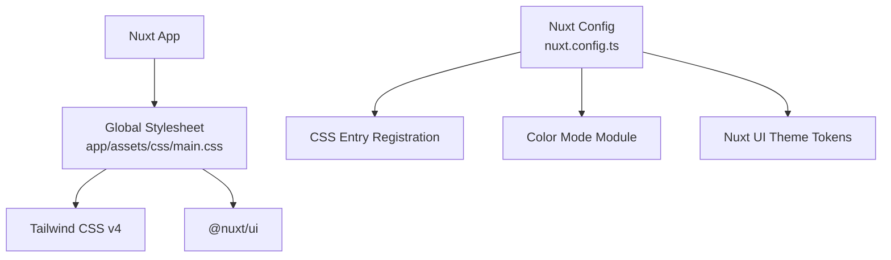
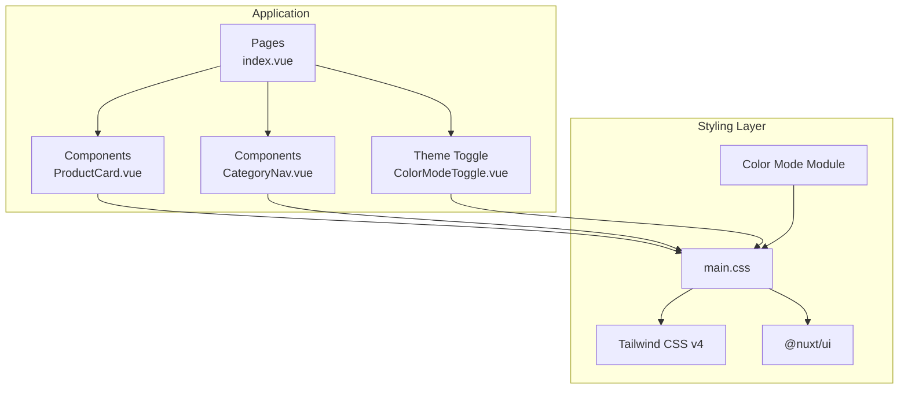
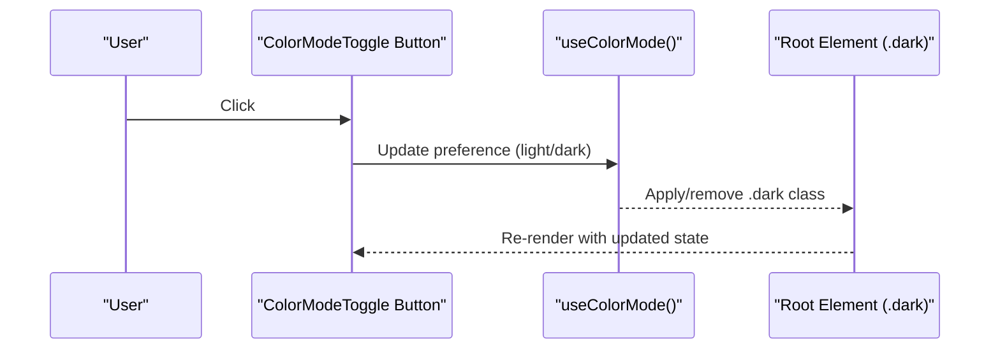
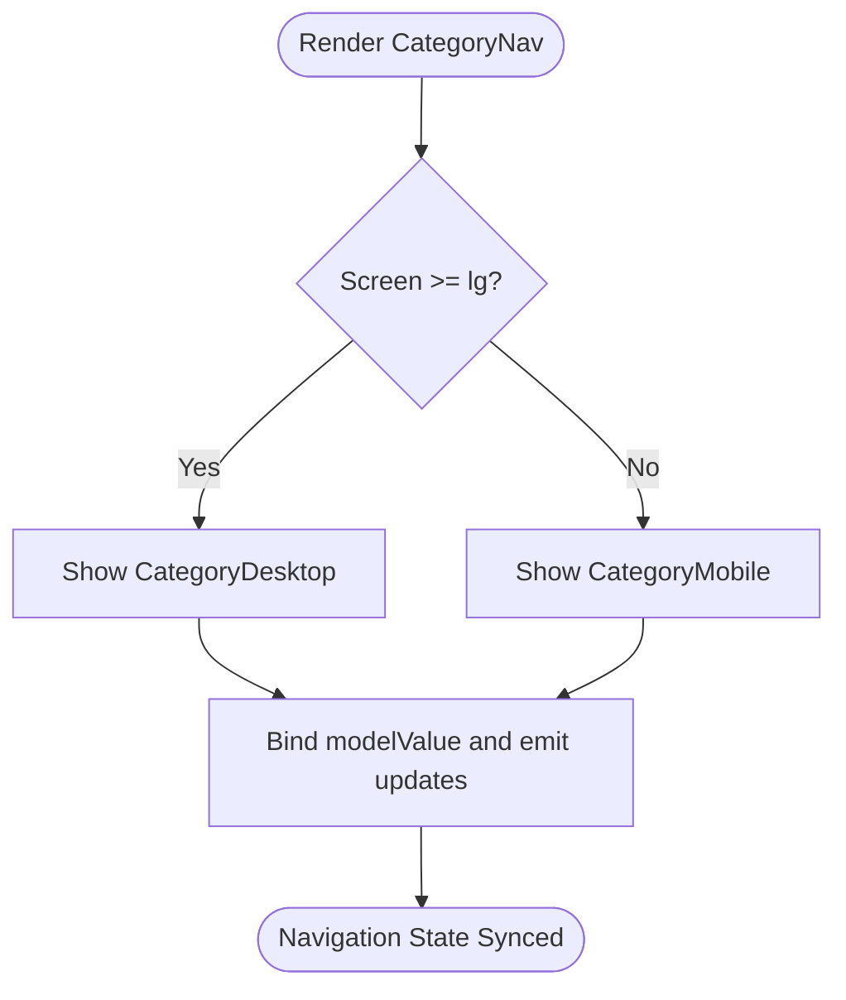
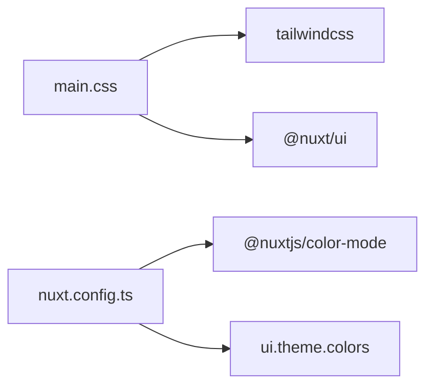

# Styling & Theming

<cite>
**Referenced Files in This Document**
- [main.css](file://app/assets/css/main.css)
- [nuxt.config.ts](file://nuxt.config.ts)
- [ColorModeToggle.vue](file://app/components/ColorModeToggle.vue)
- [ProductCard.vue](file://app/components/ProductCard.vue)
- [CategoryNav.vue](file://app/components/CategoryNav.vue)
- [index.vue](file://app/pages/index.vue)
- [package.json](file://package.json)
</cite>

## Table of Contents
1. [Introduction](#introduction)
2. [Project Structure](#project-structure)
3. [Core Components](#core-components)
4. [Architecture Overview](#architecture-overview)
5. [Detailed Component Analysis](#detailed-component-analysis)
6. [Dependency Analysis](#dependency-analysis)
7. [Performance Considerations](#performance-considerations)
8. [Troubleshooting Guide](#troubleshooting-guide)
9. [Conclusion](#conclusion)

## Introduction
This document explains the styling and theming system for a Nuxt 4 application using Tailwind CSS v4, Nuxt UI, and the color-mode module. It covers the CSS architecture, custom theme configuration, dark mode implementation, responsive design patterns, and performance considerations. It also documents the ColorModeToggle component and how it manages theme switching across the application.

## Project Structure
The styling setup is centered around a single global stylesheet that imports Tailwind and Nuxt UI, defines a static theme token, and adds application-wide styles such as dark mode backgrounds, selection colors, scroll behavior, and animations. The Nuxt configuration registers this stylesheet, enables the color-mode module with a class-based approach, and configures Nuxt UI’s theme tokens.

**Diagram sources**
- [main.css:1-6](file://app/assets/css/main.css#L1-L6)
- [nuxt.config.ts:4-36](file://nuxt.config.ts#L4-L36)

**Section sources**
- [main.css:1-106](file://app/assets/css/main.css#L1-L106)
- [nuxt.config.ts:1-52](file://nuxt.config.ts#L1-L52)

## Core Components
- Global stylesheet: Imports Tailwind and Nuxt UI, defines a static font theme token, sets smooth scrolling, base body styles, dark mode overrides, selection colors, scrollbar suppression utilities, page transitions, and select dropdown animations.
- Nuxt configuration: Registers the global stylesheet, enables @nuxtjs/color-mode with class suffix disabled, prefers system theme with dark fallback, and configures Nuxt UI theme tokens.
- ColorModeToggle component: Provides a client-only button to toggle between light and dark modes, with accessible labels and icons.

Key responsibilities:
- Centralized theme entry point via main.css.
- Class-based dark mode toggling through the color-mode module.
- Responsive layouts built with Tailwind utility classes across components.

**Section sources**
- [main.css:1-106](file://app/assets/css/main.css#L1-L106)
- [nuxt.config.ts:4-36](file://nuxt.config.ts#L4-L36)
- [ColorModeToggle.vue:1-66](file://app/components/ColorModeToggle.vue#L1-L66)

## Architecture Overview
The styling architecture follows a minimal, composable pattern:
- Tailwind CSS v4 provides utility-first classes and a modern build pipeline.
- Nuxt UI contributes additional components and tokens.
- The color-mode module applies a .dark class on the root element when dark mode is active.
- Components use responsive breakpoints and dark variants consistently.

**Diagram sources**
- [index.vue:191-329](file://app/pages/index.vue#L191-L329)
- [ProductCard.vue:9-67](file://app/components/ProductCard.vue#L9-L67)
- [CategoryNav.vue:19-35](file://app/components/CategoryNav.vue#L19-L35)
- [ColorModeToggle.vue:11-64](file://app/components/ColorModeToggle.vue#L11-L64)
- [main.css:1-6](file://app/assets/css/main.css#L1-L6)

## Detailed Component Analysis

### ColorModeToggle Component
The ColorModeToggle component encapsulates theme switching logic and presentation:
- Uses the color-mode composable to read and update the current preference.
- Renders a button with accessible attributes (aria-label, title).
- Displays sun/moon SVG icons based on the current mode.
- Wraps content in ClientOnly to avoid SSR mismatch.

**Diagram sources**
- [ColorModeToggle.vue:1-66](file://app/components/ColorModeToggle.vue#L1-L66)

Implementation highlights:
- Computed state determines icon visibility and accessibility labels.
- Click handler flips the preference between light and dark.
- Fallback placeholder ensures layout stability during SSR.

**Section sources**
- [ColorModeToggle.vue:1-66](file://app/components/ColorModeToggle.vue#L1-L66)

### ProductCard Component
ProductCard demonstrates responsive design and consistent styling:
- Uses aspect-ratio and grid layouts to adapt from single-column to multi-column grids.
- Applies dark variants for borders, backgrounds, and text colors.
- Includes hover states and transitions for interactive elements.
- Integrates StockStatus and NuxtLink for navigation and status display.

Responsive patterns:
- Grid columns scale from 1 to 2 to 3 across breakpoints.
- Typography scales with sm:text-* utilities.
- Spacing and sizing adjust responsively.

Accessibility:
- Images include alt text.
- Interactive elements have aria-labels where appropriate.

**Section sources**
- [ProductCard.vue:1-68](file://app/components/ProductCard.vue#L1-L68)

### CategoryNav Component
CategoryNav coordinates two implementations:
- Desktop vertical navigation shown at lg and above.
- Mobile bottom bar handled by CategoryMobile.vue.

Breakpoint usage:
- Hidden on small screens; visible at lg breakpoint.
- Delegates mobile-specific behavior to CategoryMobile.vue.

**Diagram sources**
- [CategoryNav.vue:19-35](file://app/components/CategoryNav.vue#L19-L35)

**Section sources**
- [CategoryNav.vue:1-37](file://app/components/CategoryNav.vue#L1-L37)

### Index Page Layout
The index page showcases a comprehensive responsive layout:
- Header row with logo, theme toggle, language switcher, and admin controls.
- Hero section with responsive typography and spacing.
- Two-column layout on large screens: sticky category sidebar and product listing.
- Search and sort controls with responsive widths.
- Product grid adapting from 1 to 2 to 3 columns.

Responsive patterns:
- Flexbox and grid utilities manage layout shifts.
- Breakpoints: sm, md, lg, xl used for progressive enhancement.
- Sticky positioning for sidebar on larger screens.

Accessibility:
- Inputs have aria-labels and placeholders.
- Buttons include aria-labels and titles.
- Modal dialogs use role="dialog" and aria-modal.

**Section sources**
- [index.vue:191-329](file://app/pages/index.vue#L191-L329)

## Dependency Analysis
The styling dependencies are straightforward:
- Tailwind CSS v4 is imported via the global stylesheet.
- Nuxt UI is imported to leverage its components and tokens.
- The color-mode module integrates with the app to apply .dark class.

**Diagram sources**
- [main.css:1-2](file://app/assets/css/main.css#L1-L2)
- [nuxt.config.ts:4-31](file://nuxt.config.ts#L4-L31)

**Section sources**
- [package.json:12-24](file://package.json#L12-L24)
- [main.css:1-2](file://app/assets/css/main.css#L1-L2)
- [nuxt.config.ts:4-31](file://nuxt.config.ts#L4-L31)

## Performance Considerations
- CSS Bundle Size:
  - Tailwind CSS v4 uses a modern build pipeline that generates only used utilities, minimizing bundle size.
  - Importing only necessary modules (@nuxt/ui) helps keep the CSS footprint lean.
- Critical CSS Extraction:
  - The global stylesheet is registered in Nuxt config, ensuring critical styles are included early.
  - Keep essential base styles (fonts, background, selection) in main.css to reduce FOUC.
- Style Optimization:
  - Use utility classes directly in components to avoid redundant CSS.
  - Avoid heavy custom CSS; prefer Tailwind utilities for consistency and tree-shaking.
- Animations and Transitions:
  - Prefer transform and opacity for animations to leverage GPU acceleration.
  - Keep animation durations short (e.g., 180ms–300ms) for snappy interactions.

[No sources needed since this section provides general guidance]

## Troubleshooting Guide
Common styling issues and resolutions:
- Dark Mode Not Applying:
  - Ensure the color-mode module is configured with classSuffix disabled so .dark is applied to the root.
  - Verify that components use dark: variants correctly.
- Font Loading Issues:
  - Confirm fonts are declared in the theme token and body styles.
  - Use font-display strategies if needed to prevent invisible text during load.
- Scrollbar Visibility:
  - Use provided utility classes or custom rules to suppress scrollbars where appropriate.
- Select Dropdown Animation:
  - If dropdown animations appear abrupt, verify keyframes and transform origins as defined in main.css.
- Browser Compatibility:
  - View transitions and some modern features may not be supported in all browsers; provide graceful fallbacks.
  - Test on iOS Safari and Android Chrome for touch interactions and scroll behaviors.

**Section sources**
- [nuxt.config.ts:32-36](file://nuxt.config.ts#L32-L36)
- [main.css:8-37](file://app/assets/css/main.css#L8-L37)
- [main.css:39-49](file://app/assets/css/main.css#L39-L49)
- [main.css:51-105](file://app/assets/css/main.css#L51-L105)

## Conclusion
This project adopts a clean, utility-first styling approach with Tailwind CSS v4, enhanced by Nuxt UI and the color-mode module. The global stylesheet centralizes theme tokens and base styles, while components implement responsive layouts and dark mode variants consistently. The ColorModeToggle component provides an accessible way to switch themes. By leveraging Tailwind’s responsive utilities and keeping custom CSS minimal, the application maintains design consistency, performance, and accessibility across devices and browsers.

[No sources needed since this section summarizes without analyzing specific files]