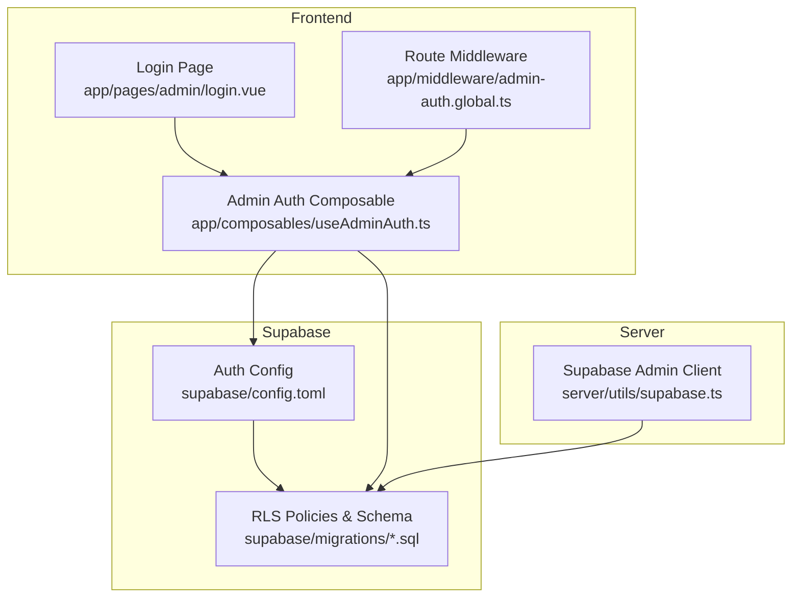
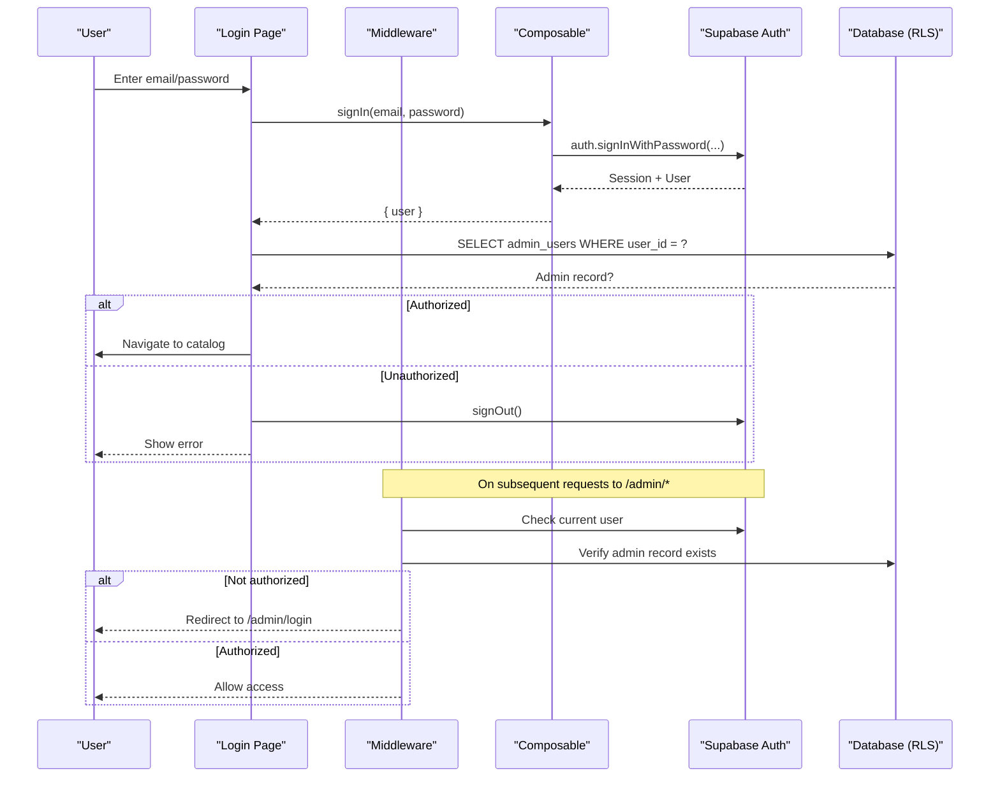
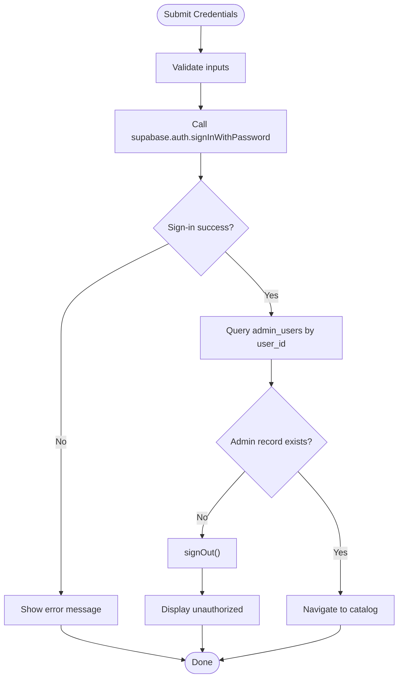
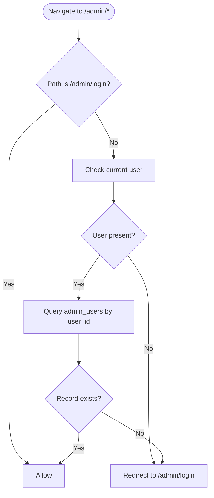
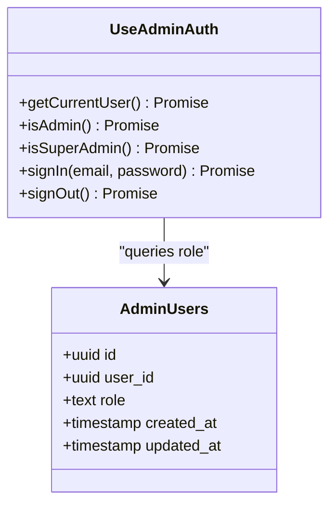
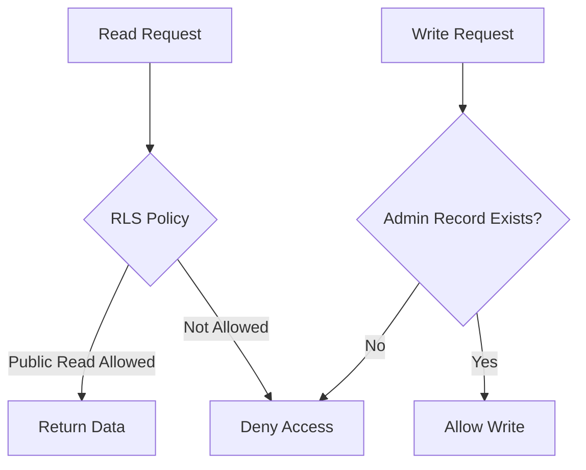
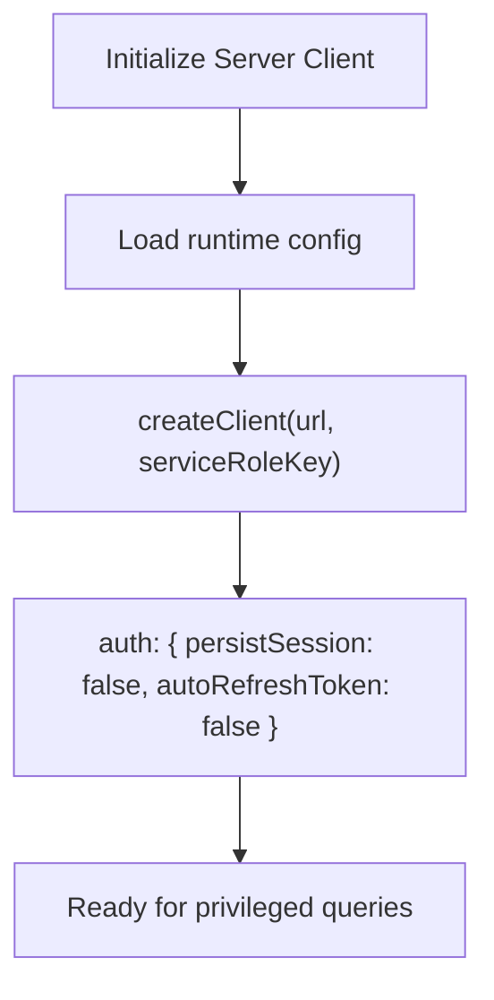
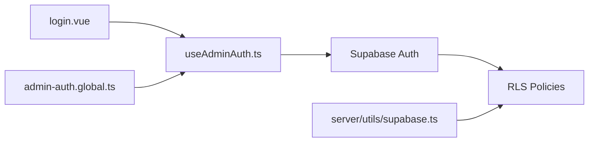

# Authentication Integration

<cite>
**Referenced Files in This Document**
- [README.md](file://README.md)
- [nuxt.config.ts](file://nuxt.config.ts)
- [useAdminAuth.ts](file://app/composables/useAdminAuth.ts)
- [admin-auth.global.ts](file://app/middleware/admin-auth.global.ts)
- [login.vue](file://app/pages/admin/login.vue)
- [supabase.ts](file://server/utils/supabase.ts)
- [config.toml](file://supabase/config.toml)
- [20260922_000001_create_catalog_schema.sql](file://supabase/migrations/20260922_000001_create_catalog_schema.sql)
- [20260922000002_storage_and_rls.sql](file://supabase/migrations/20260922000002_storage_and_rls.sql)
- [20260922073136_remove_recursive_admin_users_policy.sql](file://supabase/migrations/20260922073136_remove_recursive_admin_users_policy.sql)
</cite>

## Table of Contents
1. [Introduction](#introduction)
2. [Project Structure](#project-structure)
3. [Core Components](#core-components)
4. [Architecture Overview](#architecture-overview)
5. [Detailed Component Analysis](#detailed-component-analysis)
6. [Dependency Analysis](#dependency-analysis)
7. [Performance Considerations](#performance-considerations)
8. [Troubleshooting Guide](#troubleshooting-guide)
9. [Conclusion](#conclusion)
10. [Appendices](#appendices)

## Introduction
This document explains how Supabase authentication and session management are integrated into the application, focusing on user login flows, admin role management, permission handling via Row Level Security (RLS), protected routes, and session persistence. It also provides guidance for error handling, logout scenarios, token refresh behavior, security best practices, password policies, multi-factor authentication setup, integration with existing auth systems, and migration strategies.

## Project Structure
The authentication system spans client-side composables and middleware, server-side utilities, Supabase configuration, and database migrations that enforce permissions.

**Diagram sources**
- [login.vue:1-121](file://app/pages/admin/login.vue#L1-L121)
- [useAdminAuth.ts:1-79](file://app/composables/useAdminAuth.ts#L1-L79)
- [admin-auth.global.ts:1-28](file://app/middleware/admin-auth.global.ts#L1-L28)
- [supabase.ts:1-20](file://server/utils/supabase.ts#L1-L20)
- [config.toml:23-29](file://supabase/config.toml#L23-L29)
- [20260922000002_storage_and_rls.sql:1-205](file://supabase/migrations/20260922000002_storage_and_rls.sql#L1-L205)

**Section sources**
- [nuxt.config.ts:1-52](file://nuxt.config.ts#L1-L52)
- [config.toml:1-32](file://supabase/config.toml#L1-L32)

## Core Components
- Login page: Collects credentials, calls sign-in, validates admin record, and navigates on success or shows errors.
- Admin auth composable: Provides sign-in, sign-out, current user retrieval, and role checks against the admin_users table.
- Route middleware: Guards /admin/* routes by verifying authenticated user and admin record existence.
- Server-side admin client: Creates a Supabase client with service role key for privileged operations; disables session persistence and auto-refresh to avoid leaking tokens.
- Supabase config: Defines auth site URL and redirect URLs for local development.
- Database schema and RLS: Enforces role-based access at the database level for tables and storage buckets.

**Section sources**
- [login.vue:1-121](file://app/pages/admin/login.vue#L1-L121)
- [useAdminAuth.ts:1-79](file://app/composables/useAdminAuth.ts#L1-L79)
- [admin-auth.global.ts:1-28](file://app/middleware/admin-auth.global.ts#L1-L28)
- [supabase.ts:1-20](file://server/utils/supabase.ts#L1-L20)
- [config.toml:23-29](file://supabase/config.toml#L23-L29)
- [20260922_000001_create_catalog_schema.sql:61-67](file://supabase/migrations/20260922_000001_create_catalog_schema.sql#L61-L67)
- [20260922000002_storage_and_rls.sql:40-160](file://supabase/migrations/20260922000002_storage_and_rls.sql#L40-L160)

## Architecture Overview
The flow combines Nuxt route guards, Supabase Auth, and RLS to ensure only authorized users can access admin features.

**Diagram sources**
- [login.vue:15-54](file://app/pages/admin/login.vue#L15-L54)
- [useAdminAuth.ts:56-69](file://app/composables/useAdminAuth.ts#L56-L69)
- [admin-auth.global.ts:1-28](file://app/middleware/admin-auth.global.ts#L1-L28)
- [20260922000002_storage_and_rls.sql:40-160](file://supabase/migrations/20260922000002_storage_and_rls.sql#L40-L160)

## Detailed Component Analysis

### Login Flow and Session Handling
- The login page collects credentials, invokes the composable’s sign-in method, verifies an admin record exists, and navigates to the catalog on success. If no admin record is found, it signs out and displays an error.
- The composable uses Supabase Auth to sign in and exposes helpers to get the current user and check roles.
- The Nuxt Supabase module is configured to manage sessions via cookies with a defined lifetime and SameSite policy.

**Diagram sources**
- [login.vue:15-54](file://app/pages/admin/login.vue#L15-L54)
- [useAdminAuth.ts:56-69](file://app/composables/useAdminAuth.ts#L56-L69)

**Section sources**
- [login.vue:1-121](file://app/pages/admin/login.vue#L1-L121)
- [useAdminAuth.ts:1-79](file://app/composables/useAdminAuth.ts#L1-L79)
- [nuxt.config.ts:16-26](file://nuxt.config.ts#L16-L26)

### Protected Routes and Middleware
- The global middleware intercepts navigation to /admin/* paths, skipping the login page itself.
- It checks if a user is authenticated and whether an admin record exists for that user. If not, it redirects back to the login page.

**Diagram sources**
- [admin-auth.global.ts:1-28](file://app/middleware/admin-auth.global.ts#L1-L28)

**Section sources**
- [admin-auth.global.ts:1-28](file://app/middleware/admin-auth.global.ts#L1-L28)

### Role-Based Access Control (RBAC)
- Roles are stored in the admin_users table with values like admin and super_admin.
- The composable provides methods to check if the current user is an admin or a super admin by querying this table.
- Database-level RLS policies restrict data access based on the presence of an admin record and, for certain operations, require a super_admin role.

**Diagram sources**
- [useAdminAuth.ts:16-54](file://app/composables/useAdminAuth.ts#L16-L54)
- [20260922_000001_create_catalog_schema.sql:61-67](file://supabase/migrations/20260922_000001_create_catalog_schema.sql#L61-L67)

**Section sources**
- [useAdminAuth.ts:16-54](file://app/composables/useAdminAuth.ts#L16-L54)
- [20260922000002_storage_and_rls.sql:40-160](file://supabase/migrations/20260922000002_storage_and_rls.sql#L40-L160)

### Data Access and Storage Permissions
- Public read access is allowed for active categories, published products, and their translations/images.
- Admin write access is gated by the presence of an admin record.
- Storage bucket policies allow public reads for product images and restrict uploads/updates/deletes to admins.

**Diagram sources**
- [20260922000002_storage_and_rls.sql:1-160](file://supabase/migrations/20260922000002_storage_and_rls.sql#L1-L160)

**Section sources**
- [20260922000002_storage_and_rls.sql:1-205](file://supabase/migrations/20260922000002_storage_and_rls.sql#L1-L205)

### Server-Side Admin Client
- The server utility creates a Supabase client using the service role key, disabling session persistence and automatic token refresh to prevent sensitive tokens from being persisted in server contexts.

**Diagram sources**
- [supabase.ts:1-20](file://server/utils/supabase.ts#L1-L20)

**Section sources**
- [supabase.ts:1-20](file://server/utils/supabase.ts#L1-L20)

## Dependency Analysis
- Frontend components depend on the Supabase Nuxt module for auth state and client access.
- Middleware depends on the Supabase client to verify admin records.
- Composables encapsulate auth logic and role checks, abstracting direct client usage.
- Database policies enforce RBAC independently of frontend checks.

**Diagram sources**
- [login.vue:1-121](file://app/pages/admin/login.vue#L1-L121)
- [useAdminAuth.ts:1-79](file://app/composables/useAdminAuth.ts#L1-L79)
- [admin-auth.global.ts:1-28](file://app/middleware/admin-auth.global.ts#L1-L28)
- [supabase.ts:1-20](file://server/utils/supabase.ts#L1-L20)
- [20260922000002_storage_and_rls.sql:1-205](file://supabase/migrations/20260922000002_storage_and_rls.sql#L1-L205)

**Section sources**
- [nuxt.config.ts:1-52](file://nuxt.config.ts#L1-L52)
- [20260922000002_storage_and_rls.sql:1-205](file://supabase/migrations/20260922000002_storage_and_rls.sql#L1-L205)

## Performance Considerations
- Minimize redundant admin record lookups by caching results in composables when appropriate.
- Leverage RLS to offload authorization checks to the database layer, reducing client-side overhead.
- Avoid unnecessary network calls by batching queries where possible and reusing computed states.

[No sources needed since this section provides general guidance]

## Troubleshooting Guide
Common issues and resolutions:
- Missing environment variables: Ensure SUPABASE_SERVICE_ROLE_KEY and NUXT_PUBLIC_SUPABASE_URL are set. The server client will throw an error if these are missing.
- Redirect misconfiguration: Verify site_url and additional_redirect_urls in Supabase config match your app domain.
- Admin record not found: After successful sign-in, confirm an admin_users entry exists for the user; otherwise, sign out and show an error.
- Middleware redirect loops: Confirm the middleware skips /admin/login and correctly handles unauthenticated users.

**Section sources**
- [supabase.ts:3-11](file://server/utils/supabase.ts#L3-L11)
- [config.toml:23-29](file://supabase/config.toml#L23-L29)
- [login.vue:32-54](file://app/pages/admin/login.vue#L32-L54)
- [admin-auth.global.ts:1-28](file://app/middleware/admin-auth.global.ts#L1-L28)

## Conclusion
The application integrates Supabase authentication with robust role-based access control enforced both in the frontend middleware and through database RLS policies. Sessions are managed via cookies with configurable lifetimes, and server-side operations use a service role client without session persistence. The design ensures secure, maintainable admin access while providing clear error handling and straightforward migration paths for evolving requirements.

[No sources needed since this section summarizes without analyzing specific files]

## Appendices

### Security Best Practices
- Enforce strong password policies at the Supabase Auth level (e.g., minimum length, complexity).
- Enable multi-factor authentication (MFA) in Supabase settings for enhanced security.
- Restrict service role key usage to server-side code only; never expose it to the client.
- Keep RLS policies minimal and precise; prefer deny-by-default patterns.

[No sources needed since this section provides general guidance]

### Multi-Factor Authentication Setup
- Configure MFA providers in Supabase dashboard.
- Update login flows to handle MFA challenges and display appropriate UI feedback.

[No sources needed since this section provides general guidance]

### Integration with Existing Authentication Systems
- Use Supabase Auth’s built-in providers (OAuth, SSO) to integrate with identity providers.
- Map external user identities to admin_users records to enable RBAC.

[No sources needed since this section provides general guidance]

### Migration Strategies
- Add new roles or fields incrementally via migrations.
- Backfill data safely and test RLS policies thoroughly before enabling them in production.

[No sources needed since this section provides general guidance]