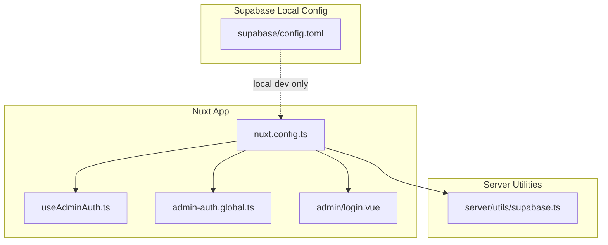
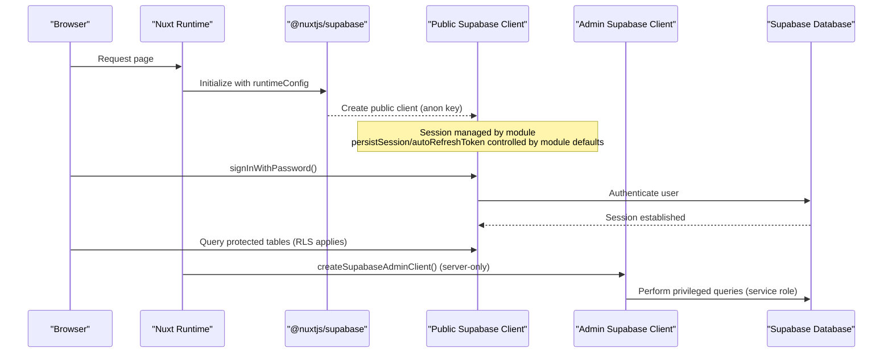
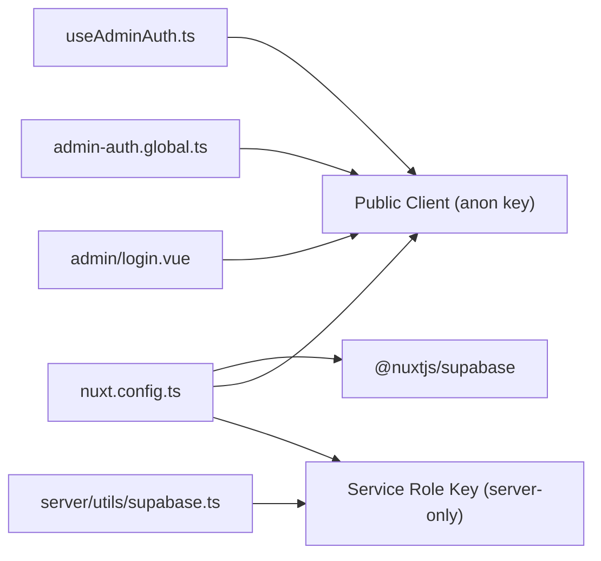

# Client Configuration & Setup

<cite>
**Referenced Files in This Document**
- [server/utils/supabase.ts](file://server/utils/supabase.ts)
- [nuxt.config.ts](file://nuxt.config.ts)
- [app/composables/useAdminAuth.ts](file://app/composables/useAdminAuth.ts)
- [app/middleware/admin-auth.global.ts](file://app/middleware/admin-auth.global.ts)
- [app/pages/admin/login.vue](file://app/pages/admin/login.vue)
- [supabase/config.toml](file://supabase/config.toml)
</cite>

## Table of Contents
1. [Introduction](#introduction)
2. [Project Structure](#project-structure)
3. [Core Components](#core-components)
4. [Architecture Overview](#architecture-overview)
5. [Detailed Component Analysis](#detailed-component-analysis)
6. [Dependency Analysis](#dependency-analysis)
7. [Performance Considerations](#performance-considerations)
8. [Troubleshooting Guide](#troubleshooting-guide)
9. [Conclusion](#conclusion)

## Introduction
This document explains how the application configures and initializes the Supabase client, manages environment variables, sets up authentication, and handles connection-related concerns. It covers both server-side and client-side configuration, including best practices for secure credential handling, development versus production setups, and troubleshooting common issues.

## Project Structure
The Supabase integration spans several layers:
- Nuxt configuration defines runtime configuration and the Supabase module settings.
- A server utility creates a privileged admin client using the service role key.
- Composables and middleware use the public client for user authentication and authorization checks.
- The local Supabase configuration file controls local development services.

**Diagram sources**
- [nuxt.config.ts:1-52](file://nuxt.config.ts#L1-L52)
- [server/utils/supabase.ts:1-20](file://server/utils/supabase.ts#L1-L20)
- [app/composables/useAdminAuth.ts:1-79](file://app/composables/useAdminAuth.ts#L1-L79)
- [app/middleware/admin-auth.global.ts:1-28](file://app/middleware/admin-auth.global.ts#L1-L28)
- [app/pages/admin/login.vue:1-121](file://app/pages/admin/login.vue#L1-L121)
- [supabase/config.toml:1-32](file://supabase/config.toml#L1-L32)

**Section sources**
- [nuxt.config.ts:1-52](file://nuxt.config.ts#L1-L52)
- [supabase/config.toml:1-32](file://supabase/config.toml#L1-L32)

## Core Components
- Nuxt runtime configuration exposes public and private keys to different layers.
- The Supabase module is configured with URL, anon key, and optional service key.
- Server-side admin client creation validates required configuration and disables session persistence/refresh for privileged operations.
- Client-side auth composable provides sign-in/sign-out and role checks against the database.
- Global middleware protects admin routes by verifying user identity and admin privileges.

Key responsibilities:
- Environment-driven configuration via Nuxt runtimeConfig.
- Secure separation between public (anon) and private (service role) clients.
- Authentication flow and authorization checks on both client and server sides.

**Section sources**
- [nuxt.config.ts:9-26](file://nuxt.config.ts#L9-L26)
- [server/utils/supabase.ts:3-19](file://server/utils/supabase.ts#L3-L19)
- [app/composables/useAdminAuth.ts:3-77](file://app/composables/useAdminAuth.ts#L3-L77)
- [app/middleware/admin-auth.global.ts:1-27](file://app/middleware/admin-auth.global.ts#L1-L27)

## Architecture Overview
The application uses two Supabase clients:
- Public client: used by the browser and server composables for authenticated requests with RLS policies.
- Admin client: created server-side with the service role key to bypass RLS when necessary.

**Diagram sources**
- [nuxt.config.ts:8-26](file://nuxt.config.ts#L8-L26)
- [server/utils/supabase.ts:3-19](file://server/utils/supabase.ts#L3-L19)
- [app/composables/useAdminAuth.ts:56-69](file://app/composables/useAdminAuth.ts#L56-L69)

## Detailed Component Analysis

### Nuxt Configuration and Environment Variables
- Runtime configuration:
  - Private key: `supabaseServiceRoleKey` sourced from `SUPABASE_SERVICE_ROLE_KEY`.
  - Public keys: `public.supabaseUrl` and `public.supabaseKey` sourced from `NUXT_PUBLIC_SUPABASE_URL` and `NUXT_PUBLIC_SUPABASE_ANON_KEY`, with safe fallbacks for development.
- Supabase module options:
  - `url` and `key` define the public client’s endpoint and anon key.
  - `serviceKey` enables server-side access with the service role key.
  - Cookie options configure session cookie name, lifetime, and SameSite policy.

Environment variable mapping:
- `SUPABASE_SERVICE_ROLE_KEY`: Server-only secret for privileged operations.
- `NUXT_PUBLIC_SUPABASE_URL`: Public project URL exposed to the client.
- `NUXT_PUBLIC_SUPABASE_ANON_KEY`: Public anon key exposed to the client.

Security notes:
- Never commit secrets; rely on environment injection at runtime.
- Use distinct values per environment (development, staging, production).
- Avoid exposing the service role key to the browser.

**Section sources**
- [nuxt.config.ts:9-26](file://nuxt.config.ts#L9-L26)

### Server-Side Admin Client Creation
- Validates that both URL and service role key are present before creating the client.
- Disables session persistence and token refresh since this is a server-side privileged client.
- Throws an explicit error if configuration is missing, aiding early failure detection.

Operational guidance:
- Ensure `SUPABASE_SERVICE_ROLE_KEY` is set in all server environments.
- Prefer using this client only where RLS cannot enforce security.

**Section sources**
- [server/utils/supabase.ts:3-19](file://server/utils/supabase.ts#L3-L19)

### Client-Side Authentication and Authorization
- Auth composable:
  - Retrieves current user via Supabase auth API.
  - Checks admin roles by querying the `admin_users` table.
  - Provides sign-in and sign-out methods.
- Global middleware:
  - Guards `/admin/*` routes, redirecting unauthenticated or unauthorized users to login.
  - Performs an authorization lookup against `admin_users`.

Error handling:
- Logs errors during authorization checks.
- Returns safe defaults (e.g., not admin) on failures to avoid unintended access.

Best practices:
- Combine client-side checks with server-side enforcement (RLS + service role usage).
- Keep role checks consistent across composables and middleware.

**Section sources**
- [app/composables/useAdminAuth.ts:3-77](file://app/composables/useAdminAuth.ts#L3-L77)
- [app/middleware/admin-auth.global.ts:1-27](file://app/middleware/admin-auth.global.ts#L1-L27)

### Login Page Flow
- Collects email and password, validates presence, and calls the auth composable.
- After successful sign-in, verifies admin record existence.
- On failure, signs out and displays an error message.

User experience:
- Shows loading state while submitting.
- Displays localized error messages.

**Section sources**
- [app/pages/admin/login.vue:15-54](file://app/pages/admin/login.vue#L15-L54)

### Local Supabase Configuration
- Defines ports for API, database, Studio, and shadow DB.
- Sets storage limits and auth site URLs for local development.
- Enables email provider for local testing.

Development tips:
- Align `auth.site_url` and `additional_redirect_urls` with your local frontend URL.
- Use Studio to inspect data and manage policies during development.

**Section sources**
- [supabase/config.toml:1-32](file://supabase/config.toml#L1-L32)

## Dependency Analysis

**Diagram sources**
- [nuxt.config.ts:8-26](file://nuxt.config.ts#L8-L26)
- [server/utils/supabase.ts:3-19](file://server/utils/supabase.ts#L3-L19)
- [app/composables/useAdminAuth.ts:3-77](file://app/composables/useAdminAuth.ts#L3-L77)
- [app/middleware/admin-auth.global.ts:1-27](file://app/middleware/admin-auth.global.ts#L1-L27)
- [app/pages/admin/login.vue:1-121](file://app/pages/admin/login.vue#L1-L121)

**Section sources**
- [nuxt.config.ts:8-26](file://nuxt.config.ts#L8-L26)
- [server/utils/supabase.ts:3-19](file://server/utils/supabase.ts#L3-L19)

## Performance Considerations
- Connection pooling:
  - The Supabase JS SDK manages connections internally; no explicit pool size is configured here.
  - For high-throughput server workloads, consider batching queries and minimizing round trips.
- Timeouts:
  - No custom timeouts are set in the provided configuration. If needed, adjust HTTP timeout settings at the platform level or within your hosting environment.
- Session management:
  - The admin client disables session persistence and auto-refresh, reducing overhead on the server side.
- Caching:
  - Leverage Supabase’s built-in caching where appropriate and avoid redundant queries in hot paths.

[No sources needed since this section provides general guidance]

## Troubleshooting Guide

Common connection issues:
- Missing environment variables:
  - Symptom: Server throws a configuration validation error when creating the admin client.
  - Resolution: Ensure `SUPABASE_SERVICE_ROLE_KEY` and `NUXT_PUBLIC_SUPABASE_URL` are set in the runtime environment.
- Incorrect project URL or anon key:
  - Symptom: Client fails to connect or returns unauthorized errors.
  - Resolution: Verify `NUXT_PUBLIC_SUPABASE_URL` and `NUXT_PUBLIC_SUPABASE_ANON_KEY` match the intended Supabase project.

Authentication failures:
- Invalid credentials:
  - Symptom: Sign-in fails and error is propagated to the UI.
  - Resolution: Confirm user exists and password is correct; check email provider settings in local config if using email auth.
- Unauthorized admin access:
  - Symptom: User can sign in but is redirected from admin routes.
  - Resolution: Ensure the user has a corresponding record in `admin_users`; verify RLS policies and role checks.

Network problems:
- CORS or redirect misconfiguration:
  - Symptom: Auth redirects fail locally.
  - Resolution: Update `auth.site_url` and `additional_redirect_urls` in local Supabase config to match your frontend URL.

Operational checks:
- Validate runtime configuration availability on the server.
- Inspect browser console and network logs for auth flows.
- Review Supabase dashboard for rate limits and quota issues.

**Section sources**
- [server/utils/supabase.ts:9-11](file://server/utils/supabase.ts#L9-L11)
- [app/composables/useAdminAuth.ts:28-33](file://app/composables/useAdminAuth.ts#L28-L33)
- [app/middleware/admin-auth.global.ts:19-26](file://app/middleware/admin-auth.global.ts#L19-L26)
- [supabase/config.toml:23-29](file://supabase/config.toml#L23-L29)

## Conclusion
This setup separates public and privileged access to Supabase through carefully managed environment variables and runtime configuration. The Nuxt module initializes the public client for browser interactions, while a server-side admin client uses the service role key for privileged operations. Authentication and authorization are enforced both client-side and server-side, with clear error handling and local development configuration. Following the recommended practices ensures secure, maintainable, and scalable Supabase integration across environments.

[No sources needed since this section summarizes without analyzing specific files]