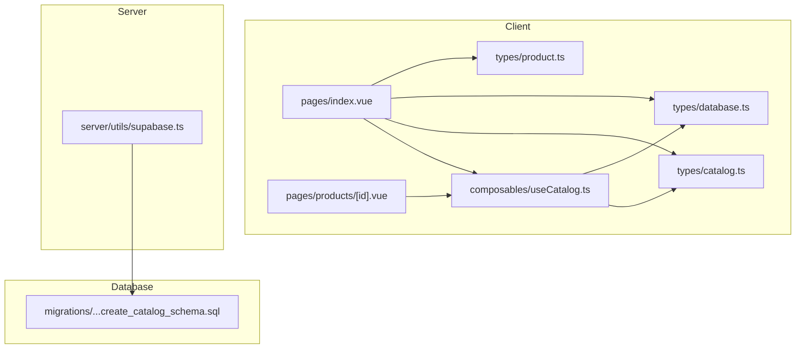
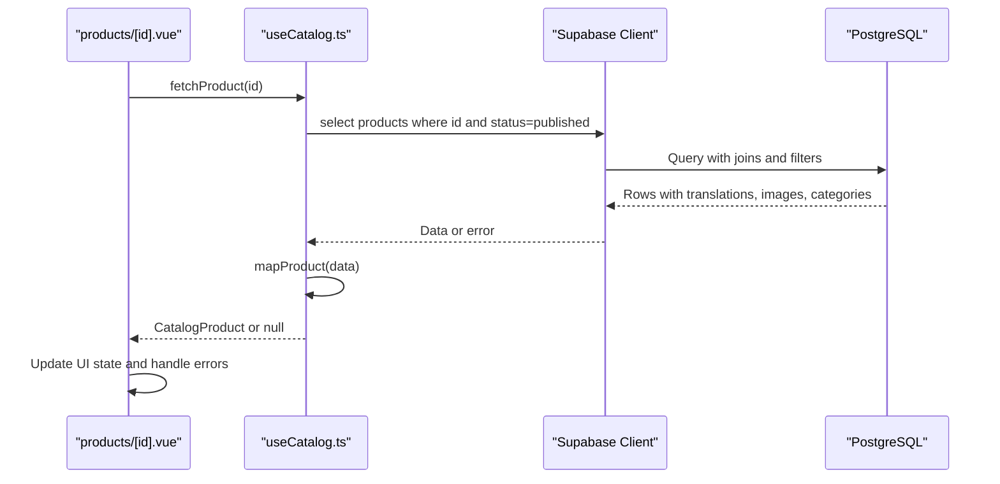
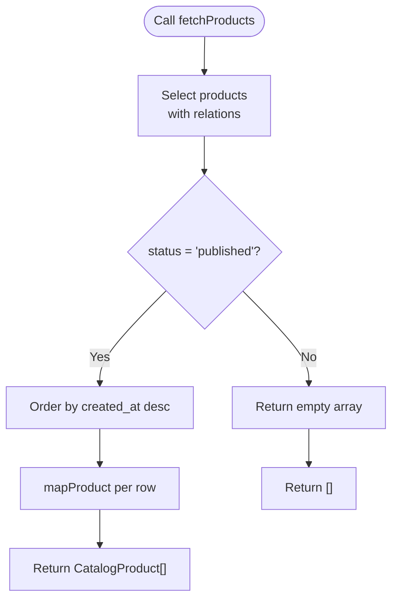
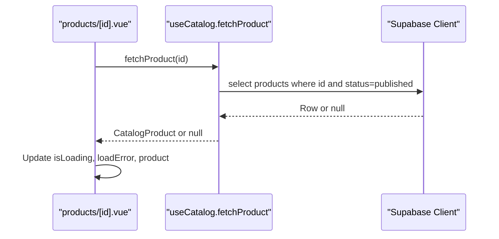
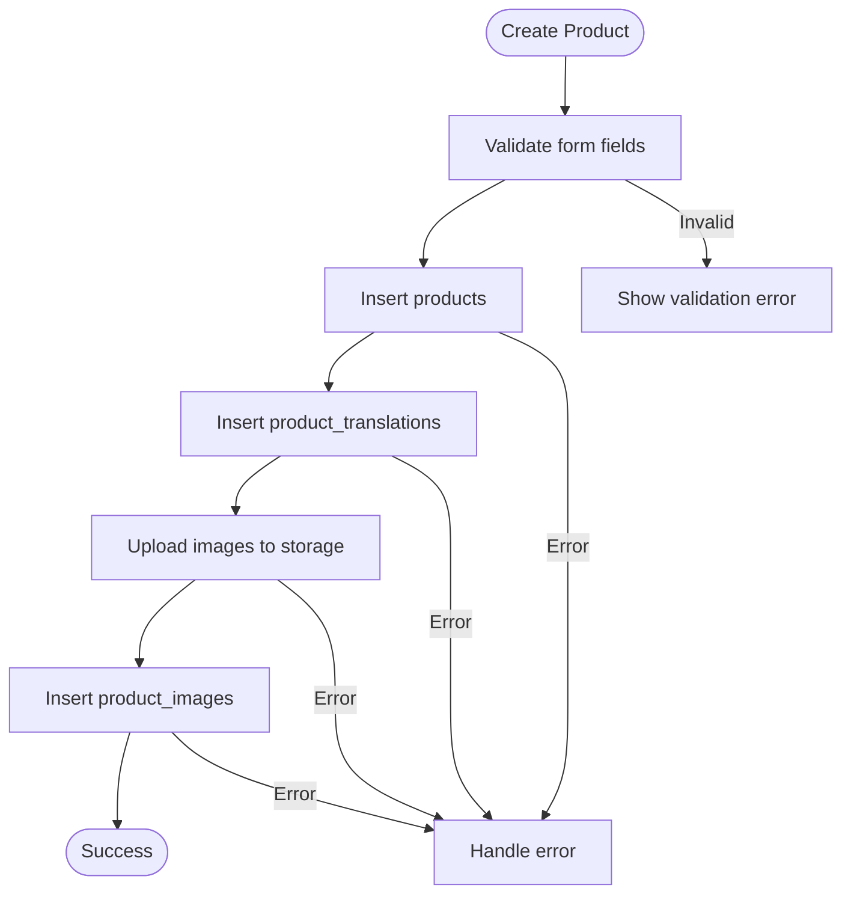
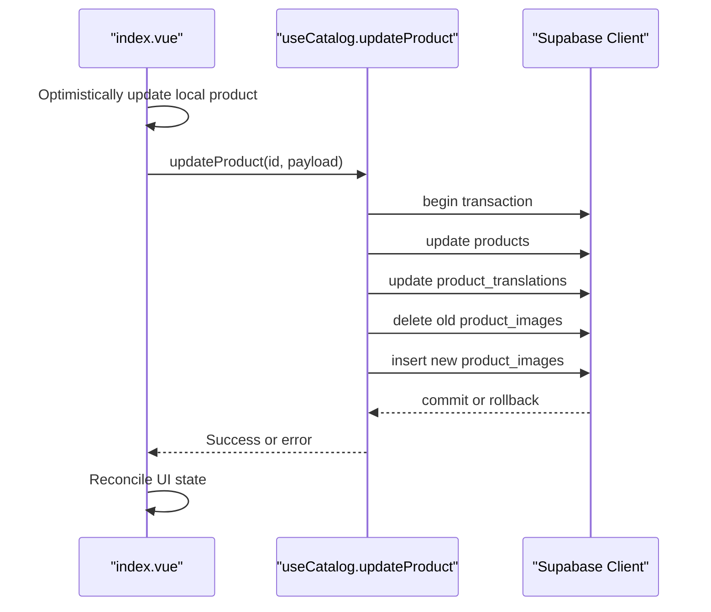
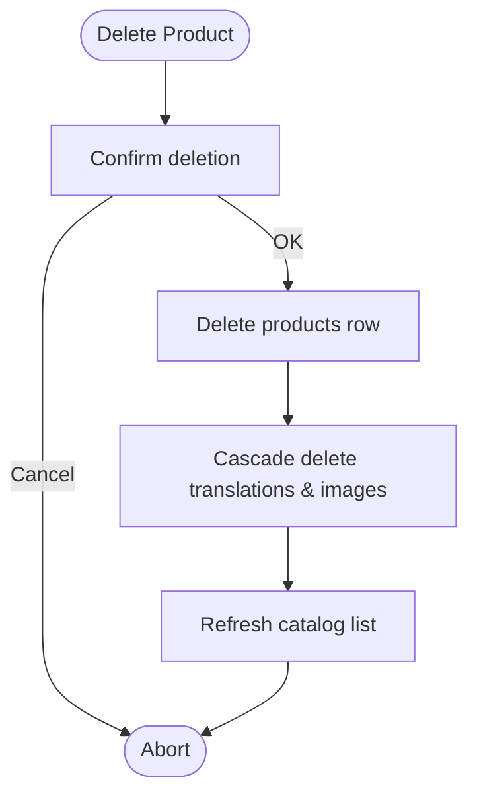
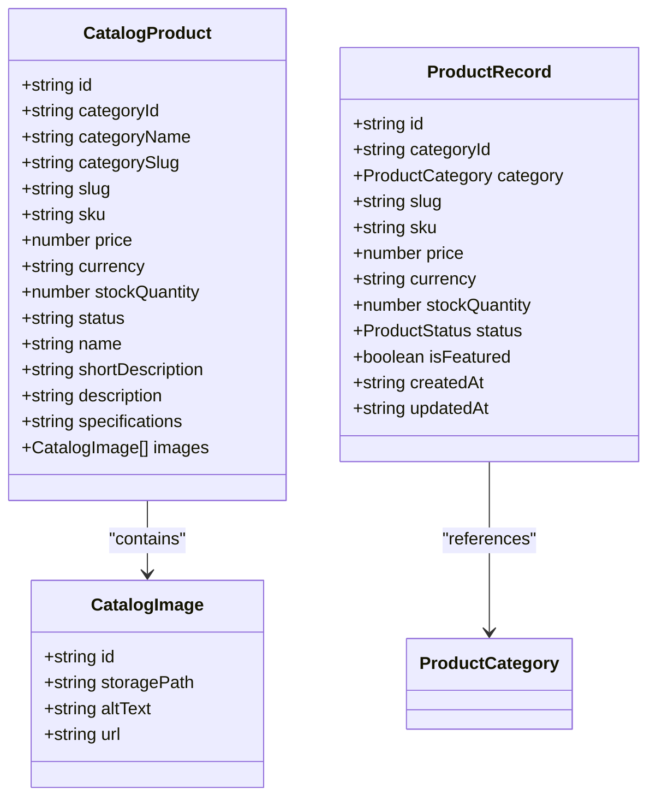
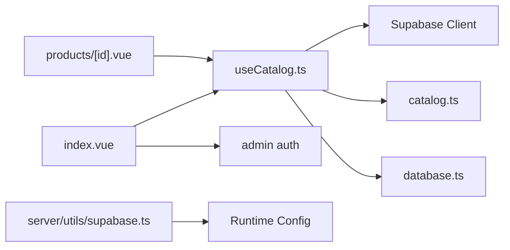

# CRUD Operations

<cite>
**Referenced Files in This Document**
- [useCatalog.ts](file://app/composables/useCatalog.ts)
- [catalog.ts](file://app/types/catalog.ts)
- [product.ts](file://app/types/product.ts)
- [database.ts](file://app/types/database.ts)
- [index.vue](file://app/pages/index.vue)
- [id.vue](file://app/pages/products/[id].vue)
- [supabase.ts](file://server/utils/supabase.ts)
- [20260922_000001_create_catalog_schema.sql](file://supabase/migrations/20260922_000001_create_catalog_schema.sql)
</cite>

## Table of Contents
1. [Introduction](#introduction)
2. [Project Structure](#project-structure)
3. [Core Components](#core-components)
4. [Architecture Overview](#architecture-overview)
5. [Detailed Component Analysis](#detailed-component-analysis)
6. [Dependency Analysis](#dependency-analysis)
7. [Performance Considerations](#performance-considerations)
8. [Troubleshooting Guide](#troubleshooting-guide)
9. [Conclusion](#conclusion)

## Introduction
This document explains how the product catalog system implements CRUD operations, with a focus on reading data through fetchProducts and fetchProduct, including query patterns, filtering by status, and data transformation via mapProduct. It also provides guidance for implementing create, update, and delete operations following the same patterns, along with error handling, validation, type safety, optimistic updates, and transaction handling recommendations.

## Project Structure
The product catalog is implemented across composables, types, pages, server utilities, and database migrations:
- Composable layer: useCatalog.ts exposes typed read functions and data mapping.
- Type layer: catalog.ts defines UI-facing models; database.ts defines Supabase schema types; product.ts defines domain records.
- Pages: index.vue contains admin editing and full catalog lifecycle; products/[id].vue reads a single product.
- Server utility: supabase.ts creates an admin client for privileged operations.
- Database: migration file defines tables, constraints, indexes, and triggers.

**Diagram sources**
- [useCatalog.ts:1-61](file://app/composables/useCatalog.ts#L1-L61)
- [catalog.ts:1-31](file://app/types/catalog.ts#L1-L31)
- [database.ts:77-122](file://app/types/database.ts#L77-L122)
- [product.ts:1-40](file://app/types/product.ts#L1-L40)
- [index.vue:1-188](file://app/pages/index.vue#L1-L188)
- [id.vue:1-47](file://app/pages/products/[id].vue#L1-L47)
- [supabase.ts:1-20](file://server/utils/supabase.ts#L1-L20)
- [20260922_000001_create_catalog_schema.sql:22-59](file://supabase/migrations/20260922_000001_create_catalog_schema.sql#L22-L59)

**Section sources**
- [useCatalog.ts:1-61](file://app/composables/useCatalog.ts#L1-L61)
- [index.vue:1-188](file://app/pages/index.vue#L1-L188)
- [id.vue:1-47](file://app/pages/products/[id].vue#L1-L47)
- [supabase.ts:1-20](file://server/utils/supabase.ts#L1-L20)
- [20260922_000001_create_catalog_schema.sql:22-59](file://supabase/migrations/20260922_000001_create_catalog_schema.sql#L22-L59)

## Core Components
- useCatalog composable: Provides fetchProducts, fetchProduct, and fetchCategories. It maps raw Supabase rows to CatalogProduct using mapProduct, handles locale-aware translations, and resolves public image URLs.
- Page components:
  - products/[id].vue uses fetchProduct to load a single published product with error handling and loading states.
  - index.vue demonstrates full CRUD flows (create/update/delete), including image uploads and cascading deletes.
- Types:
  - catalog.ts defines CatalogProduct and related UI models.
  - database.ts defines Supabase Row/Insert/Update types for strong typing.
  - product.ts defines domain-level record interfaces used elsewhere.
- Server utility:
  - supabase.ts creates an admin client using service role credentials for privileged operations.

**Section sources**
- [useCatalog.ts:13-47](file://app/composables/useCatalog.ts#L13-L47)
- [catalog.ts:8-24](file://app/types/catalog.ts#L8-L24)
- [database.ts:92-109](file://app/types/database.ts#L92-L109)
- [product.ts:8-21](file://app/types/product.ts#L8-L21)
- [id.vue:10-20](file://app/pages/products/[id].vue#L10-L20)
- [index.vue:134-183](file://app/pages/index.vue#L134-L183)
- [supabase.ts:3-19](file://server/utils/supabase.ts#L3-L19)

## Architecture Overview
The application follows a layered architecture:
- Presentation layer (Vue pages) orchestrates user interactions and state.
- Composable layer encapsulates data fetching and transformation logic.
- Type layer ensures compile-time safety across layers.
- Server utility provides privileged access when needed.
- Database schema enforces constraints and relationships.

**Diagram sources**
- [id.vue:10-20](file://app/pages/products/[id].vue#L10-L20)
- [useCatalog.ts:43-47](file://app/composables/useCatalog.ts#L43-L47)

## Detailed Component Analysis

### Reading Products: fetchProducts and fetchProduct
- Query pattern:
  - Uses a predefined select string that includes related translations, images, and categories.
  - Filters by status = 'published' to expose only live items.
  - Orders by created_at descending for newest-first listing.
- Data transformation:
  - mapProduct normalizes raw rows into CatalogProduct, resolving locale-specific translations, category names, numeric price, and sorted image URLs.
- Error handling:
  - Errors from Supabase are thrown to callers, which should catch and display user-friendly messages.

**Diagram sources**
- [useCatalog.ts:35-41](file://app/composables/useCatalog.ts#L35-L41)

**Section sources**
- [useCatalog.ts:35-47](file://app/composables/useCatalog.ts#L35-L47)
- [catalog.ts:8-24](file://app/types/catalog.ts#L8-L24)

### Single Product Detail: products/[id].vue
- Loads a single product by id and status = 'published'.
- Handles loading, error, and not-found states gracefully.
- Parses specifications into structured labels/values for display.

**Diagram sources**
- [id.vue:10-20](file://app/pages/products/[id].vue#L10-L20)
- [useCatalog.ts:43-47](file://app/composables/useCatalog.ts#L43-L47)

**Section sources**
- [id.vue:10-47](file://app/pages/products/[id].vue#L10-L47)
- [useCatalog.ts:43-47](file://app/composables/useCatalog.ts#L43-L47)

### Creating Products
- Validation:
  - Ensure required fields like categoryId, sku, slug, price, stockQuantity are present and valid before sending to the database.
- Insert flow:
  - Insert into products table with required fields.
  - Insert corresponding translation record(s) for the target locale(s).
  - Upload images and insert product_images entries with sort_order and primary flag.
- Error handling:
  - Catch and surface errors at each step; rollback or clean up partial state if necessary.

**Diagram sources**
- [index.vue:134-172](file://app/pages/index.vue#L134-L172)

**Section sources**
- [index.vue:134-172](file://app/pages/index.vue#L134-L172)
- [database.ts:92-109](file://app/types/database.ts#L92-L109)

### Updating Products
- Update flow:
  - Update products table with changed fields.
  - Update product_translations for the active locale(s).
  - Replace product_images based on new image paths or uploaded files.
- Optimistic updates:
  - Immediately reflect changes in the UI while the request is in flight; revert on error.
- Transaction handling:
  - Group product, translation, and image updates within a single transaction to ensure consistency.

**Diagram sources**
- [index.vue:134-172](file://app/pages/index.vue#L134-L172)

**Section sources**
- [index.vue:134-172](file://app/pages/index.vue#L134-L172)

### Deleting Products
- Delete flow:
  - Confirm deletion with the user.
  - Delete the product row; related translations and images are cascade-deleted by foreign key constraints.
- Post-delete:
  - Refresh the catalog list and clear any pending selection.

**Diagram sources**
- [index.vue:174-183](file://app/pages/index.vue#L174-L183)
- [20260922_000001_create_catalog_schema.sql:36-59](file://supabase/migrations/20260922_000001_create_catalog_schema.sql#L36-L59)

**Section sources**
- [index.vue:174-183](file://app/pages/index.vue#L174-L183)
- [20260922_000001_create_catalog_schema.sql:36-59](file://supabase/migrations/20260922_000001_create_catalog_schema.sql#L36-L59)

### Data Models and Type Safety
- CatalogProduct (UI model):
  - Includes normalized fields such as name, shortDescription, description, specifications (stringified JSON), and images with resolved URLs.
- ProductRecord and related records:
  - Represent domain entities for internal usage and alignment with database schema.
- Database types:
  - Strongly typed Row/Insert/Update interfaces for Supabase queries.

**Diagram sources**
- [catalog.ts:1-31](file://app/types/catalog.ts#L1-L31)
- [product.ts:1-40](file://app/types/product.ts#L1-L40)

**Section sources**
- [catalog.ts:1-31](file://app/types/catalog.ts#L1-L31)
- [product.ts:1-40](file://app/types/product.ts#L1-L40)
- [database.ts:77-122](file://app/types/database.ts#L77-L122)

## Dependency Analysis
- useCatalog depends on:
  - Supabase client for querying products, categories, and images.
  - i18n for locale-aware translation selection.
  - Types from catalog.ts and database.ts for compile-time safety.
- Pages depend on:
  - useCatalog for reading data.
  - Admin auth for protecting write operations.
- Server utility depends on:
  - Runtime config for Supabase URL and service role key.

**Diagram sources**
- [useCatalog.ts:1-61](file://app/composables/useCatalog.ts#L1-L61)
- [index.vue:1-188](file://app/pages/index.vue#L1-L188)
- [id.vue:1-47](file://app/pages/products/[id].vue#L1-L47)
- [supabase.ts:1-20](file://server/utils/supabase.ts#L1-L20)

**Section sources**
- [useCatalog.ts:1-61](file://app/composables/useCatalog.ts#L1-L61)
- [index.vue:1-188](file://app/pages/index.vue#L1-L188)
- [id.vue:1-47](file://app/pages/products/[id].vue#L1-L47)
- [supabase.ts:1-20](file://server/utils/supabase.ts#L1-L20)

## Performance Considerations
- Prefer server-side filtering and ordering:
  - Use status = 'published' and order by created_at in queries to reduce client-side processing.
- Minimize payload size:
  - Select only required columns and relations; avoid unnecessary joins.
- Optimize image handling:
  - Sort images server-side or cache sort_order; generate public URLs efficiently.
- Pagination:
  - For large catalogs, implement pagination to limit data transfer and improve rendering performance.
- Caching:
  - Cache fetched products and categories where appropriate to reduce repeated network requests.

[No sources needed since this section provides general guidance]

## Troubleshooting Guide
- Common errors:
  - Missing Supabase configuration: Ensure runtime config has supabaseUrl and serviceRoleKey.
  - Constraint violations: Validate inputs against database constraints (e.g., non-negative price and stock_quantity).
  - Image upload failures: Check storage permissions and path formats.
- Debugging tips:
  - Log Supabase error objects to identify specific failure reasons.
  - Verify RLS policies and service role permissions for admin operations.
- Recovery strategies:
  - Wrap multi-step writes in transactions to maintain consistency.
  - Provide user feedback and allow retry on transient failures.

**Section sources**
- [supabase.ts:3-19](file://server/utils/supabase.ts#L3-L19)
- [index.vue:134-183](file://app/pages/index.vue#L134-L183)

## Conclusion
The product catalog system implements robust CRUD operations with clear separation of concerns:
- Reading is handled by useCatalog with well-defined query patterns and data transformation.
- Writing operations follow consistent validation, error handling, and type safety practices.
- Transactions and optimistic updates improve reliability and user experience.
- The database schema enforces integrity and supports efficient queries through indexes and constraints.

[No sources needed since this section summarizes without analyzing specific files]