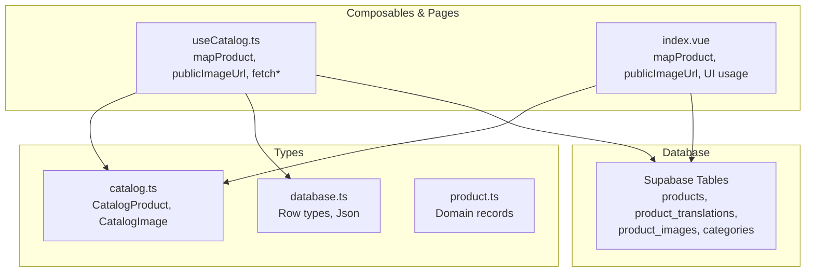
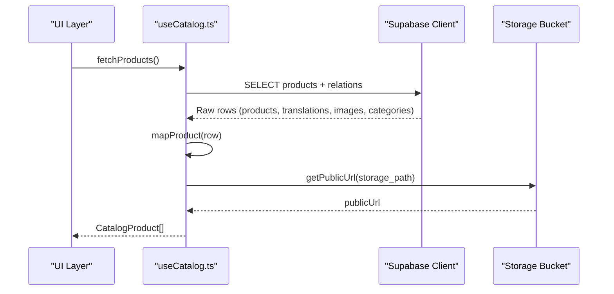
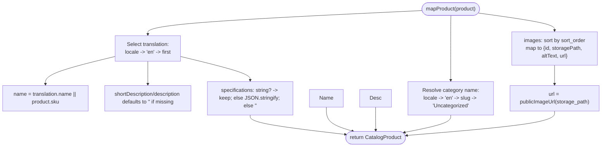
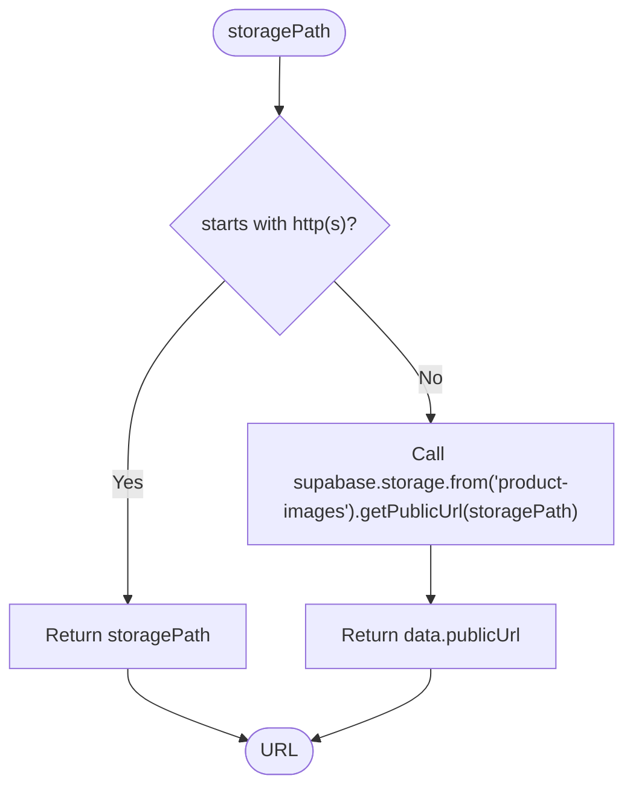
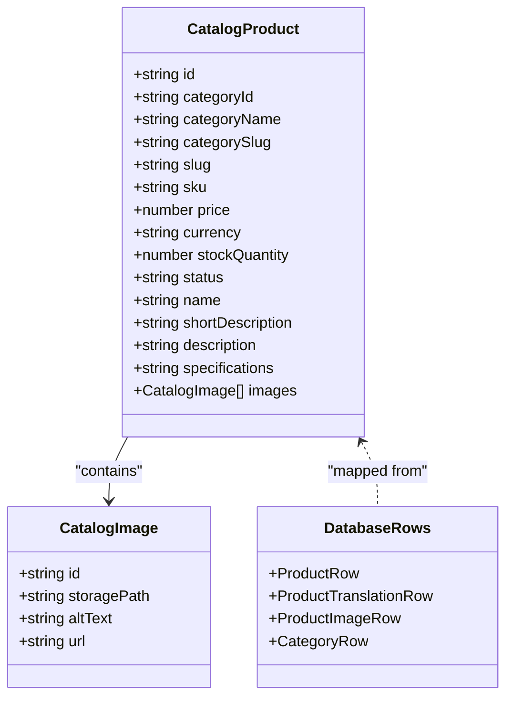
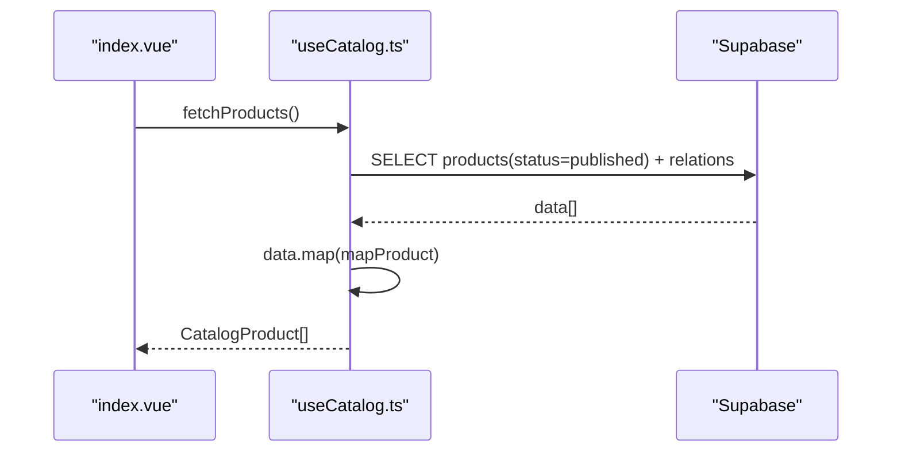
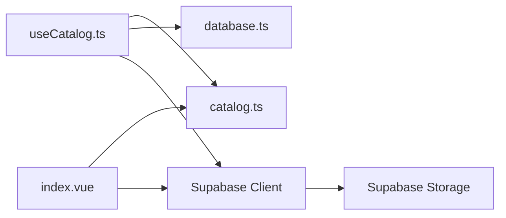

# Data Transformation & Mapping

<cite>
**Referenced Files in This Document**
- [useCatalog.ts](file://app/composables/useCatalog.ts)
- [index.vue](file://app/pages/index.vue)
- [catalog.ts](file://app/types/catalog.ts)
- [database.ts](file://app/types/database.ts)
- [product.ts](file://app/types/product.ts)
- [20260922_000001_create_catalog_schema.sql](file://supabase/migrations/20260922_000001_create_catalog_schema.sql)
</cite>

## Table of Contents
1. [Introduction](#introduction)
2. [Project Structure](#project-structure)
3. [Core Components](#core-components)
4. [Architecture Overview](#architecture-overview)
5. [Detailed Component Analysis](#detailed-component-analysis)
6. [Dependency Analysis](#dependency-analysis)
7. [Performance Considerations](#performance-considerations)
8. [Troubleshooting Guide](#troubleshooting-guide)
9. [Conclusion](#conclusion)
10. [Appendices](#appendices)

## Introduction
This document explains how raw Supabase responses are transformed into application-specific types for the product catalog. It focuses on:
- The mapProduct function that converts database rows into CatalogProduct objects
- Translation resolution based on locale with fallbacks
- Category name extraction and slug handling
- Image URL generation via publicImageUrl for both local storage paths and external URLs
- Specifications normalization to a consistent string format
- Guidelines for creating custom mappers, handling null/undefined values, and preserving type safety

## Project Structure
The transformation logic is primarily implemented in composables and pages, with strongly-typed models in the types directory. Database schema definitions provide context for the shape of incoming data.

**Diagram sources**
- [useCatalog.ts:1-61](file://app/composables/useCatalog.ts#L1-L61)
- [index.vue:1-120](file://app/pages/index.vue#L1-L120)
- [catalog.ts:1-31](file://app/types/catalog.ts#L1-L31)
- [database.ts:1-105](file://app/types/database.ts#L1-L105)
- [product.ts:1-40](file://app/types/product.ts#L1-L40)

**Section sources**
- [useCatalog.ts:1-61](file://app/composables/useCatalog.ts#L1-L61)
- [index.vue:1-120](file://app/pages/index.vue#L1-L120)
- [catalog.ts:1-31](file://app/types/catalog.ts#L1-L31)
- [database.ts:1-105](file://app/types/database.ts#L1-L105)
- [product.ts:1-40](file://app/types/product.ts#L1-L40)

## Core Components
- mapProduct: Converts a raw product row (including related translations, images, and category) into a CatalogProduct instance. It resolves localized content, normalizes specifications, and builds image entries with public URLs.
- publicImageUrl: Resolves an image path to a usable URL by returning external links as-is or generating a public URL from Supabase Storage for local paths.
- Fetch helpers: Compose queries and apply mapping to return typed results for products and categories.

Key responsibilities:
- Locale-aware translation selection with fallbacks
- Category display name derivation with safe fallbacks
- Consistent numeric price conversion
- Stable image ordering and URL resolution
- Normalized specifications string output

**Section sources**
- [useCatalog.ts:8-33](file://app/composables/useCatalog.ts#L8-L33)
- [index.vue:65-98](file://app/pages/index.vue#L65-L98)
- [catalog.ts:1-31](file://app/types/catalog.ts#L1-L31)

## Architecture Overview
The transformation pipeline integrates with Supabase queries and i18n to produce UI-ready data.

**Diagram sources**
- [useCatalog.ts:37-41](file://app/composables/useCatalog.ts#L37-L41)
- [useCatalog.ts:8-11](file://app/composables/useCatalog.ts#L8-L11)
- [useCatalog.ts:13-33](file://app/composables/useCatalog.ts#L13-L33)

## Detailed Component Analysis

### mapProduct Implementation
Responsibilities:
- Select the best translation for the current locale, falling back to English, then to any available translation
- Extract category name using locale-aware translation, with fallback to slug and a default label
- Normalize price to number and preserve currency code
- Normalize specifications to a string (either already a string or JSON.stringify of an object/array)
- Build images array sorted by sort_order and compute public URLs

Locale resolution flow:
- Prefer current locale
- Fallback to 'en'
- Fallback to first available translation

Category name resolution flow:
- Prefer current locale translation name
- Fallback to 'en' translation name
- Fallback to category slug
- Fallback to 'Uncategorized'

Specifications normalization:
- If the value is already a string, use it directly
- If it is an object/array, serialize to pretty-printed JSON
- Otherwise, default to empty string

Images processing:
- Ensure non-null array
- Sort by sort_order ascending
- Map each image to a CatalogImage with id, storagePath, altText, and url resolved via publicImageUrl

**Diagram sources**
- [useCatalog.ts:13-33](file://app/composables/useCatalog.ts#L13-L33)
- [index.vue:77-98](file://app/pages/index.vue#L77-L98)

**Section sources**
- [useCatalog.ts:13-33](file://app/composables/useCatalog.ts#L13-L33)
- [index.vue:77-98](file://app/pages/index.vue#L77-L98)

### publicImageUrl Utility
Purpose:
- Return external URLs unchanged when storagePath starts with http:// or https://
- For local storage paths, generate a public URL using Supabase Storage

Behavior:
- Input: storagePath string
- Output: absolute URL suitable for 

Usage:
- Called per image during mapping to ensure all images have resolvable URLs

**Diagram sources**
- [useCatalog.ts:8-11](file://app/composables/useCatalog.ts#L8-L11)
- [index.vue:65-68](file://app/pages/index.vue#L65-L68)

**Section sources**
- [useCatalog.ts:8-11](file://app/composables/useCatalog.ts#L8-L11)
- [index.vue:65-68](file://app/pages/index.vue#L65-L68)

### Type Safety and Models
- CatalogProduct defines the UI-facing product model with normalized fields like name, shortDescription, description, specifications (string), and images array
- CatalogImage defines image metadata including a computed url
- Database row types describe the raw structure returned by Supabase queries
- Product domain records define internal domain shapes used elsewhere in the app

Type relationships:
- mapProduct enforces conversion from raw rows to CatalogProduct
- publicImageUrl ensures url field is always a string
- Fetch functions return arrays of CatalogProduct or CatalogCategory

**Diagram sources**
- [catalog.ts:1-31](file://app/types/catalog.ts#L1-L31)
- [database.ts:32-67](file://app/types/database.ts#L32-L67)

**Section sources**
- [catalog.ts:1-31](file://app/types/catalog.ts#L1-L31)
- [database.ts:32-67](file://app/types/database.ts#L32-L67)

### Data Flow and Query Shape
- Queries select only necessary fields to minimize payload size
- Relations include translations, images, and categories to support mapping
- Errors from Supabase are thrown to be handled upstream

**Diagram sources**
- [useCatalog.ts:35-41](file://app/composables/useCatalog.ts#L35-L41)
- [index.vue:101-117](file://app/pages/index.vue#L101-L117)

**Section sources**
- [useCatalog.ts:35-41](file://app/composables/useCatalog.ts#L35-L41)
- [index.vue:101-117](file://app/pages/index.vue#L101-L117)

## Dependency Analysis
- useCatalog depends on:
  - Supabase client for querying and storage
  - i18n locale for translation resolution
  - Types from catalog.ts and database.ts for compile-time safety
- index.vue duplicates some logic for local usage but aligns behavior with useCatalog
- Database schema defines tables and constraints that inform expected fields and types

**Diagram sources**
- [useCatalog.ts:1-61](file://app/composables/useCatalog.ts#L1-L61)
- [index.vue:1-120](file://app/pages/index.vue#L1-L120)
- [catalog.ts:1-31](file://app/types/catalog.ts#L1-L31)
- [database.ts:1-105](file://app/types/database.ts#L1-L105)

**Section sources**
- [useCatalog.ts:1-61](file://app/composables/useCatalog.ts#L1-L61)
- [index.vue:1-120](file://app/pages/index.vue#L1-L120)
- [catalog.ts:1-31](file://app/types/catalog.ts#L1-L31)
- [database.ts:1-105](file://app/types/database.ts#L1-L105)

## Performance Considerations
- Minimize selected fields in queries to reduce payload size
- Avoid redundant computations by caching locale and bucket configuration where appropriate
- Sorting images server-side is not currently applied; client-side sorting is acceptable for small sets
- Consider memoizing publicImageUrl results per storagePath to avoid repeated requests
- Batch operations where possible and handle errors early to prevent unnecessary work

[No sources needed since this section provides general guidance]

## Troubleshooting Guide
Common issues and resolutions:
- Missing translations:
  - Ensure translations exist for the current locale; otherwise fallback to 'en' or first available translation
- Empty category names:
  - Provide a valid category translation or slug; mapper falls back to 'Uncategorized'
- Invalid or missing images:
  - Verify storage_path exists and is accessible; publicImageUrl will throw if the request fails
- Price parsing errors:
  - Ensure price is a valid number; mapper uses Number conversion which coerces strings but may produce NaN for invalid input
- Specifications format:
  - If stored as JSON, mapper serializes to string; if stored as string, it remains unchanged

Error propagation:
- Supabase errors are thrown from fetch functions; callers should catch and display user-friendly messages

**Section sources**
- [useCatalog.ts:37-47](file://app/composables/useCatalog.ts#L37-L47)
- [index.vue:46-56](file://app/pages/index.vue#L46-L56)

## Conclusion
The transformation layer centralizes conversion from raw Supabase responses to application-specific types, ensuring consistent localization, robust fallbacks, and reliable image URL resolution. By adhering to the patterns described here, you can extend the system with new mappers while maintaining type safety and predictable behavior.

[No sources needed since this section summarizes without analyzing specific files]

## Appendices

### Guidelines for Creating Custom Mappers
- Accept raw rows and return strongly-typed application models
- Resolve locale-aware fields with explicit fallbacks to 'en' and then to stable identifiers (e.g., slugs)
- Normalize numeric fields (e.g., price) and optional text fields to safe defaults
- Handle nested arrays (e.g., images) by sorting and transforming each item consistently
- Use utility functions (like publicImageUrl) to encapsulate side effects such as network calls
- Keep mapping logic pure where possible; isolate I/O to utilities

**Section sources**
- [useCatalog.ts:13-33](file://app/composables/useCatalog.ts#L13-L33)
- [index.vue:77-98](file://app/pages/index.vue#L77-L98)

### Handling Null/Undefined Values
- Use optional chaining and nullish coalescing to safely access nested properties
- Provide meaningful defaults for required fields (e.g., empty strings for descriptions, 'Uncategorized' for missing category names)
- Validate inputs before transformations to prevent runtime errors

**Section sources**
- [useCatalog.ts:13-33](file://app/composables/useCatalog.ts#L13-L33)
- [index.vue:77-98](file://app/pages/index.vue#L77-L98)

### Maintaining Type Safety
- Define clear interfaces for both raw rows and mapped outputs
- Align mapper outputs with interface contracts to catch mismatches at compile time
- Reuse shared types across composables and pages to ensure consistency

**Section sources**
- [catalog.ts:1-31](file://app/types/catalog.ts#L1-L31)
- [database.ts:32-67](file://app/types/database.ts#L32-L67)
- [product.ts:1-40](file://app/types/product.ts#L1-L40)

### Database Schema Context
- product_translations stores localized content and supports JSONB specifications
- product_images store storage paths and sort order for deterministic ordering
- categories and their translations support localized category names

**Section sources**
- [20260922_000001_create_catalog_schema.sql:36-59](file://supabase/migrations/20260922_000001_create_catalog_schema.sql#L36-L59)