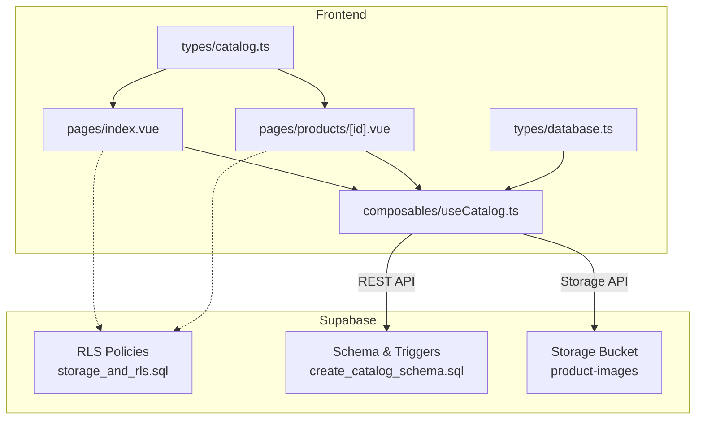
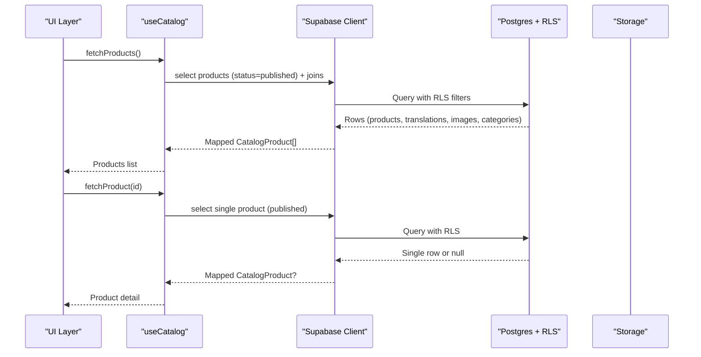
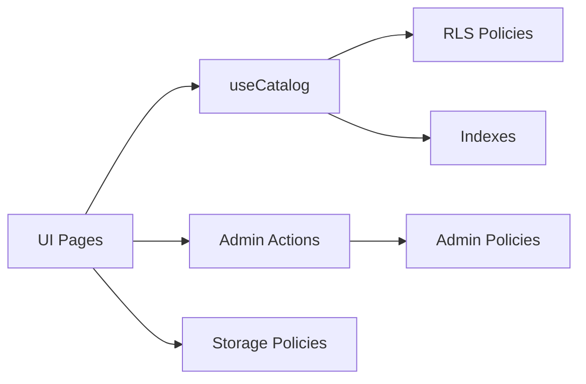

# Database Operations & Queries

<cite>
**Referenced Files in This Document**
- [20260922_000001_create_catalog_schema.sql](file://supabase/migrations/20260922_000001_create_catalog_schema.sql)
- [20260922000002_storage_and_rls.sql](file://supabase/migrations/20260922000002_storage_and_rls.sql)
- [useCatalog.ts](file://app/composables/useCatalog.ts)
- [index.vue](file://app/pages/index.vue)
- [products/[id].vue](file://app/pages/products/[id].vue)
- [supabase.ts](file://server/utils/supabase.ts)
- [database.ts](file://app/types/database.ts)
- [catalog.ts](file://app/types/catalog.ts)
</cite>

## Table of Contents
1. Introduction
2. Project Structure
3. Core Components
4. Architecture Overview
5. Detailed Component Analysis
6. Dependency Analysis
7. Performance Considerations
8. Troubleshooting Guide
9. Conclusion
10. Appendices

## Introduction
This document explains how the application implements database operations and query patterns using Supabase. It covers CRUD for the product catalog, category management, and inventory tracking; advanced query patterns such as filtering, sorting, pagination, and joins; optimistic updates, real-time synchronization strategies, and transaction handling; plus query optimization, indexing, performance monitoring, error handling, retry mechanisms, offline support, data validation, TypeScript type safety, and schema enforcement.

## Project Structure
The project uses a Nuxt frontend with Supabase for database, storage, and security policies. The core data model is defined in migrations and typed via generated TypeScript types. Client-side composables and pages orchestrate queries, mapping, and UI state. A server utility provides an admin client when needed.

**Diagram sources**
- [useCatalog.ts:1-61](file://app/composables/useCatalog.ts#L1-L61)
- [index.vue:1-465](file://app/pages/index.vue#L1-L465)
- [products/[id].vue:1-177](file://app/pages/products/[id].vue#L1-L177)
- [20260922_000001_create_catalog_schema.sql:1-113](file://supabase/migrations/20260922_000001_create_catalog_schema.sql#L1-L113)
- [20260922000002_storage_and_rls.sql:1-205](file://supabase/migrations/20260922000002_storage_and_rls.sql#L1-L205)

**Section sources**
- [useCatalog.ts:1-61](file://app/composables/useCatalog.ts#L1-L61)
- [index.vue:1-465](file://app/pages/index.vue#L1-L465)
- [products/[id].vue:1-177](file://app/pages/products/[id].vue#L1-L177)
- [20260922_000001_create_catalog_schema.sql:1-113](file://supabase/migrations/20260922_000001_create_catalog_schema.sql#L1-L113)
- [20260922000002_storage_and_rls.sql:1-205](file://supabase/migrations/20260922000002_storage_and_rls.sql#L1-L205)

## Core Components
- Data model and constraints: categories, products, translations, images, admin users, updated_at triggers, and indexes are defined in the schema migration.
- Security: Row-Level Security (RLS) policies restrict public reads to published items and active categories; admin-only write access is enforced; storage bucket policies allow public read and admin write/delete.
- Client composable: useCatalog centralizes fetching, mapping, and image URL resolution.
- Pages: index.vue orchestrates listing, search, sort, and admin CRUD; products/[id].vue loads a single product with safe error handling.
- Admin client: server/utils/supabase.ts creates a service-role client for privileged operations when needed.

Key responsibilities:
- Read-only public flows use RLS-enforced selects on published products and active categories.
- Admin flows perform inserts/updates/deletes with policy checks and storage uploads.
- Type safety is enforced via generated Database types and domain interfaces.

**Section sources**
- [20260922_000001_create_catalog_schema.sql:1-113](file://supabase/migrations/20260922_000001_create_catalog_schema.sql#L1-L113)
- [20260922000002_storage_and_rls.sql:1-205](file://supabase/migrations/20260922000002_storage_and_rls.sql#L1-L205)
- [useCatalog.ts:1-61](file://app/composables/useCatalog.ts#L1-L61)
- [index.vue:1-465](file://app/pages/index.vue#L1-L465)
- [products/[id].vue:1-177](file://app/pages/products/[id].vue#L1-L177)
- [supabase.ts:1-20](file://server/utils/supabase.ts#L1-L20)
- [database.ts:1-123](file://app/types/database.ts#L1-L123)
- [catalog.ts:1-31](file://app/types/catalog.ts#L1-L31)

## Architecture Overview
The system separates concerns between UI, composable logic, and Supabase services. Public reads rely on RLS to filter data at the database layer. Admin writes go through explicit Supabase calls with error handling and UI feedback.

**Diagram sources**
- [useCatalog.ts:37-47](file://app/composables/useCatalog.ts#L37-L47)
- [20260922000002_storage_and_rls.sql:11-38](file://supabase/migrations/20260922000002_storage_and_rls.sql#L11-L38)

## Detailed Component Analysis

### Data Model and Schema
- Tables:
  - categories: id, slug (unique), sort_order, is_active, timestamps
  - category_translations: id, category_id (FK), locale, name, timestamps, unique(category_id, locale)
  - products: id, category_id (FK), slug (unique), sku (unique), price (>=0), currency, stock_quantity (>=0), status (draft/published/archived), is_featured, timestamps
  - product_translations: id, product_id (FK), locale, name, short_description, description, specifications (jsonb), timestamps, unique(product_id, locale)
  - product_images: id, product_id (FK), storage_path, alt_text, sort_order, is_primary, timestamps, unique(product_id, storage_path)
  - admin_users: id, user_id (unique), role (admin/super_admin), timestamps
- Indexes:
  - idx_products_category_id, idx_products_status, idx_products_featured
  - idx_product_translations_locale
  - idx_product_images_product_id
  - idx_categories_slug
- Triggers:
  - Updated-at triggers auto-update timestamps on all tables

These definitions enforce referential integrity, constrain values, and optimize common queries.

**Section sources**
- [20260922_000001_create_catalog_schema.sql:3-75](file://supabase/migrations/20260922_000001_create_catalog_schema.sql#L3-L75)
- [20260922_000001_create_catalog_schema.sql:76-113](file://supabase/migrations/20260922_000001_create_catalog_schema.sql#L76-L113)

### Security and Access Control (RLS and Storage)
- Public reads:
  - Categories: only active ones
  - Products: only published
  - Translations and images: accessible only when parent product is published
- Admin writes:
  - All catalog tables require admin presence via admin_users table
  - Super-admin only for admin_users management
- Storage:
  - Public read on product-images bucket
  - Admin-only upload/update/delete

These policies ensure that clients never need to manually filter by status or active flags; RLS enforces it server-side.

**Section sources**
- [20260922000002_storage_and_rls.sql:1-160](file://supabase/migrations/20260922000002_storage_and_rls.sql#L1-L160)
- [20260922000002_storage_and_rls.sql:162-205](file://supabase/migrations/20260922000002_storage_and_rls.sql#L162-L205)

### Composable: useCatalog
Responsibilities:
- Build a single efficient select string that includes related translations, images, and categories
- Map raw rows into domain objects with localization fallbacks and image URLs
- Provide functions:
  - fetchProducts(): returns published products sorted by created_at desc
  - fetchProduct(id): returns a single published product or null
  - fetchCategories(): returns active categories sorted by sort_order

Optimizations:
- Select only needed columns via explicit projection
- Use maybeSingle for single-row retrieval
- Resolve storage URLs via getPublicUrl

Error handling:
- Throws errors from Supabase responses; callers should catch and display messages

Type safety:
- Uses generated Database type for typed queries

**Section sources**
- [useCatalog.ts:1-61](file://app/composables/useCatalog.ts#L1-L61)

### Page: Product Detail
- Loads a single product by id using fetchProduct
- Displays gallery, specs, pricing, and stock status
- Handles loading states, not-found cases, and errors gracefully

Data flow:
- Route param -> fetchProduct -> mapProduct -> render

**Section sources**
- [products/[id].vue:1-177](file://app/pages/products/[id].vue#L1-L177)

### Page: Catalog Listing and Admin CRUD
- Loads categories and products concurrently
- Filters by selected category and free-text search
- Sorts by newest, price low/high, or name
- Admin mode enables add/edit/delete and image uploads
- Save flow:
  - Upsert product row
  - Upsert translation row for English
  - Upload images to storage
  - Delete old images and insert new ones with order and primary flag
- Delete flow:
  - Delete product row (images cascade via FK constraints)

Validation and safety:
- Required fields validated before save
- Numeric inputs constrained by form controls
- Errors surfaced via alerts

**Section sources**
- [index.vue:101-188](file://app/pages/index.vue#L101-L188)
- [index.vue:134-183](file://app/pages/index.vue#L134-L183)

### Server Admin Client
- Creates a Supabase client with service role key for privileged operations
- Disables session persistence and token refresh since it runs server-side

Usage:
- Intended for server-side tasks requiring bypassing RLS or elevated privileges

**Section sources**
- [supabase.ts:1-20](file://server/utils/supabase.ts#L1-L20)

### Type Safety and Schema Enforcement
- Generated Database types define table schemas, relationships, and allowed Insert/Update shapes
- Domain interfaces (CatalogProduct, CatalogCategory, CatalogImage) provide strongly-typed contracts for UI
- Enforced constraints:
  - Unique slugs and SKUs
  - Non-negative price and stock
  - Enum-like status values via check constraints
  - JSONB specifications with parsing/validation in UI

**Section sources**
- [database.ts:1-123](file://app/types/database.ts#L1-L123)
- [catalog.ts:1-31](file://app/types/catalog.ts#L1-L31)
- [20260922_000001_create_catalog_schema.sql:22-47](file://supabase/migrations/20260922_000001_create_catalog_schema.sql#L22-L47)

## Dependency Analysis
- Frontend depends on Supabase REST and Storage APIs
- RLS policies gate visibility and mutability
- Indexes support efficient filtering and sorting
- Admin roles gate write operations

**Diagram sources**
- [useCatalog.ts:37-57](file://app/composables/useCatalog.ts#L37-L57)
- [20260922000002_storage_and_rls.sql:11-160](file://supabase/migrations/20260922000002_storage_and_rls.sql#L11-L160)
- [20260922_000001_create_catalog_schema.sql:69-75](file://supabase/migrations/20260922_000001_create_catalog_schema.sql#L69-L75)

**Section sources**
- [useCatalog.ts:37-57](file://app/composables/useCatalog.ts#L37-L57)
- [20260922000002_storage_and_rls.sql:11-160](file://supabase/migrations/20260922000002_storage_and_rls.sql#L11-L160)
- [20260922_000001_create_catalog_schema.sql:69-75](file://supabase/migrations/20260922_000001_create_catalog_schema.sql#L69-L75)

## Performance Considerations
- Query design:
  - Use explicit column selection to reduce payload size
  - Leverage RLS to push filtering to the database
  - Prefer single queries with joins over multiple round-trips where possible
- Indexing strategy:
  - Category and status filters benefit from existing indexes
  - Locale-based lookups use dedicated index
  - Image queries use product_id index
- Sorting:
  - Order by created_at for “newest”
  - In-memory sort for price/name after fetch if needed
- Storage:
  - Generate stable storage paths per product to avoid collisions
  - Rebuild image records on save to maintain correct ordering

[No sources needed since this section provides general guidance]

## Troubleshooting Guide
Common issues and remedies:
- Empty results despite valid IDs:
  - Verify RLS allows reading the target row (e.g., product must be published)
- Updates return no changes:
  - Ensure SELECT policy exists for UPDATE; otherwise RLS silently blocks
- Permission denied on storage:
  - Confirm admin role and storage policies for upload/update/delete
- Missing indexes causing slow queries:
  - Check EXPLAIN plans and add targeted indexes for frequent filters
- Timeouts or high CPU:
  - Reduce payload size, refine filters, and review query plans

Operational tips:
- Always handle errors from Supabase calls and surface user-friendly messages
- For critical paths, implement retries with exponential backoff for transient network errors
- Use optimistic UI updates with rollback on failure for better UX

**Section sources**
- [20260922000002_storage_and_rls.sql:11-38](file://supabase/migrations/20260922000002_storage_and_rls.sql#L11-L38)
- [products/[id].vue:10-20](file://app/pages/products/[id].vue#L10-L20)
- [index.vue:134-183](file://app/pages/index.vue#L134-L183)

## Conclusion
The application implements a secure, type-safe, and efficient catalog system using Supabase. RLS ensures data visibility aligns with business rules, while indexes and careful query design keep performance strong. Admin workflows cover full CRUD with robust error handling and storage integration. Future enhancements can include pagination, real-time subscriptions, and advanced search, guided by the patterns and best practices outlined here.

[No sources needed since this section summarizes without analyzing specific files]

## Appendices

### CRUD Patterns and Examples

#### Read: List Published Products
- Pattern: Select products with status = published, join translations and images, order by created_at desc
- Implementation path: [useCatalog.ts:37-41](file://app/composables/useCatalog.ts#L37-L41)

#### Read: Get Single Product
- Pattern: Select one product by id with status = published, return null if not found
- Implementation path: [useCatalog.ts:43-47](file://app/composables/useCatalog.ts#L43-L47)

#### Read: List Active Categories
- Pattern: Select active categories with translations, ordered by sort_order
- Implementation path: [useCatalog.ts:49-57](file://app/composables/useCatalog.ts#L49-L57)

#### Create: Add Product and Translation
- Pattern: Insert product, then insert translation for default locale
- Implementation path: [index.vue:147-153](file://app/pages/index.vue#L147-L153)

#### Update: Edit Product and Translation
- Pattern: Update product row, then update translation row for default locale
- Implementation path: [index.vue:142-146](file://app/pages/index.vue#L142-L146)

#### Delete: Remove Product
- Pattern: Delete product row; images cascade via foreign key
- Implementation path: [index.vue:174-183](file://app/pages/index.vue#L174-L183)

### Advanced Query Patterns

#### Filtering
- Status filter via RLS and explicit .eq('status', 'published')
- Category filter via client-side matching against loaded categories
- Text search via client-side includes on name, SKU, and short description

#### Sorting
- Server-side: order by created_at desc for newest
- Client-side: sort by price or name after fetch

#### Pagination
- Not implemented yet; recommended approach:
  - Use offset/limit or cursor-based pagination with created_at or id
  - Combine with RLS filters to minimize payload

#### Complex Joins
- Single select retrieves products with nested translations, images, and categories
- Reduces round-trips and leverages Postgres joins efficiently

**Section sources**
- [useCatalog.ts:35-57](file://app/composables/useCatalog.ts#L35-L57)
- [index.vue:46-63](file://app/pages/index.vue#L46-L63)

### Optimistic Updates and Real-Time Synchronization

- Optimistic updates:
  - Update local UI immediately on save, then revert on error
  - Apply to product list and detail views for responsive UX
- Real-time synchronization:
  - Subscribe to changes on products/categories tables to reflect edits instantly
  - Use channels scoped to relevant filters (e.g., published products)
  - Handle reconnection and conflict resolution gracefully

[No sources needed since this section provides general guidance]

### Transaction Handling
- Multi-step saves (product + translation + images) should be wrapped in transactions to ensure atomicity
- On failure, roll back all steps to maintain consistency
- Consider using Supabase RPC or server-side functions to encapsulate transactions

[No sources needed since this section provides general guidance]

### Error Handling and Retry Mechanisms
- Wrap each Supabase call in try/catch and surface user-friendly messages
- Implement retries for transient errors (network timeouts, rate limits) with exponential backoff
- Distinguish between client validation errors and server/database errors

**Section sources**
- [products/[id].vue:10-20](file://app/pages/products/[id].vue#L10-L20)
- [index.vue:134-183](file://app/pages/index.vue#L134-L183)

### Offline Support
- Cache recent products and categories locally (e.g., localStorage or IndexedDB)
- Serve cached data when offline; queue mutations until connectivity resumes
- Sync conflicts resolved by last-write-wins or manual reconciliation

[No sources needed since this section provides general guidance]

### Data Validation and Type Safety
- Frontend validation:
  - Required fields enforced in forms
  - Numeric constraints via input attributes
- Backend enforcement:
  - Constraints and checks in schema
  - RLS policies for authorization
- TypeScript:
  - Generated Database types ensure compile-time safety
  - Domain interfaces standardize UI contracts

**Section sources**
- [database.ts:1-123](file://app/types/database.ts#L1-L123)
- [catalog.ts:1-31](file://app/types/catalog.ts#L1-L31)
- [20260922_000001_create_catalog_schema.sql:22-47](file://supabase/migrations/20260922_000001_create_catalog_schema.sql#L22-L47)

### Query Optimization Techniques and Indexing Strategy
- Use explicit projections to limit returned columns
- Rely on RLS to filter rows at the database layer
- Leverage existing indexes for category, status, locale, and images
- Monitor slow queries with EXPLAIN ANALYZE and adjust indexes accordingly

**Section sources**
- [20260922_000001_create_catalog_schema.sql:69-75](file://supabase/migrations/20260922_000001_create_catalog_schema.sql#L69-L75)
- [useCatalog.ts:35-57](file://app/composables/useCatalog.ts#L35-L57)