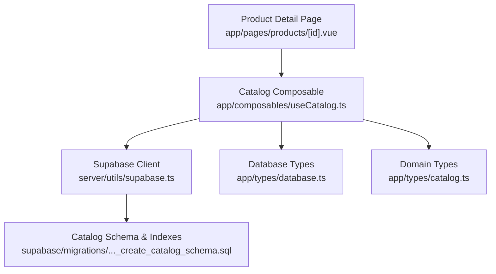
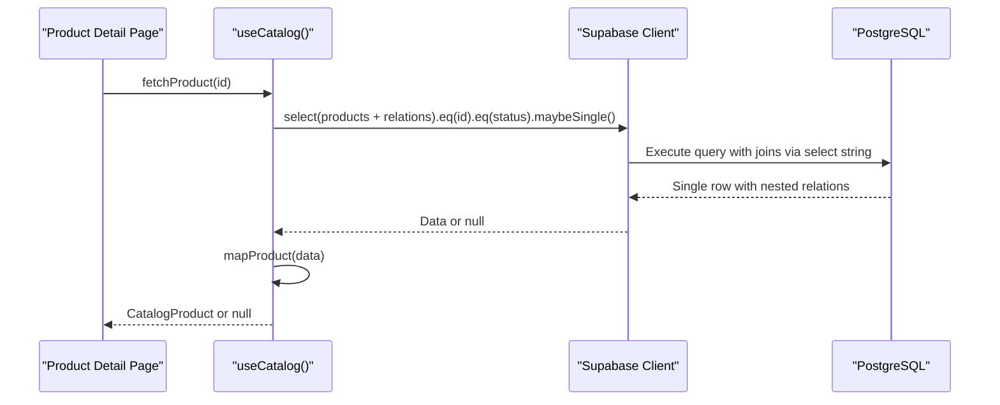
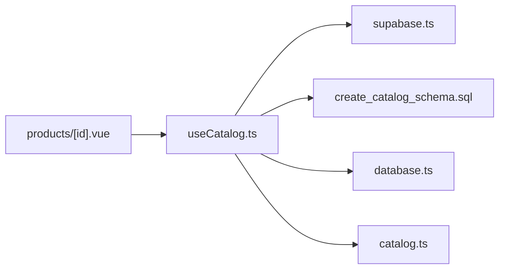
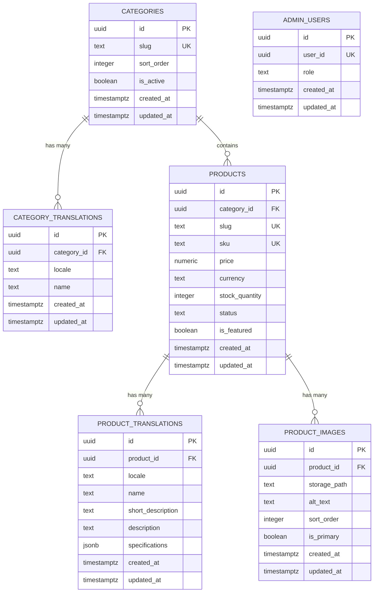

# Query Patterns & Optimization

<cite>
**Referenced Files in This Document**
- [useCatalog.ts](file://app/composables/useCatalog.ts)
- [supabase.ts](file://server/utils/supabase.ts)
- [20260922_000001_create_catalog_schema.sql](file://supabase/migrations/20260922_000001_create_catalog_schema.sql)
- [database.ts](file://app/types/database.ts)
- [catalog.ts](file://app/types/catalog.ts)
- [products/[id].vue](file://app/pages/products/[id].vue)
- [data-n-plus-one.md](file://.agents/skills/supabase-postgres-best-practices/references/data-n-plus-one.md)
- [query-missing-indexes.md](file://.agents/skills/supabase-postgres-best-practices/references/query-missing-indexes.md)
- [data-pagination.md](file://.agents/skills/supabase-postgres-best-practices/references/data-pagination.md)
- [monitor-explain-analyze.md](file://.agents/skills/supabase-postgres-best-practices/references/monitor-explain-analyze.md)
</cite>

## Table of Contents
1. Introduction
2. Project Structure
3. Core Components
4. Architecture Overview
5. Detailed Component Analysis
6. Dependency Analysis
7. Performance Considerations
8. Troubleshooting Guide
9. Conclusion
10. Appendices

## Introduction
This document explains advanced query patterns and optimization techniques used in the Supabase integration for fetching products, categories, and translations efficiently. It covers:
- Select string patterns to minimize payload and avoid N+1 queries
- Complex joins across products, categories, and translations
- Filtering with equality checks, sorting strategies, and pagination approaches
- Indexing recommendations and query composition best practices
- Real-time subscriptions guidance and caching strategies
- Query result transformation patterns for localization and image URLs

## Project Structure
The catalog data layer is implemented as a composable that builds optimized Supabase queries and maps results into typed domain models. The database schema defines tables for products, categories, translations, and images, along with indexes to support common filters and joins.

**Diagram sources**
- [products/[id].vue:1-47](file://app/pages/products/[id].vue#L1-L47)
- [useCatalog.ts:1-61](file://app/composables/useCatalog.ts#L1-L61)
- [supabase.ts:1-20](file://server/utils/supabase.ts#L1-L20)
- [20260922_000001_create_catalog_schema.sql:1-113](file://supabase/migrations/20260922_000001_create_catalog_schema.sql#L1-L113)
- [database.ts:1-123](file://app/types/database.ts#L1-L123)
- [catalog.ts:1-31](file://app/types/catalog.ts#L1-L31)

**Section sources**
- [useCatalog.ts:1-61](file://app/composables/useCatalog.ts#L1-L61)
- [20260922_000001_create_catalog_schema.sql:1-113](file://supabase/migrations/20260922_000001_create_catalog_schema.sql#L1-L113)
- [database.ts:1-123](file://app/types/database.ts#L1-L123)
- [catalog.ts:1-31](file://app/types/catalog.ts#L1-L31)
- [products/[id].vue:1-47](file://app/pages/products/[id].vue#L1-L47)

## Core Components
- Catalog Composable: Builds efficient select strings, applies filters and ordering, and transforms results into localized domain models.
- Database Schema: Defines normalized tables for products, categories, translations, and images; includes indexes on frequently filtered/joined columns.
- Domain Types: Strongly typed interfaces for product and category data consumed by UI components.
- Admin Client Utility: Creates a server-side Supabase client configured for service role access where needed.

Key responsibilities:
- Efficient single-query fetches using nested selects to avoid N+1 queries
- Localization-aware mapping to pick the correct translation based on current locale
- Image URL resolution via storage helper
- Error propagation from Supabase calls

**Section sources**
- [useCatalog.ts:13-57](file://app/composables/useCatalog.ts#L13-L57)
- [20260922_000001_create_catalog_schema.sql:22-74](file://supabase/migrations/20260922_000001_create_catalog_schema.sql#L22-L74)
- [catalog.ts:8-30](file://app/types/catalog.ts#L8-L30)
- [supabase.ts:3-19](file://server/utils/supabase.ts#L3-L19)

## Architecture Overview
The data flow starts at the product detail page, which invokes the catalog composable to fetch a single published product by ID. The composable executes a single Supabase query that joins related entities (translations, images, categories) using a carefully crafted select string. Results are mapped to domain types and returned to the page.

**Diagram sources**
- [products/[id].vue:10-20](file://app/pages/products/[id].vue#L10-L20)
- [useCatalog.ts:43-47](file://app/composables/useCatalog.ts#L43-L47)
- [20260922_000001_create_catalog_schema.sql:22-74](file://supabase/migrations/20260922_000001_create_catalog_schema.sql#L22-L74)

## Detailed Component Analysis

### Select String Pattern for Efficient Data Fetching
- A reusable select string specifies only required fields and nested relations (product_translations, product_images, categories with category_translations), minimizing payload size and avoiding N+1 queries by fetching all related data in one request.
- The pattern ensures localization by including locale-specific translation fields and allows client-side selection of the appropriate translation.

Benefits:
- Reduces network overhead by selecting only necessary columns
- Eliminates N+1 queries by joining related tables through Supabase’s nested select
- Simplifies transformation logic by providing structured nested objects

**Section sources**
- [useCatalog.ts:35-40](file://app/composables/useCatalog.ts#L35-L40)
- [20260922_000001_create_catalog_schema.sql:22-74](file://supabase/migrations/20260922_000001_create_catalog_schema.sql#L22-L74)

### Complex Joins Between Products, Categories, and Translations
- The select string nests categories and their translations alongside product translations and images, enabling a single round trip to assemble a fully localized product object.
- Foreign key relationships are enforced in the schema, ensuring referential integrity and predictable join behavior.

Optimization notes:
- Ensure foreign keys are indexed (category_id on products) to speed up joins
- Use locale-based filtering in application code after fetching to avoid complex SQL conditions when not necessary

**Section sources**
- [useCatalog.ts:13-35](file://app/composables/useCatalog.ts#L13-L35)
- [20260922_000001_create_catalog_schema.sql:22-74](file://supabase/migrations/20260922_000001_create_catalog_schema.sql#L22-L74)

### Filtering Strategies Using Equality Checks
- Published-only listing uses an equality filter on status to return only active items.
- Single product retrieval combines equality filters on id and status, then uses maybeSingle to handle zero or one row cases safely.

Best practices:
- Prefer equality filters on indexed columns for performance
- Combine multiple filters to narrow results early

**Section sources**
- [useCatalog.ts:37-47](file://app/composables/useCatalog.ts#L37-L47)
- [20260922_000001_create_catalog_schema.sql:69-74](file://supabase/migrations/20260922_000001_create_catalog_schema.sql#L69-L74)

### Sorting With Order
- Product listings sort by creation time descending to show newest first.
- Category listings sort by explicit sort_order to control presentation order.

Recommendations:
- Sort on indexed columns when possible (e.g., created_at)
- For multi-column sorts, ensure composite indexes align with the order clause

**Section sources**
- [useCatalog.ts:37-51](file://app/composables/useCatalog.ts#L37-L51)
- [20260922_000001_create_catalog_schema.sql:69-74](file://supabase/migrations/20260922_000001_create_catalog_schema.sql#L69-L74)

### Pagination Implementation
- Current implementation does not include pagination parameters. For large catalogs, adopt cursor-based pagination to maintain O(1) performance regardless of page depth.
- Cursor-based approach stores the last seen value (e.g., id or timestamp) and queries with greater-than conditions to fetch subsequent pages.

Implementation guidance:
- Add a cursor parameter to fetch functions
- Use order by id and where id > lastId with limit to implement next-page navigation
- For multi-column sorting, include all sort columns in the cursor condition

**Section sources**
- [data-pagination.md:1-51](file://.agents/skills/supabase-postgres-best-practices/references/data-pagination.md#L1-L51)

### Query Result Transformation Patterns
- Localization mapping selects the translation matching the current locale, falls back to English, then to any available translation.
- Category names follow the same fallback strategy.
- Images are sorted by sort_order and transformed to include public URLs via storage helper.

Transformation tips:
- Keep transformation logic centralized in the composable to ensure consistency
- Normalize JSONB specifications into arrays for consistent rendering

**Section sources**
- [useCatalog.ts:13-35](file://app/composables/useCatalog.ts#L13-L35)
- [products/[id].vue:22-43](file://app/pages/products/[id].vue#L22-L43)

### Real-Time Subscriptions
- While not currently used in the catalog composable, real-time subscriptions can be leveraged to keep UI in sync with database changes (e.g., new products, stock updates).
- Subscribe to channels on relevant tables and update local state upon events.

Guidance:
- Use channel subscriptions scoped to specific rows or filters to reduce bandwidth
- Handle connection drops and re-subscribe gracefully

[No sources needed since this section provides general guidance]

### Caching Strategies
- Cache product and category lists at the component or store level to avoid repeated network requests during navigation.
- Consider short-lived cache invalidation on mutations (e.g., after publishing a product).

Recommendations:
- Use in-memory caches for SSR/CSR transitions
- Persist critical reads in session storage if appropriate

[No sources needed since this section provides general guidance]

## Dependency Analysis
The catalog composable depends on:
- Supabase client utility for authenticated/admin access
- Database schema for table structure and indexes
- Type definitions for compile-time safety

**Diagram sources**
- [useCatalog.ts:1-61](file://app/composables/useCatalog.ts#L1-L61)
- [supabase.ts:1-20](file://server/utils/supabase.ts#L1-L20)
- [20260922_000001_create_catalog_schema.sql:1-113](file://supabase/migrations/20260922_000001_create_catalog_schema.sql#L1-L113)
- [database.ts:1-123](file://app/types/database.ts#L1-L123)
- [catalog.ts:1-31](file://app/types/catalog.ts#L1-L31)
- [products/[id].vue:1-47](file://app/pages/products/[id].vue#L1-L47)

**Section sources**
- [useCatalog.ts:1-61](file://app/composables/useCatalog.ts#L1-L61)
- [supabase.ts:1-20](file://server/utils/supabase.ts#L1-L20)
- [20260922_000001_create_catalog_schema.sql:1-113](file://supabase/migrations/20260922_000001_create_catalog_schema.sql#L1-L113)
- [database.ts:1-123](file://app/types/database.ts#L1-L123)
- [catalog.ts:1-31](file://app/types/catalog.ts#L1-L31)
- [products/[id].vue:1-47](file://app/pages/products/[id].vue#L1-L47)

## Performance Considerations
- Indexing:
  - Ensure indexes exist on foreign keys and frequently filtered columns (category_id, status, locale, product_id, slug).
  - Composite indexes may be beneficial for multi-column sorts and filters.
- Query Composition:
  - Use nested selects to fetch related data in a single request, avoiding N+1 queries.
  - Limit selected columns to what is needed to reduce payload size.
- Avoiding N+1 Queries:
  - Batch load related entities using joins or array-based lookups instead of looping per item.
- Monitoring:
  - Use EXPLAIN ANALYZE to identify bottlenecks and validate index usage.
  - Enable pg_stat_statements to track slow and frequent queries.

**Section sources**
- [20260922_000001_create_catalog_schema.sql:69-74](file://supabase/migrations/20260922_000001_create_catalog_schema.sql#L69-L74)
- [data-n-plus-one.md:1-54](file://.agents/skills/supabase-postgres-best-practices/references/data-n-plus-one.md#L1-L54)
- [query-missing-indexes.md:1-44](file://.agents/skills/supabase-postgres-best-practices/references/query-missing-indexes.md#L1-L44)
- [monitor-explain-analyze.md:1-46](file://.agents/skills/supabase-postgres-best-practices/references/monitor-explain-analyze.md#L1-L46)

## Troubleshooting Guide
Common issues and resolutions:
- Missing or incorrect environment configuration for Supabase client leads to initialization errors. Verify runtime config values.
- Empty results when fetching single products: ensure equality filters match existing rows and status is set correctly.
- Slow queries: check indexes on filter/join columns and review execution plans with EXPLAIN ANALYZE.
- Localization mismatches: confirm locale availability and fallback logic in transformation.

Operational steps:
- Validate Supabase client setup and permissions
- Inspect query plans and adjust indexes accordingly
- Add logging around fetch calls to capture errors and payloads for debugging

**Section sources**
- [supabase.ts:3-19](file://server/utils/supabase.ts#L3-L19)
- [useCatalog.ts:37-57](file://app/composables/useCatalog.ts#L37-L57)
- [monitor-explain-analyze.md:1-46](file://.agents/skills/supabase-postgres-best-practices/references/monitor-explain-analyze.md#L1-L46)

## Conclusion
The catalog integration demonstrates efficient Supabase query patterns by leveraging nested selects to avoid N+1 queries, applying targeted filters and sorting, and transforming results into localized domain models. The schema includes essential indexes to support fast joins and filters. Future enhancements should include cursor-based pagination, optional real-time subscriptions for live updates, and caching strategies to further improve performance and responsiveness.

## Appendices

### Data Models Diagram

**Diagram sources**
- [20260922_000001_create_catalog_schema.sql:3-67](file://supabase/migrations/20260922_000001_create_catalog_schema.sql#L3-L67)