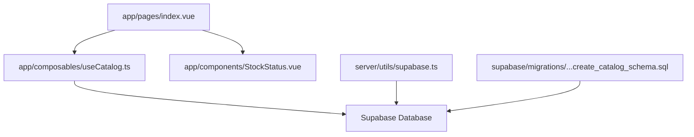
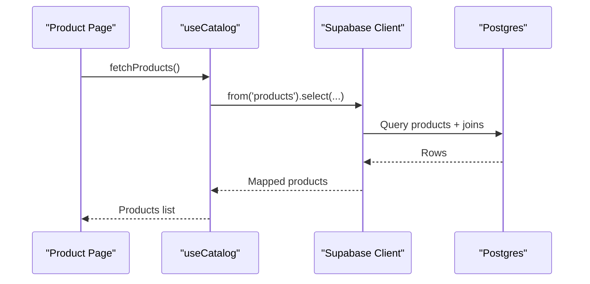
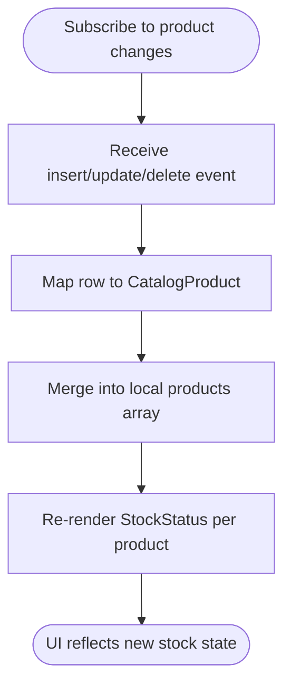
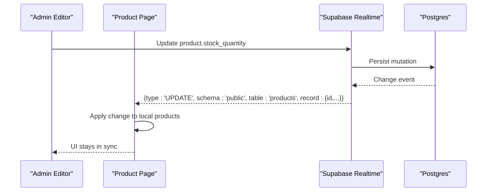
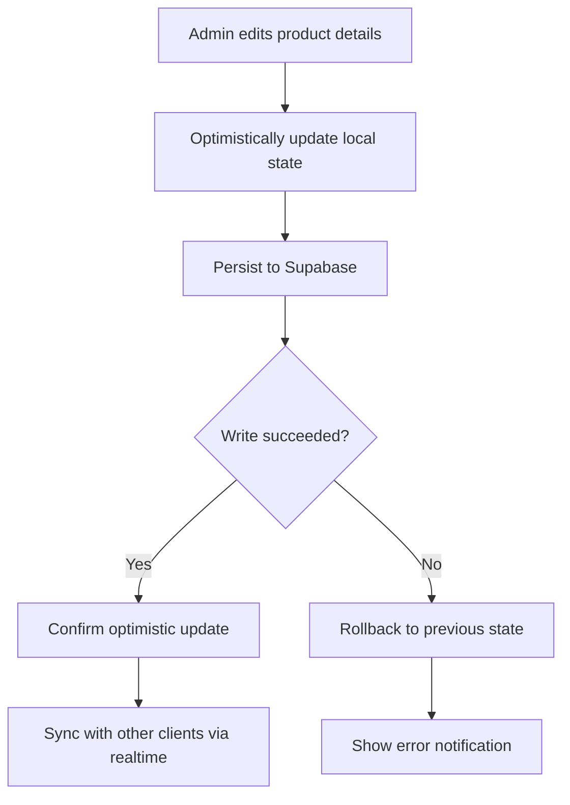
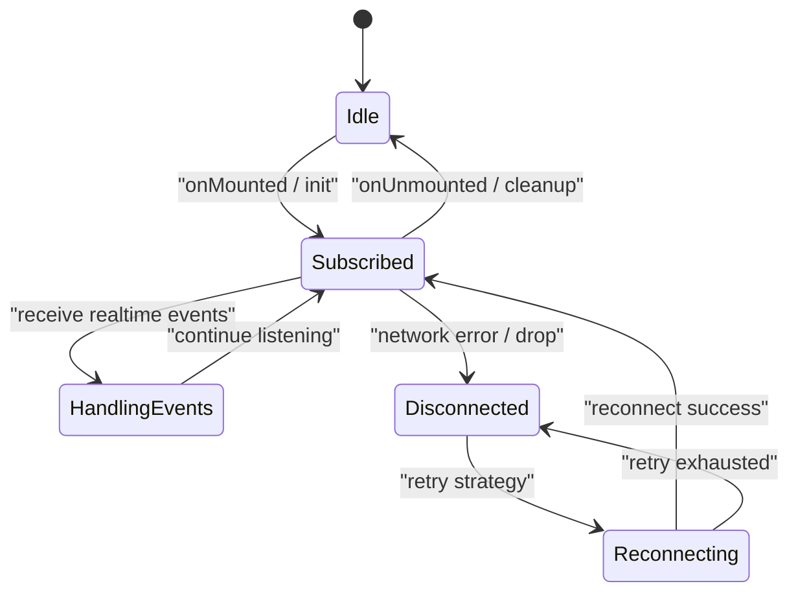
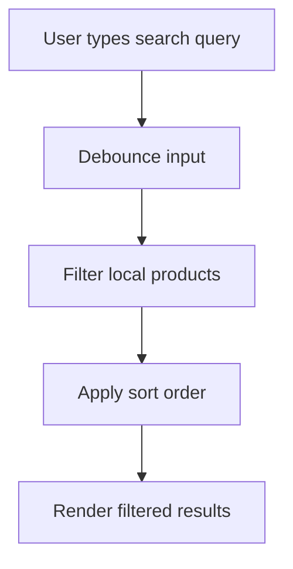
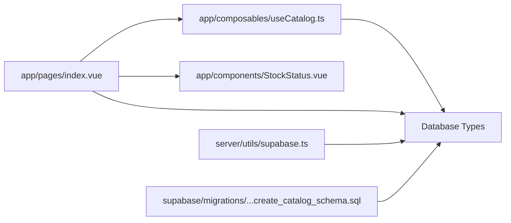

# Real-time Features & Subscriptions

<cite>
**Referenced Files in This Document**
- [README.md](file://README.md)
- [app/pages/index.vue](file://app/pages/index.vue)
- [app/composables/useCatalog.ts](file://app/composables/useCatalog.ts)
- [app/components/StockStatus.vue](file://app/components/StockStatus.vue)
- [app/constants/catalog.ts](file://app/constants/catalog.ts)
- [server/utils/supabase.ts](file://server/utils/supabase.ts)
- [supabase/migrations/20260922_000001_create_catalog_schema.sql](file://supabase/migrations/20260922_000001_create_catalog_schema.sql)
</cite>

## Table of Contents
1. [Introduction](#introduction)
2. [Project Structure](#project-structure)
3. [Core Components](#core-components)
4. [Architecture Overview](#architecture-overview)
5. [Detailed Component Analysis](#detailed-component-analysis)
6. [Dependency Analysis](#dependency-analysis)
7. [Performance Considerations](#performance-considerations)
8. [Troubleshooting Guide](#troubleshooting-guide)
9. [Conclusion](#conclusion)
10. [Appendices](#appendices)

## Introduction
This document explains how to implement Supabase real-time features and subscription management for this Nuxt application. It focuses on:
- Real-time stock status updates
- Live inventory changes
- Collaborative editing patterns
- Subscription lifecycle, error handling, and reconnection strategies
- Real-time notifications, live search results, and synchronized user interfaces
- Performance considerations for high-frequency updates, connection management, and memory optimization
- Offline scenarios, update queueing, and conflict resolution

The current codebase uses Supabase for data access and admin authentication but does not yet include explicit real-time subscriptions. The guidance below shows where and how to add them without changing existing behavior.

**Section sources**
- [README.md:1-36](file://README.md#L1-L36)

## Project Structure
The project is a Nuxt application with:
- Pages that load catalog data via Supabase
- Composables that encapsulate data fetching and mapping
- A server-side utility for creating an admin Supabase client
- Database schema defining products, categories, translations, images, and admin users

**Diagram sources**
- [app/pages/index.vue:101-120](file://app/pages/index.vue#L101-L120)
- [app/composables/useCatalog.ts:37-57](file://app/composables/useCatalog.ts#L37-L57)
- [server/utils/supabase.ts:3-19](file://server/utils/supabase.ts#L3-L19)
- [supabase/migrations/20260922_000001_create_catalog_schema.sql:22-59](file://supabase/migrations/20260922_000001_create_catalog_schema.sql#L22-L59)

**Section sources**
- [app/pages/index.vue:101-120](file://app/pages/index.vue#L101-L120)
- [app/composables/useCatalog.ts:37-57](file://app/composables/useCatalog.ts#L37-L57)
- [server/utils/supabase.ts:3-19](file://server/utils/supabase.ts#L3-L19)
- [supabase/migrations/20260922_000001_create_catalog_schema.sql:22-59](file://supabase/migrations/20260922_000001_create_catalog_schema.sql#L22-L59)

## Core Components
- Product listing and editor page: loads categories and products, handles admin CRUD operations, and manages local state for filtering and sorting.
- Catalog composable: centralizes product and category queries and maps raw database rows into typed domain objects.
- Stock status component: renders stock labels and colors based on quantity thresholds.
- Admin Supabase client: creates a service-role client for server-side operations.

Key responsibilities:
- Data loading and mapping are centralized in the catalog composable.
- UI state (loading, errors, filters, sort order) lives in the main page.
- Stock visualization is isolated in a small presentational component.

**Section sources**
- [app/pages/index.vue:101-120](file://app/pages/index.vue#L101-L120)
- [app/composables/useCatalog.ts:13-57](file://app/composables/useCatalog.ts#L13-L57)
- [app/components/StockStatus.vue:1-20](file://app/components/StockStatus.vue#L1-L20)
- [server/utils/supabase.ts:3-19](file://server/utils/supabase.ts#L3-L19)

## Architecture Overview
Current architecture relies on request/response calls to Supabase. To enable real-time capabilities, you should introduce Supabase channels and subscriptions around the same data boundaries used by the existing components.

**Diagram sources**
- [app/pages/index.vue:101-120](file://app/pages/index.vue#L101-L120)
- [app/composables/useCatalog.ts:37-41](file://app/composables/useCatalog.ts#L37-L41)

To add real-time:
- Subscribe to product and category changes at the page or composable level.
- Apply incoming events to the same mapped product structure used by the UI.
- Keep initial load logic unchanged; use subscriptions to keep the UI in sync.

[No sources needed since this diagram shows conceptual workflow, not actual code structure]

## Detailed Component Analysis

### Real-time Stock Status Updates
Goal: Update stock indicators instantly when inventory changes.

Implementation approach:
- Add a channel subscription for product row changes.
- On insert/update/delete, apply the change to the local products array using the same mapping function already used for initial load.
- Use the existing stock threshold constant to compute status.

Guidelines:
- Use the same mapping logic as in the page and composable to ensure consistent fields like stockQuantity, name, and images.
- Avoid full re-fetches on every event; prefer targeted merges.
- Debounce rapid updates if necessary to reduce render churn.

**Section sources**
- [app/components/StockStatus.vue:1-20](file://app/components/StockStatus.vue#L1-L20)
- [app/constants/catalog.ts:1-1](file://app/constants/catalog.ts#L1-L1)
- [app/pages/index.vue:79-99](file://app/pages/index.vue#L79-L99)

### Live Inventory Changes
Goal: Reflect inventory mutations across all connected clients.

Implementation approach:
- Subscribe to product table changes.
- For inserts: add mapped product to the list.
- For updates: find by id and merge only changed fields.
- For deletes: remove by id.

Guidelines:
- Ensure stable ids exist for efficient merging.
- Normalize image lists and translations during merge to avoid duplication.
- Handle partial updates carefully; preserve computed fields and derived arrays.

**Section sources**
- [app/pages/index.vue:134-171](file://app/pages/index.vue#L134-L171)
- [app/composables/useCatalog.ts:13-33](file://app/composables/useCatalog.ts#L13-L33)

### Collaborative Editing Features
Goal: Allow multiple admins to edit product details concurrently while keeping the UI consistent.

Implementation approach:
- Subscribe to product_translations and product_images changes.
- On translation updates, merge localized fields by locale.
- On image changes, reconcile image lists by storage_path and sort_order.
- Show optimistic UI updates with rollback on error.

Guidelines:
- Use transactional writes where possible to minimize inconsistent states.
- Track concurrent edits with versioning or timestamps to resolve conflicts.
- Provide undo/rollback UX for failed collaborative edits.

[No sources needed since this diagram shows conceptual workflow, not actual code structure]

### Subscription Lifecycle Management
Recommended lifecycle:
- Create channels on component mount or composable initialization.
- Attach handlers for insert, update, delete events.
- Clean up channels on unmount or when the feature is disabled.
- Centralize subscription creation in a reusable composable to avoid duplicates.

Guidelines:
- Store channel references to unsubscribe cleanly.
- Implement exponential backoff for reconnects.
- Log connection state transitions for observability.

[No sources needed since this diagram shows conceptual workflow, not actual code structure]

### Error Handling and Reconnection Strategies
Error handling should cover:
- Network failures
- Authentication/session issues
- Permission denials due to RLS policies
- Malformed realtime payloads

Reconnection strategy:
- Immediate retry once, then exponential backoff.
- Cap maximum retries.
- Resume subscriptions after reconnection.
- Surface user-facing errors without crashing the app.

[No sources needed since this section provides general guidance]

### Real-time Notifications
Use cases:
- New product published
- Low stock alerts
- Admin actions (save, delete)

Approach:
- Emit realtime events for notable actions.
- Maintain a small notification store with deduplication and auto-dismiss timers.
- Integrate with existing alert UI patterns already used in the page.

[No sources needed since this section provides general guidance]

### Live Search Results
Two approaches:
- Client-side filtering over a locally maintained product list updated by realtime.
- Server-side search with debounced queries triggered by input changes.

Recommendation:
- Prefer client-side filtering for low-to-medium catalogs to reduce server load.
- Use server-side search for large catalogs or advanced full-text search.

**Section sources**
- [app/pages/index.vue:46-63](file://app/pages/index.vue#L46-L63)

### Synchronized User Interfaces
Ensure all views derive from a single source of truth:
- Centralized product list state
- Consistent mapping functions
- Realtime updates applied uniformly

Benefits:
- Eliminates drift between components
- Simplifies testing and debugging
- Reduces duplicate network requests

[No sources needed since this section provides general guidance]

## Dependency Analysis
The following diagram highlights dependencies among key files involved in data flow and potential integration points for real-time features.

**Diagram sources**
- [app/pages/index.vue:1-4](file://app/pages/index.vue#L1-L4)
- [app/composables/useCatalog.ts:1-2](file://app/composables/useCatalog.ts#L1-L2)
- [server/utils/supabase.ts:1-1](file://server/utils/supabase.ts#L1-L1)
- [supabase/migrations/20260922_000001_create_catalog_schema.sql:1-113](file://supabase/migrations/20260922_000001_create_catalog_schema.sql#L1-L113)

**Section sources**
- [app/pages/index.vue:1-4](file://app/pages/index.vue#L1-L4)
- [app/composables/useCatalog.ts:1-2](file://app/composables/useCatalog.ts#L1-L2)
- [server/utils/supabase.ts:1-1](file://server/utils/supabase.ts#L1-L1)
- [supabase/migrations/20260922_000001_create_catalog_schema.sql:1-113](file://supabase/migrations/20260922_000001_create_catalog_schema.sql#L1-L113)

## Performance Considerations
High-frequency updates:
- Batch UI updates where possible.
- Avoid heavy computations inside event handlers; offload to workers or memoized computations.
- Use stable keys and minimal re-renders.

Connection management:
- Reuse Supabase clients.
- Limit the number of active channels.
- Unsubscribe channels when components are destroyed.

Memory optimization:
- Normalize product lists and avoid deep copies on each update.
- Trim old notifications and logs.
- Debounce frequent inputs like search.

[No sources needed since this section provides general guidance]

## Troubleshooting Guide
Common issues and resolutions:
- Missing configuration: Ensure Supabase URL and service role key are set before creating the admin client.
- Auth checks failing: Verify admin roles and RLS policies.
- Data mismatches: Ensure mapping functions handle nulls and missing relations gracefully.
- Stale UI: Confirm subscriptions are created and cleaned up correctly.

Existing error handling patterns:
- Load and action errors are captured and displayed in the page.
- Admin auth checks log errors and return safe defaults.

**Section sources**
- [server/utils/supabase.ts:9-11](file://server/utils/supabase.ts#L9-L11)
- [app/composables/useAdminAuth.ts:28-31](file://app/composables/useAdminAuth.ts#L28-L31)
- [app/pages/index.vue:117-119](file://app/pages/index.vue#L117-L119)
- [app/pages/index.vue:174-183](file://app/pages/index.vue#L174-L183)

## Conclusion
This application currently performs standard Supabase queries and admin operations. To deliver real-time experiences such as live stock updates, collaborative editing, and synchronized UIs, introduce Supabase channels and subscriptions around the existing data boundaries. Follow the lifecycle, error handling, and performance guidelines provided to build robust, scalable real-time features.

[No sources needed since this section summarizes without analyzing specific files]

## Appendices

### Database Schema Notes Relevant to Real-time
- Products table includes stock_quantity and status, ideal for real-time stock and availability updates.
- Categories and translations support dynamic catalog navigation.
- Images are linked to products and can be updated independently.

**Section sources**
- [supabase/migrations/20260922_000001_create_catalog_schema.sql:22-59](file://supabase/migrations/20260922_000001_create_catalog_schema.sql#L22-L59)