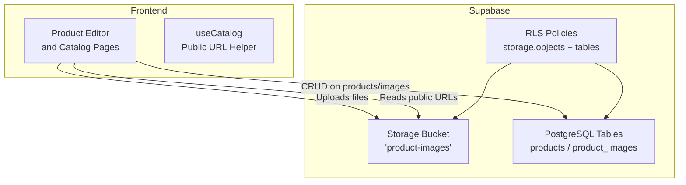
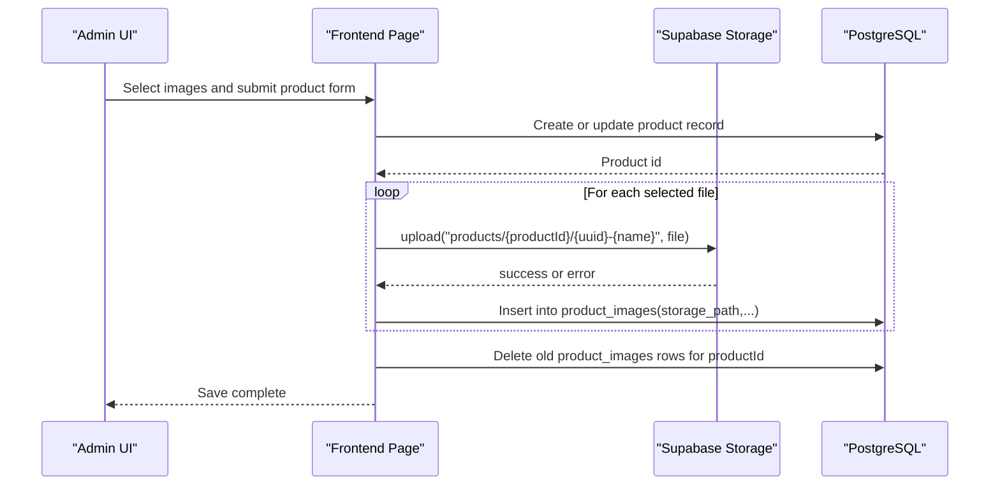
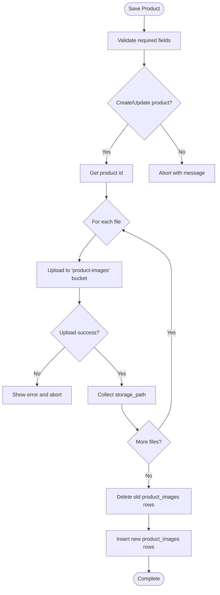
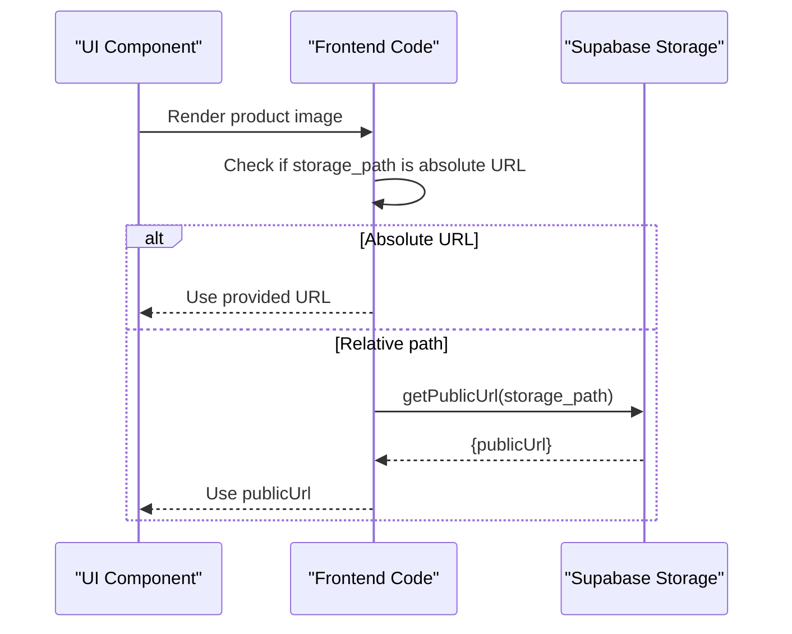
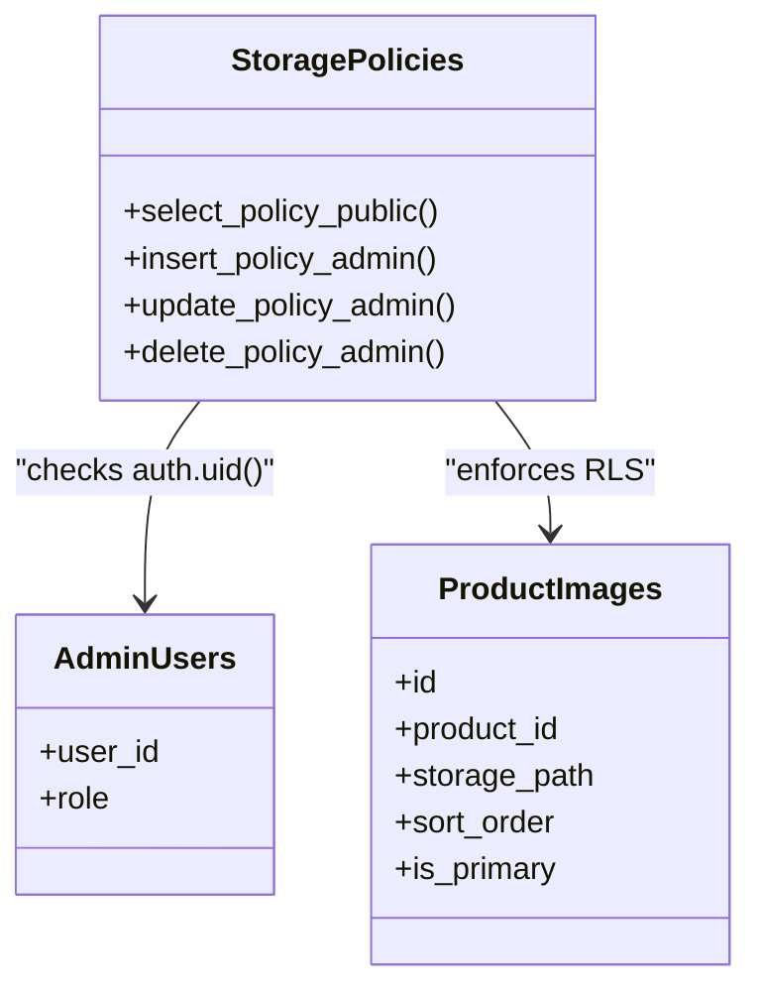
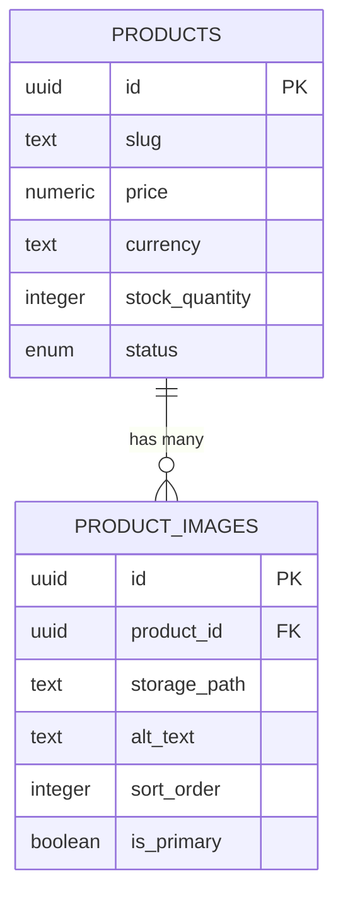
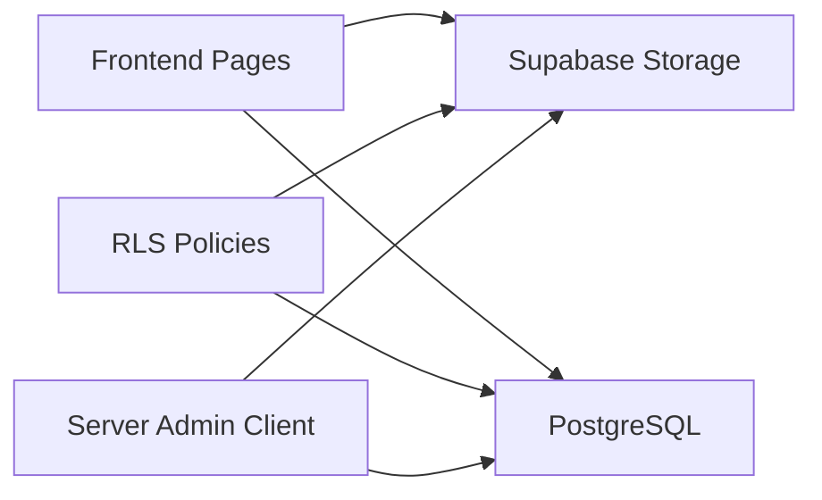

# Storage & File Management

<cite>
**Referenced Files in This Document**
- [config.toml](file://supabase/config.toml)
- [20260922000002_storage_and_rls.sql](file://supabase/migrations/20260922000002_storage_and_rls.sql)
- [index.vue](file://app/pages/index.vue)
- [useCatalog.ts](file://app/composables/useCatalog.ts)
- [supabase.ts](file://server/utils/supabase.ts)
- [product.ts](file://app/types/product.ts)
- [database.ts](file://app/types/database.ts)
</cite>

## Table of Contents
1. Introduction
2. Project Structure
3. Core Components
4. Architecture Overview
5. Detailed Component Analysis
6. Dependency Analysis
7. Performance Considerations
8. Troubleshooting Guide
9. Conclusion
10. Appendices

## Introduction
This document explains how the application integrates with Supabase Storage for product image management. It covers upload workflows, file organization, access control via policies, public URL resolution, and operational considerations such as validation, size limits, performance, caching, and cost management. The goal is to help developers understand how images are stored, secured, and served efficiently while maintaining a clear separation between metadata (PostgreSQL) and binary assets (Storage).

## Project Structure
The storage integration spans configuration, database schema, server-side client setup, and frontend usage:
- Supabase configuration defines storage limits and local development settings.
- A migration creates RLS policies that govern read/write access to the storage bucket and related tables.
- Frontend pages and composables handle uploads, public URL generation, and catalog rendering.
- A server utility provides an admin client for privileged operations when needed.

**Diagram sources**
- [index.vue:65-68](file://app/pages/index.vue#L65-L68)
- [index.vue:156-166](file://app/pages/index.vue#L156-L166)
- [useCatalog.ts:8-11](file://app/composables/useCatalog.ts#L8-L11)
- [20260922000002_storage_and_rls.sql:162-205](file://supabase/migrations/20260922000002_storage_and_rls.sql#L162-L205)

**Section sources**
- [config.toml:20-22](file://supabase/config.toml#L20-L22)
- [20260922000002_storage_and_rls.sql:162-205](file://supabase/migrations/20260922000002_storage_and_rls.sql#L162-L205)
- [index.vue:65-68](file://app/pages/index.vue#L65-L68)
- [index.vue:156-166](file://app/pages/index.vue#L156-L166)
- [useCatalog.ts:8-11](file://app/composables/useCatalog.ts#L8-L11)

## Core Components
- Storage bucket: “product-images” used for all product images.
- Database tables:
  - products: core product metadata.
  - product_images: links each image to a product via storage_path, sort order, and primary flag.
- Access control:
  - Public read policy on storage.objects for the “product-images” bucket.
  - Admin-only write/update/delete policies enforced by checking admin_users.
- Client utilities:
  - Frontend uses getPublicUrl to resolve CDN/public URLs from storage paths.
  - Server-side admin client enables privileged operations when required.

Key responsibilities:
- Upload flow: validate inputs, create unique storage path, upload to bucket, persist references in product_images.
- Read flow: fetch published products and images, compute public URLs for display.
- Security: enforce admin-only writes; allow public reads for the bucket.

**Section sources**
- [20260922_000001_create_catalog_schema.sql:49-59](file://supabase/migrations/20260922_000001_create_catalog_schema.sql#L49-L59)
- [20260922000002_storage_and_rls.sql:162-205](file://supabase/migrations/20260922000002_storage_and_rls.sql#L162-L205)
- [index.vue:156-166](file://app/pages/index.vue#L156-L166)
- [useCatalog.ts:8-11](file://app/composables/useCatalog.ts#L8-L11)
- [supabase.ts:3-19](file://server/utils/supabase.ts#L3-L19)

## Architecture Overview
The system separates concerns between metadata and media:
- Metadata lives in PostgreSQL (products, product_images).
- Media lives in Supabase Storage under a dedicated bucket.
- Policies ensure only authenticated admins can modify content, while anyone can read public images.
- The frontend resolves public URLs at render time using the storage client.

**Diagram sources**
- [index.vue:134-172](file://app/pages/index.vue#L134-L172)
- [20260922000002_storage_and_rls.sql:162-205](file://supabase/migrations/20260922000002_storage_and_rls.sql#L162-L205)

## Detailed Component Analysis

### Upload Workflow and File Organization
- File selection is handled in the editor UI and queued for upload upon save.
- Each file is uploaded to a deterministic folder structure: products/{productId}/{uuid}-{originalName}.
- After successful uploads, the application deletes existing product_images entries for the product and inserts new ones with sort_order and is_primary flags.
- Errors during upload or DB operations are caught and surfaced to the user.

**Diagram sources**
- [index.vue:134-172](file://app/pages/index.vue#L134-L172)

**Section sources**
- [index.vue:156-166](file://app/pages/index.vue#L156-L166)

### Public URL Resolution and CDN Delivery
- Public URLs are resolved per image using the storage client’s getPublicUrl method.
- If a storage_path is already a full URL, it is returned as-is; otherwise, a public URL is computed.
- This approach leverages Supabase’s built-in CDN for efficient delivery.

**Diagram sources**
- [index.vue:65-68](file://app/pages/index.vue#L65-L68)
- [useCatalog.ts:8-11](file://app/composables/useCatalog.ts#L8-L11)

**Section sources**
- [index.vue:65-68](file://app/pages/index.vue#L65-L68)
- [useCatalog.ts:8-11](file://app/composables/useCatalog.ts#L8-L11)

### Access Control and Security Policies
- Public read access is allowed for the “product-images” bucket via a storage.objects select policy.
- Write operations (insert, update, delete) require the caller to be recognized as an admin through the admin_users table.
- Row-level security is enabled on relevant tables to restrict data visibility based on product status and relationships.

**Diagram sources**
- [20260922000002_storage_and_rls.sql:162-205](file://supabase/migrations/20260922000002_storage_and_rls.sql#L162-L205)
- [20260922000002_storage_and_rls.sql:117-133](file://supabase/migrations/20260922000002_storage_and_rls.sql#L117-L133)

**Section sources**
- [20260922000002_storage_and_rls.sql:162-205](file://supabase/migrations/20260922000002_storage_and_rls.sql#L162-L205)
- [20260922000002_storage_and_rls.sql:117-133](file://supabase/migrations/20260922000002_storage_and_rls.sql#L117-L133)

### Data Models and Relationships
- product_images stores the link between a product and its images via storage_path, along with ordering and primary image flags.
- Types define the shape of records used across the app.

**Diagram sources**
- [20260922_000001_create_catalog_schema.sql:49-59](file://supabase/migrations/20260922_000001_create_catalog_schema.sql#L49-L59)
- [product.ts:32-39](file://app/types/product.ts#L32-L39)
- [database.ts:104-109](file://app/types/database.ts#L104-L109)

**Section sources**
- [20260922_000001_create_catalog_schema.sql:49-59](file://supabase/migrations/20260922_000001_create_catalog_schema.sql#L49-L59)
- [product.ts:32-39](file://app/types/product.ts#L32-L39)
- [database.ts:104-109](file://app/types/database.ts#L104-L109)

### Server-Side Admin Client
- A server utility constructs a Supabase client using service role credentials for privileged operations where necessary.
- It enforces runtime checks for required configuration values before creating the client.

**Section sources**
- [supabase.ts:3-19](file://server/utils/supabase.ts#L3-L19)

## Dependency Analysis
- Frontend components depend on:
  - Supabase Storage client for uploads and public URL resolution.
  - Supabase PostgREST client for product and image CRUD.
- Backend/server depends on:
  - Supabase service role client for admin tasks.
- Policies enforce:
  - Public read on storage bucket.
  - Admin-only write/update/delete on storage and tables.

**Diagram sources**
- [index.vue:156-166](file://app/pages/index.vue#L156-L166)
- [useCatalog.ts:8-11](file://app/composables/useCatalog.ts#L8-L11)
- [20260922000002_storage_and_rls.sql:162-205](file://supabase/migrations/20260922000002_storage_and_rls.sql#L162-L205)
- [supabase.ts:3-19](file://server/utils/supabase.ts#L3-L19)

**Section sources**
- [index.vue:156-166](file://app/pages/index.vue#L156-L166)
- [useCatalog.ts:8-11](file://app/composables/useCatalog.ts#L8-L11)
- [20260922000002_storage_and_rls.sql:162-205](file://supabase/migrations/20260922000002_storage_and_rls.sql#L162-L205)
- [supabase.ts:3-19](file://server/utils/supabase.ts#L3-L19)

## Performance Considerations
- Image optimization:
  - Pre-process images on the server or via a function to reduce size and convert to web-friendly formats before upload.
  - Generate multiple sizes (e.g., thumbnail, medium, large) and store them under versioned paths to support responsive delivery.
- Caching strategies:
  - Leverage browser caching via cache-control headers configured in the storage bucket.
  - Use CDN features (e.g., edge caching) to minimize origin requests.
- Cost management:
  - Enforce strict file size limits and format restrictions to avoid unnecessary storage costs.
  - Implement lifecycle rules to archive or delete outdated images.
- Network efficiency:
  - Use lazy loading for images below the fold.
  - Prefer smaller thumbnails for listings and larger versions on detail pages.

[No sources needed since this section provides general guidance]

## Troubleshooting Guide
Common issues and resolutions:
- Upload fails due to insufficient permissions:
  - Ensure the current user exists in admin_users and policies allow insert/update/delete on the bucket.
- Upload exceeds size limit:
  - Adjust file_size_limit in storage configuration or implement client-side validation to reject oversized files.
- Public URL not resolving:
  - Verify the storage_path is correct and the bucket allows public reads.
- Inconsistent image references:
  - Confirm that product_images rows are updated atomically after uploads and that old references are removed.

Operational tips:
- Log errors from storage and DB calls and surface user-friendly messages.
- Add retry logic for transient network failures during upload.
- Monitor storage usage and set alerts for unexpected growth.

**Section sources**
- [20260922000002_storage_and_rls.sql:162-205](file://supabase/migrations/20260922000002_storage_and_rls.sql#L162-L205)
- [config.toml:20-22](file://supabase/config.toml#L20-L22)
- [index.vue:156-172](file://app/pages/index.vue#L156-L172)

## Conclusion
The application uses Supabase Storage to manage product images with a clear separation between metadata and media. Policies secure the bucket and database tables, while the frontend handles uploads and public URL resolution. By following the guidelines in this document—especially around validation, size limits, optimization, and caching—you can build a robust, performant, and cost-effective image management system.

[No sources needed since this section summarizes without analyzing specific files]

## Appendices

### Configuration Reference
- Storage size limit: defined in the storage section of the configuration file.
- Local development ports and schemas are also specified for convenience.

**Section sources**
- [config.toml:1-32](file://supabase/config.toml#L1-L32)

### Policy Summary
- Public read on storage.objects for the “product-images” bucket.
- Admin-only insert/update/delete on storage.objects for the same bucket.
- Row-level security on product-related tables to restrict visibility based on status and relationships.

**Section sources**
- [20260922000002_storage_and_rls.sql:162-205](file://supabase/migrations/20260922000002_storage_and_rls.sql#L162-L205)
- [20260922000002_storage_and_rls.sql:117-133](file://supabase/migrations/20260922000002_storage_and_rls.sql#L117-L133)