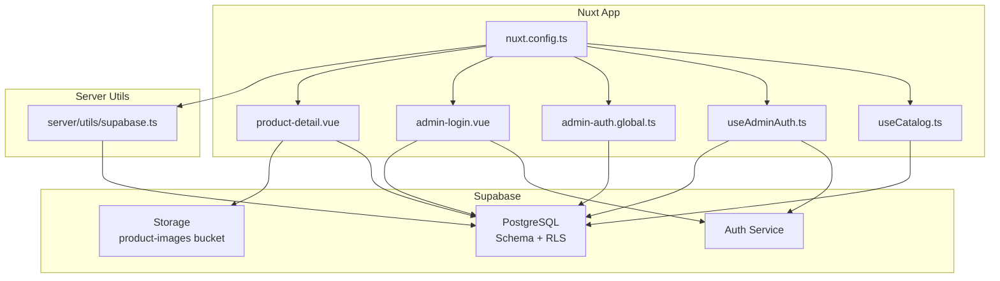
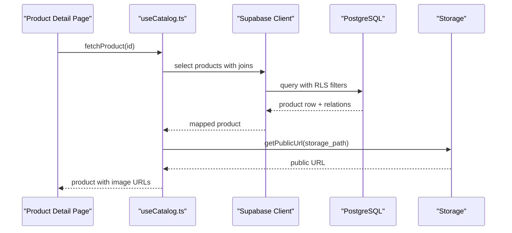
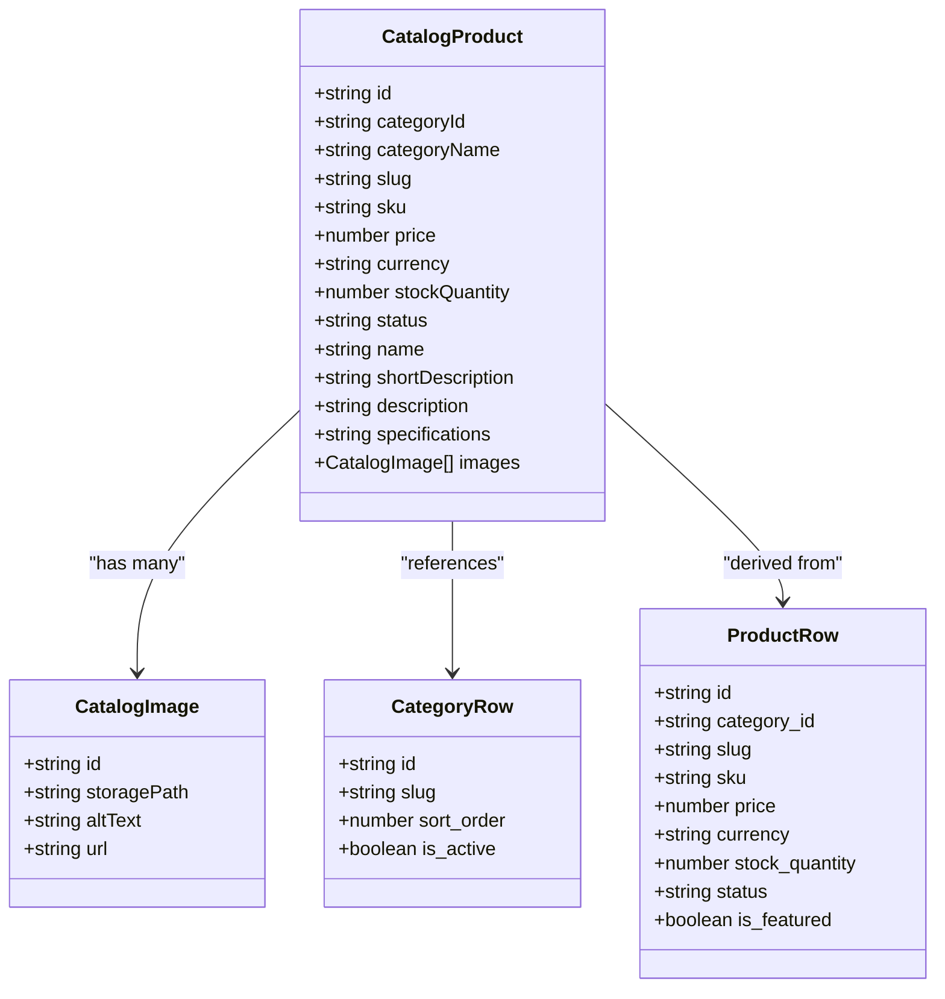
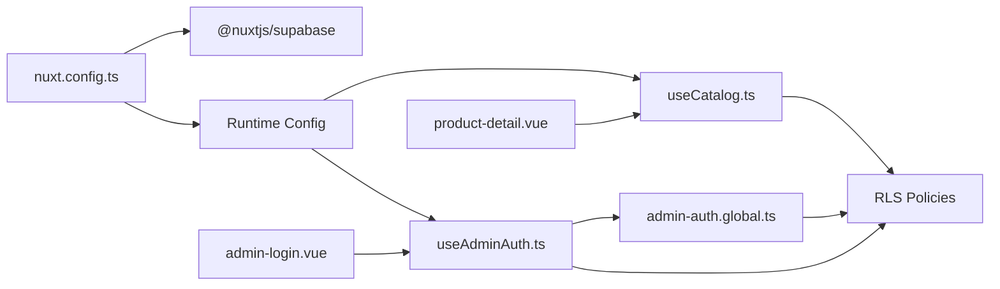

# Supabase Integration

<cite>
**Referenced Files in This Document**
- [nuxt.config.ts](file://nuxt.config.ts)
- [supabase.ts](file://server/utils/supabase.ts)
- [useAdminAuth.ts](file://app/composables/useAdminAuth.ts)
- [useCatalog.ts](file://app/composables/useCatalog.ts)
- [database.ts](file://app/types/database.ts)
- [catalog.ts](file://app/types/catalog.ts)
- [create_catalog_schema.sql](file://supabase/migrations/20260922_000001_create_catalog_schema.sql)
- [storage_and_rls.sql](file://supabase/migrations/20260922000002_storage_and_rls.sql)
- [remove_recursive_admin_users_policy.sql](file://supabase/migrations/20260922073136_remove_recursive_admin_users_policy.sql)
- [config.toml](file://supabase/config.toml)
- [admin-login.vue](file://app/pages/admin/login.vue)
- [product-detail.vue](file://app/pages/products/[id].vue)
- [admin-auth.global.ts](file://app/middleware/admin-auth.global.ts)
</cite>

## Table of Contents
1. Introduction
2. Project Structure
3. Core Components
4. Architecture Overview
5. Detailed Component Analysis
6. Dependency Analysis
7. Performance Considerations
8. Troubleshooting Guide
9. Conclusion

## Introduction
This document explains the Supabase integration for a Nuxt-based catalog application. It covers database connectivity, real-time capabilities, storage management, authentication, and operational best practices. The focus is on how the app configures the Supabase client, performs CRUD operations, manages product images via Storage, enforces security with Row Level Security (RLS), and handles admin authentication flows.

## Project Structure
The project integrates Supabase through:
- Environment-driven configuration in the Nuxt runtime config
- A server-side admin client for privileged operations
- Composables for catalog data access and admin authentication
- Database schema and RLS policies defined in migrations
- Storage policies for public read and admin-only write access to product images

**Diagram sources**
- [nuxt.config.ts:9-26](file://nuxt.config.ts#L9-L26)
- [useCatalog.ts:4-59](file://app/composables/useCatalog.ts#L4-L59)
- [useAdminAuth.ts:3-77](file://app/composables/useAdminAuth.ts#L3-L77)
- [admin-auth.global.ts:1-28](file://app/middleware/admin-auth.global.ts#L1-L28)
- [admin-login.vue:15-54](file://app/pages/admin/login.vue#L15-L54)
- [product-detail.vue:10-46](file://app/pages/products/[id].vue#L10-L46)
- [supabase.ts:3-19](file://server/utils/supabase.ts#L3-L19)

**Section sources**
- [nuxt.config.ts:9-26](file://nuxt.config.ts#L9-L26)
- [create_catalog_schema.sql:3-75](file://supabase/migrations/20260922_000001_create_catalog_schema.sql#L3-L75)
- [storage_and_rls.sql:1-205](file://supabase/migrations/20260922000002_storage_and_rls.sql#L1-L205)

## Core Components
- Client configuration and environment variables:
  - Public URL and anon key are exposed to the client via runtime config
  - Service role key is kept server-only for privileged operations
- Admin client factory:
  - Creates a Supabase client with service role key and disables session persistence/refresh for server use
- Catalog composable:
  - Provides typed queries for products, categories, and image URLs
- Admin auth composable:
  - Wraps sign-in/sign-out and admin role checks against the admin_users table
- Middleware guard:
  - Protects /admin routes by verifying user identity and admin record existence
- Migrations:
  - Define schema, indexes, triggers, and RLS policies for secure data access
  - Storage policies allow public reads and admin writes to the product-images bucket

**Section sources**
- [nuxt.config.ts:9-26](file://nuxt.config.ts#L9-L26)
- [supabase.ts:3-19](file://server/utils/supabase.ts#L3-L19)
- [useCatalog.ts:4-59](file://app/composables/useCatalog.ts#L4-L59)
- [useAdminAuth.ts:3-77](file://app/composables/useAdminAuth.ts#L3-L77)
- [admin-auth.global.ts:1-28](file://app/middleware/admin-auth.global.ts#L1-L28)
- [create_catalog_schema.sql:3-75](file://supabase/migrations/20260922_000001_create_catalog_schema.sql#L3-L75)
- [storage_and_rls.sql:1-205](file://supabase/migrations/20260922000002_storage_and_rls.sql#L1-L205)

## Architecture Overview
The application uses two Supabase clients:
- Client-side anonymous client for public catalog reads and authenticated admin actions
- Server-side admin client using the service role key for privileged operations

Data access is governed by RLS policies that restrict visibility based on status and roles. Storage access is similarly policy-driven, allowing public reads and admin-only writes to the product-images bucket.

**Diagram sources**
- [product-detail.vue:10-46](file://app/pages/products/[id].vue#L10-L46)
- [useCatalog.ts:37-47](file://app/composables/useCatalog.ts#L37-L47)
- [storage_and_rls.sql:162-164](file://supabase/migrations/20260922000002_storage_and_rls.sql#L162-L164)

## Detailed Component Analysis

### Supabase Client Configuration and Environment Variables
- Runtime configuration exposes:
  - Public Supabase URL and anon key to the browser
  - Service role key only on the server
- Supabase module options configure redirect behavior, cookie settings, and keys
- Server admin client disables session persistence and token refresh for server-side usage

Key behaviors:
- Missing configuration throws an error at client creation time
- Public endpoints rely on RLS to filter data
- Admin endpoints can bypass RLS when using the service role client

**Section sources**
- [nuxt.config.ts:9-26](file://nuxt.config.ts#L9-L26)
- [supabase.ts:3-19](file://server/utils/supabase.ts#L3-L19)

### Database Connectivity and Query Patterns
- Schema includes categories, products, translations, images, and admin users
- Indexes optimize common queries (category_id, status, locale, slug)
- Triggers update timestamps automatically
- RLS policies:
  - Public reads limited to active categories and published products
  - Admins can manage all catalog entities
  - Product images readable by everyone; writable by admins

CRUD patterns used:
- List published products ordered by created_at
- Fetch single product by id with status filter
- Fetch active categories sorted by sort_order
- Map results into domain types and compute derived fields (e.g., localized names)

Optimization notes:
- Use selective selects to reduce payload size
- Leverage existing indexes for filtering and ordering
- Avoid N+1 by selecting related tables in a single query

**Section sources**
- [create_catalog_schema.sql:3-75](file://supabase/migrations/20260922_000001_create_catalog_schema.sql#L3-L75)
- [useCatalog.ts:37-57](file://app/composables/useCatalog.ts#L37-L57)
- [database.ts:77-122](file://app/types/database.ts#L77-L122)

### Real-Time Features
- The current implementation does not subscribe to Supabase channels or listen to realtime events
- To add real-time updates (e.g., inventory changes), you would:
  - Subscribe to channels on relevant tables
  - Maintain local cache state and reconcile incoming changes
  - Handle reconnection and error scenarios gracefully

[No sources needed since this section describes conceptual enhancements]

### Optimistic Updates
- Not implemented in the current codebase
- Recommended approach:
  - Update local UI immediately
  - Send mutation to server
  - Reconcile on success or rollback on failure
  - Use optimistic UI states and loading indicators

[No sources needed since this section describes conceptual enhancements]

### Storage Management for Product Images
- Bucket: product-images
- Policies:
  - Public SELECT allowed for the bucket
  - Insert/Update/Delete restricted to admins (via admin_users check)
- Image URLs are resolved via getPublicUrl and embedded into product mappings

Operational considerations:
- Enforce file size limits via Supabase storage settings
- Validate file types and sizes before upload on the server side
- Use CDN caching headers if configured at the platform level

**Section sources**
- [storage_and_rls.sql:162-205](file://supabase/migrations/20260922000002_storage_and_rls.sql#L162-L205)
- [useCatalog.ts:8-11](file://app/composables/useCatalog.ts#L8-L11)
- [config.toml:20-21](file://supabase/config.toml#L20-L21)

### Authentication Integration and Session Management
- Admin login flow:
  - Sign in with email/password
  - Verify admin record exists for the user
  - Redirect to catalog on success
- Authorization middleware:
  - Guards /admin routes
  - Checks user identity and admin record presence
- Role checks:
  - isAdmin and isSuperAdmin helpers query admin_users for role information

Security notes:
- Always validate admin privileges server-side where possible
- Use RLS to enforce data access rules consistently
- Keep service role key secret and never expose it to the client

**Section sources**
- [admin-login.vue:15-54](file://app/pages/admin/login.vue#L15-L54)
- [admin-auth.global.ts:1-28](file://app/middleware/admin-auth.global.ts#L1-L28)
- [useAdminAuth.ts:16-54](file://app/composables/useAdminAuth.ts#L16-L54)
- [storage_and_rls.sql:40-160](file://supabase/migrations/20260922000002_storage_and_rls.sql#L40-L160)

### Data Fetching with Error Handling and Loading States
- Product detail page:
  - Shows loading skeleton while fetching
  - Displays error alerts on failure
  - Renders product details when available
- Catalog composable:
  - Throws errors from Supabase responses for consistent handling
  - Maps raw rows to typed domain models

Best practices:
- Centralize error messages and localization
- Debounce rapid navigation to avoid redundant requests
- Cache results at the component or store level if appropriate

**Section sources**
- [product-detail.vue:10-46](file://app/pages/products/[id].vue#L10-L46)
- [useCatalog.ts:37-47](file://app/composables/useCatalog.ts#L37-L47)

### Class and Type Relationships

**Diagram sources**
- [catalog.ts:1-31](file://app/types/catalog.ts#L1-L31)
- [database.ts:14-75](file://app/types/database.ts#L14-L75)

## Dependency Analysis
- Nuxt config wires up Supabase module and runtime config
- Composables depend on Supabase client provided by the module
- Middleware depends on Supabase client and admin_users table
- Pages consume composables for data and auth flows
- Migrations define schema and policies that govern client behavior

**Diagram sources**
- [nuxt.config.ts:8-26](file://nuxt.config.ts#L8-L26)
- [useCatalog.ts:4-59](file://app/composables/useCatalog.ts#L4-L59)
- [useAdminAuth.ts:3-77](file://app/composables/useAdminAuth.ts#L3-L77)
- [admin-auth.global.ts:1-28](file://app/middleware/admin-auth.global.ts#L1-L28)
- [storage_and_rls.sql:1-205](file://supabase/migrations/20260922000002_storage_and_rls.sql#L1-L205)

**Section sources**
- [nuxt.config.ts:8-26](file://nuxt.config.ts#L8-L26)
- [storage_and_rls.sql:1-205](file://supabase/migrations/20260922000002_storage_and_rls.sql#L1-L205)

## Performance Considerations
- Query optimization:
  - Use selective column lists to minimize payloads
  - Filter early with indexed columns (status, category_id, locale, slug)
  - Order by indexed fields where possible
- Caching:
  - Consider component-level caching or SSR hydration for product listings
  - Use browser cache headers for static assets and CDN-cached images
- Real-time:
  - If added, limit subscriptions to necessary channels and debounce updates
- Storage:
  - Ensure images are optimized and served via CDN
  - Enforce file size limits and validate uploads server-side

[No sources needed since this section provides general guidance]

## Troubleshooting Guide
Common issues and resolutions:
- Missing Supabase configuration:
  - Symptom: Error thrown when creating admin client due to missing URL or service role key
  - Resolution: Ensure runtime config has required environment variables set
- Unauthorized access to admin routes:
  - Symptom: Redirected to login even after signing in
  - Resolution: Verify admin_users record exists for the user and RLS policies are correctly applied
- Product not found:
  - Symptom: Empty product detail page
  - Resolution: Check that the product status is published and RLS allows selection
- Storage access denied:
  - Symptom: Upload/update/delete fails for product images
  - Resolution: Confirm user has admin role and storage policies allow operations for the bucket
- Realtime not updating:
  - Symptom: UI does not reflect backend changes
  - Resolution: Implement channel subscriptions and handle reconnection logic

**Section sources**
- [supabase.ts:9-11](file://server/utils/supabase.ts#L9-L11)
- [admin-auth.global.ts:7-26](file://app/middleware/admin-auth.global.ts#L7-L26)
- [storage_and_rls.sql:162-205](file://supabase/migrations/20260922000002_storage_and_rls.sql#L162-L205)
- [product-detail.vue:10-46](file://app/pages/products/[id].vue#L10-L46)

## Conclusion
The application integrates Supabase with a clear separation between public and admin operations. RLS policies enforce secure data access, while storage policies protect product images. The catalog composable provides efficient, typed queries, and the admin auth flow ensures only authorized users can manage content. For further improvements, consider adding real-time subscriptions, optimistic updates, and enhanced caching strategies to improve responsiveness and scalability.