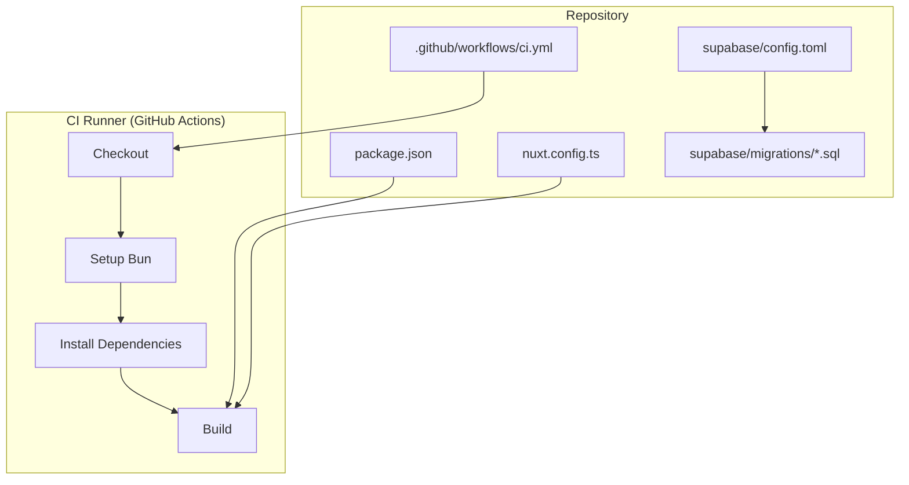
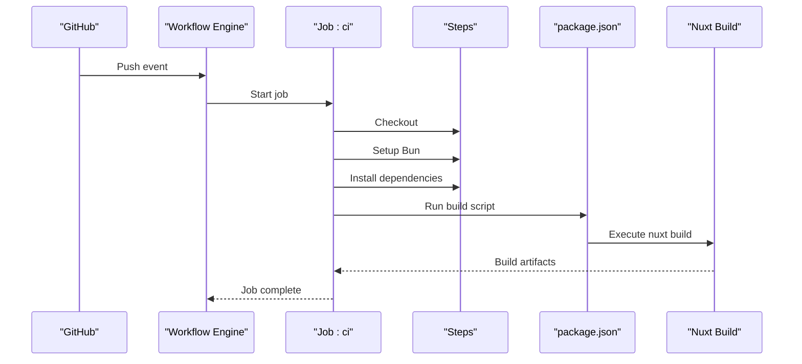
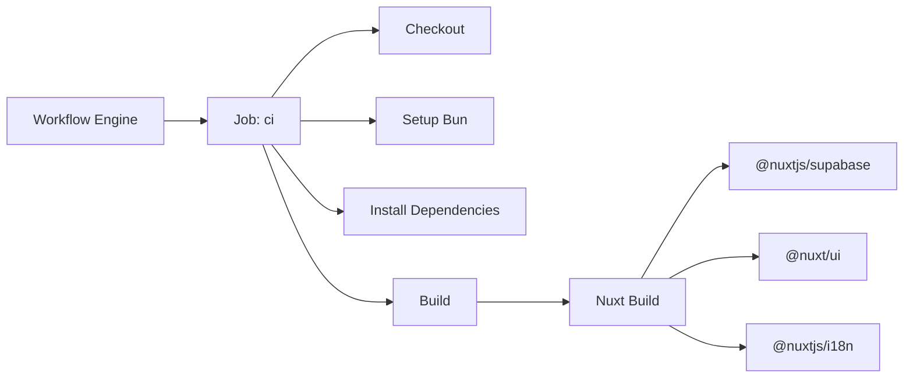

# CI/CD Pipeline Configuration

<cite>
**Referenced Files in This Document**
- [ci.yml](file://.github/workflows/ci.yml)
- [package.json](file://package.json)
- [nuxt.config.ts](file://nuxt.config.ts)
- [config.toml](file://supabase/config.toml)
- [20260922_000001_create_catalog_schema.sql](file://supabase/migrations/20260922_000001_create_catalog_schema.sql)
- [20260922000002_storage_and_rls.sql](file://supabase/migrations/20260922000002_storage_and_rls.sql)
- [20260922073136_remove_recursive_admin_users_policy.sql](file://supabase/migrations/20260922073136_remove_recursive_admin_users_policy.sql)
</cite>

## Table of Contents
1. [Introduction](#introduction)
2. [Project Structure](#project-structure)
3. [Core Components](#core-components)
4. [Architecture Overview](#architecture-overview)
5. [Detailed Component Analysis](#detailed-component-analysis)
6. [Dependency Analysis](#dependency-analysis)
7. [Performance Considerations](#performance-considerations)
8. [Troubleshooting Guide](#troubleshooting-guide)
9. [Conclusion](#conclusion)

## Introduction
This document explains the CI/CD pipeline configuration and automation processes for the project, focusing on GitHub Actions workflow setup, build process configuration, environment variable management, artifact handling, database migrations, storage bucket setup, Supabase integration testing, deployment stages, rollback procedures, monitoring/logging strategies, failure notifications, debugging failed builds, performance optimization, caching dependencies, parallelizing tests, troubleshooting common issues, and security considerations for sensitive configuration.

## Project Structure
The repository includes a Nuxt application with Supabase integration, local Supabase configuration, and a minimal GitHub Actions workflow that checks out code, installs Bun, installs dependencies, and runs the build.

**Diagram sources**
- [ci.yml:1-26](file://.github/workflows/ci.yml#L1-L26)
- [package.json:1-26](file://package.json#L1-L26)
- [nuxt.config.ts:1-52](file://nuxt.config.ts#L1-L52)
- [config.toml:1-32](file://supabase/config.toml#L1-L32)
- [20260922_000001_create_catalog_schema.sql:1-113](file://supabase/migrations/20260922_000001_create_catalog_schema.sql#L1-L113)
- [20260922000002_storage_and_rls.sql:1-205](file://supabase/migrations/20260922000002_storage_and_rls.sql#L1-L205)
- [20260922073136_remove_recursive_admin_users_policy.sql:1-2](file://supabase/migrations/20260922073136_remove_recursive_admin_users_policy.sql#L1-L2)

**Section sources**
- [ci.yml:1-26](file://.github/workflows/ci.yml#L1-L26)
- [package.json:1-26](file://package.json#L1-L26)
- [nuxt.config.ts:1-52](file://nuxt.config.ts#L1-L52)
- [config.toml:1-32](file://supabase/config.toml#L1-L32)

## Core Components
- GitHub Actions Workflow: Defines a single job that runs on push to any branch, using Ubuntu latest, checking out code, installing Bun, installing dependencies with a frozen lockfile, and running the build script.
- Build Scripts: The build is executed via the Nuxt CLI through the package scripts.
- Runtime Configuration: Nuxt runtime config reads Supabase URLs and keys from environment variables; public and service role keys are configured.
- Local Supabase Config: Defines ports, schemas, storage limits, auth settings, and Studio availability for local development.
- Database Migrations: SQL files define schema, indexes, triggers, row-level security policies, and storage policies.

Key responsibilities:
- ci.yml orchestrates checkout, toolchain setup, dependency installation, and build execution.
- package.json defines the build command and postinstall hook.
- nuxt.config.ts configures modules, runtime config, Supabase module options, UI theme, color mode, and i18n.
- supabase/config.toml sets up local Supabase services and storage constraints.
- SQL migrations implement catalog schema, RLS policies, and storage policies.

**Section sources**
- [ci.yml:1-26](file://.github/workflows/ci.yml#L1-L26)
- [package.json:1-26](file://package.json#L1-L26)
- [nuxt.config.ts:1-52](file://nuxt.config.ts#L1-L52)
- [config.toml:1-32](file://supabase/config.toml#L1-L32)
- [20260922_000001_create_catalog_schema.sql:1-113](file://supabase/migrations/20260922_000001_create_catalog_schema.sql#L1-L113)
- [20260922000002_storage_and_rls.sql:1-205](file://supabase/migrations/20260922000002_storage_and_rls.sql#L1-L205)
- [20260922073136_remove_recursive_admin_users_policy.sql:1-2](file://supabase/migrations/20260922073136_remove_recursive_admin_users_policy.sql#L1-L2)

## Architecture Overview
The CI pipeline executes a linear sequence: checkout, install Bun, install dependencies, and run the build. The build depends on Nuxt and its modules, including Supabase integration. Environment variables control runtime configuration for Supabase.

**Diagram sources**
- [ci.yml:1-26](file://.github/workflows/ci.yml#L1-L26)
- [package.json:1-26](file://package.json#L1-L26)

## Detailed Component Analysis

### GitHub Actions Workflow
- Triggers: Runs on push events.
- Matrix: Single OS target (ubuntu-latest).
- Steps:
  - Checkout repository.
  - Install Bun runtime.
  - Install dependencies using a frozen lockfile.
  - Run the build script.

Recommendations:
- Add automated testing and linting steps.
- Cache dependencies to speed up subsequent runs.
- Parallelize test suites by splitting into multiple jobs or matrix entries.
- Publish build artifacts for preview deployments.

**Section sources**
- [ci.yml:1-26](file://.github/workflows/ci.yml#L1-L26)

### Build Process Configuration
- Build command: Executed via Nuxt CLI as defined in package scripts.
- Postinstall hook: Prepares Nuxt during dependency installation.
- Output: Nuxt generates production-ready assets under the default output directory.

Environment variables required at build time:
- NUXT_PUBLIC_SUPABASE_URL
- NUXT_PUBLIC_SUPABASE_ANON_KEY
- SUPABASE_SERVICE_ROLE_KEY

Notes:
- The build uses these variables to configure the Supabase client and module.
- Ensure secrets are provided in GitHub repository settings when deploying to environments requiring Supabase credentials.

**Section sources**
- [package.json:1-26](file://package.json#L1-L26)
- [nuxt.config.ts:9-25](file://nuxt.config.ts#L9-L25)

### Environment Variable Management
- Public Supabase URL and anon key are exposed to the client via runtimeConfig.public.
- Service role key is used server-side for privileged operations.
- Defaults are present for local development but should be overridden in CI/CD with secure secrets.

Security guidance:
- Store SUPABASE_SERVICE_ROLE_KEY as a GitHub secret.
- Avoid committing real values; use placeholders or environment-specific overrides.
- Restrict access to secrets at the organization or repository level.

**Section sources**
- [nuxt.config.ts:9-25](file://nuxt.config.ts#L9-L25)

### Artifact Handling
- Current workflow does not explicitly publish artifacts.
- Recommended approach:
  - After successful build, upload generated static assets or server bundle as an artifact.
  - Use artifact retention policies to manage storage costs.
  - Reference artifacts in downstream deployment jobs.

**Section sources**
- [ci.yml:1-26](file://.github/workflows/ci.yml#L1-L26)

### Database Migrations
- Migration files define:
  - Catalog schema tables and relationships.
  - Indexes for performance.
  - Updated-at triggers for auditability.
  - Row-level security policies for read/write access control.
  - Storage policies for product images bucket.

CI/CD recommendations:
- Add a dedicated job to apply migrations against a Supabase project or local instance.
- Use idempotent migration commands and versioned migration directories.
- Validate migrations before applying them to production.

**Section sources**
- [20260922_000001_create_catalog_schema.sql:1-113](file://supabase/migrations/20260922_000001_create_catalog_schema.sql#L1-L113)
- [20260922000002_storage_and_rls.sql:1-205](file://supabase/migrations/20260922000002_storage_and_rls.sql#L1-L205)
- [20260922073136_remove_recursive_admin_users_policy.sql:1-2](file://supabase/migrations/20260922073136_remove_recursive_admin_users_policy.sql#L1-L2)

### Storage Bucket Setup
- Policies allow public read access to the product-images bucket and restrict write/update/delete to authenticated admins.
- Local Supabase config sets file size limits and storage-related behavior.

CI/CD recommendations:
- Create the product-images bucket if it does not exist.
- Apply storage policies via SQL or Supabase CLI.
- Verify policy enforcement with integration tests.

**Section sources**
- [20260922000002_storage_and_rls.sql:162-205](file://supabase/migrations/20260922000002_storage_and_rls.sql#L162-L205)
- [config.toml:20-21](file://supabase/config.toml#L20-L21)

### Supabase Integration Testing
- The application integrates Supabase via the Nuxt module and runtime configuration.
- Integration tests should:
  - Initialize a test Supabase instance or use a staging project.
  - Seed test data and reset state between tests.
  - Assert RLS policies and storage policies.
  - Validate admin authentication flows and protected endpoints.

CI/CD recommendations:
- Spin up a Supabase instance locally or use ephemeral projects.
- Run integration tests after applying migrations.
- Capture logs and artifacts for failures.

**Section sources**
- [nuxt.config.ts:16-25](file://nuxt.config.ts#L16-L25)
- [20260922000002_storage_and_rls.sql:1-205](file://supabase/migrations/20260922000002_storage_and_rls.sql#L1-L205)

### Deployment Pipeline Stages
- Current workflow only builds the app.
- Suggested stages:
  - Test and Lint
  - Build
  - Deploy Preview (feature branches)
  - Deploy Production (protected branches/tags)
- Each stage should validate prerequisites, set environment variables, and handle rollbacks.

**Section sources**
- [ci.yml:1-26](file://.github/workflows/ci.yml#L1-L26)

### Rollback Procedures
- Maintain previous build artifacts and deployment versions.
- Use immutable tags or versioned releases.
- Implement quick rollback by redeploying the last known good artifact.
- Automate rollback triggers based on health checks or error rates.

[No sources needed since this section provides general guidance]

### Monitoring and Logging Strategies
- Enable logging for each step in CI workflows.
- Collect build logs and test reports.
- Integrate with alerting systems for failed jobs.
- For Supabase, monitor query performance and RLS policy violations.

[No sources needed since this section provides general guidance]

### Failure Notifications
- Configure notifications via email, Slack, or other channels.
- Use status badges to indicate pipeline health.
- Provide actionable error messages and links to logs.

[No sources needed since this section provides general guidance]

### Debugging Failed Builds
- Reproduce locally using the same toolchain (Bun version).
- Inspect dependency resolution errors and lockfile mismatches.
- Validate environment variables and secrets.
- Check Supabase connectivity and permissions.

[No sources needed since this section provides general guidance]

## Dependency Analysis
The CI workflow depends on:
- GitHub Actions runner environment.
- Bun runtime installed via a community action.
- Node-like package manager commands executed by Bun.
- Nuxt build system and its modules.

**Diagram sources**
- [ci.yml:1-26](file://.github/workflows/ci.yml#L1-L26)
- [package.json:12-23](file://package.json#L12-L23)
- [nuxt.config.ts:8-8](file://nuxt.config.ts#L8-L8)

**Section sources**
- [ci.yml:1-26](file://.github/workflows/ci.yml#L1-L26)
- [package.json:12-23](file://package.json#L12-L23)
- [nuxt.config.ts:8-8](file://nuxt.config.ts#L8-L8)

## Performance Considerations
Optimization strategies:
- Cache dependencies:
  - Cache Bun’s dependency store keyed by the lockfile hash.
  - Restore cache before installing dependencies.
- Parallelize tests:
  - Split tests across multiple jobs or shards.
  - Use matrix strategy for different Node/Bun versions if needed.
- Reduce IO overhead:
  - Limit workspace size and avoid unnecessary file operations.
- Optimize build:
  - Use incremental builds where supported.
  - Exclude dev-only dependencies in production builds.

[No sources needed since this section provides general guidance]

## Troubleshooting Guide
Common issues and resolutions:
- Lockfile mismatch:
  - Ensure the lockfile is committed and consistent across environments.
  - Use frozen lockfile mode in CI to prevent drift.
- Missing environment variables:
  - Verify that all required Supabase variables are set in GitHub secrets.
  - Confirm runtime config reads the correct variables.
- Supabase connectivity:
  - Check network access and firewall rules.
  - Validate API keys and permissions.
- Build failures due to modules:
  - Ensure compatible versions of Nuxt and modules.
  - Review module configuration in Nuxt config.

**Section sources**
- [ci.yml:21-25](file://.github/workflows/ci.yml#L21-L25)
- [nuxt.config.ts:9-25](file://nuxt.config.ts#L9-L25)

## Security Considerations
Sensitive configuration best practices:
- Store secrets in GitHub Secrets and reference them in workflows.
- Never hardcode SUPABASE_SERVICE_ROLE_KEY or other secrets in code.
- Restrict access to secrets at the repository or organization level.
- Rotate secrets regularly and audit usage.
- Use least-privilege principles for Supabase roles and policies.

**Section sources**
- [nuxt.config.ts:9-25](file://nuxt.config.ts#L9-L25)

## Conclusion
The current CI pipeline performs checkout, dependency installation, and build execution. To strengthen reliability and security, add testing, linting, caching, artifact publishing, and deployment stages. Integrate database migration and storage bucket setup jobs, enforce environment-specific configurations, and implement robust monitoring, logging, and failure notification mechanisms. Follow security best practices for managing sensitive configuration and optimize pipeline performance through caching and parallelization.