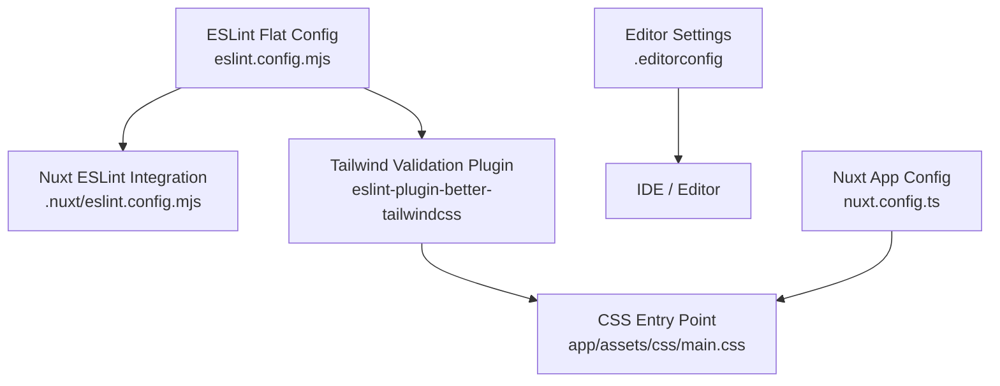
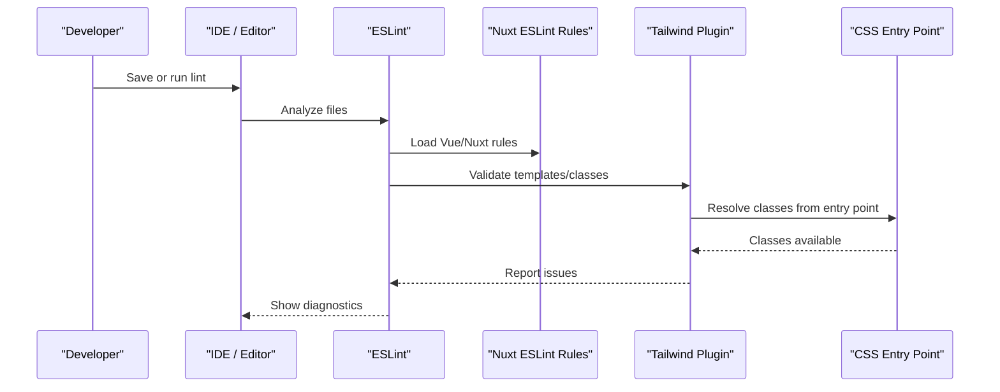
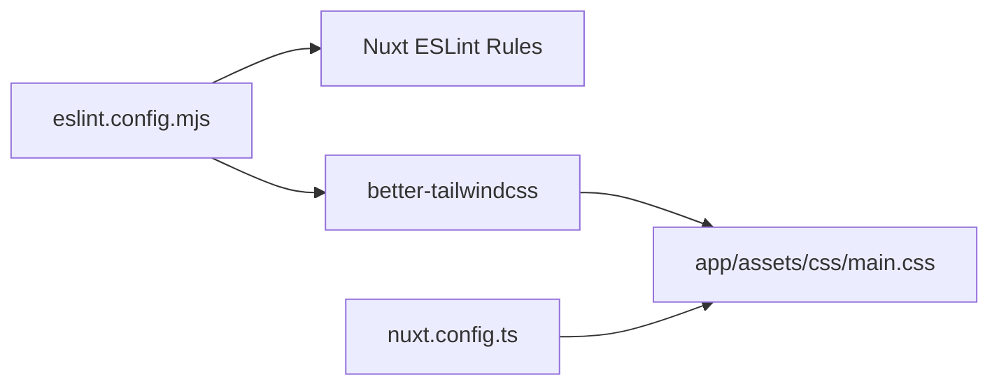

# Code Quality Tools & Linting

<cite>
**Referenced Files in This Document**
- [eslint.config.mjs](file://eslint.config.mjs)
- [package.json](file://package.json)
- [nuxt.config.ts](file://nuxt.config.ts)
- [.editorconfig](file://.editorconfig)
</cite>

## Table of Contents
1. [Introduction](#introduction)
2. [Project Structure](#project-structure)
3. [Core Components](#core-components)
4. [Architecture Overview](#architecture-overview)
5. [Detailed Component Analysis](#detailed-component-analysis)
6. [Dependency Analysis](#dependency-analysis)
7. [Performance Considerations](#performance-considerations)
8. [Troubleshooting Guide](#troubleshooting-guide)
9. [Conclusion](#conclusion)
10. [Appendices](#appendices)

## Introduction
This document explains the code quality and linting setup for this Nuxt.js project, focusing on ESLint configuration with Nuxt integration and Tailwind CSS validation using eslint-plugin-better-tailwindcss. It also covers how to extend rules for TypeScript and Vue components, integrate with development workflows (pre-commit hooks and IDEs), handle common issues, and optimize performance for large codebases. The goal is to help teams maintain consistent code style and enforce standards through automated checks.

## Project Structure
The project uses a modern ESLint flat config and integrates with Nuxt via a generated config that provides Vue and Nuxt-specific rules. Tailwind CSS validation is enabled through a dedicated plugin configured to analyze your component templates against your CSS entry point. Editor behavior is standardized via an EditorConfig file.

**Diagram sources**
- [eslint.config.mjs:1-20](file://eslint.config.mjs#L1-L20)
- [nuxt.config.ts:1-52](file://nuxt.config.ts#L1-L52)
- [.editorconfig:1-14](file://.editorconfig#L1-L14)

**Section sources**
- [eslint.config.mjs:1-20](file://eslint.config.mjs#L1-L20)
- [nuxt.config.ts:1-52](file://nuxt.config.ts#L1-L52)
- [.editorconfig:1-14](file://.editorconfig#L1-L14)

## Core Components
- ESLint Flat Config: Centralized configuration that composes Nuxt’s ESLint setup and adds Tailwind CSS validation rules.
- Nuxt Integration: Provides Vue, TypeScript, and Nuxt-specific rules automatically via the generated Nuxt ESLint config.
- Tailwind CSS Validation: Uses eslint-plugin-better-tailwindcss to validate class usage and attributes in Vue templates against your CSS entry point.
- EditorConfig: Enforces consistent indentation, line endings, charset, and whitespace trimming across editors.

Key responsibilities:
- Validate Vue templates and SFC files for correct Tailwind classes and attributes.
- Apply Nuxt/Vue/TypeScript best practices via Nuxt’s ESLint integration.
- Ensure consistent editor behavior across team members.

**Section sources**
- [eslint.config.mjs:1-20](file://eslint.config.mjs#L1-L20)
- [nuxt.config.ts:1-52](file://nuxt.config.ts#L1-L52)
- [.editorconfig:1-14](file://.editorconfig#L1-L14)

## Architecture Overview
The linting pipeline runs ESLint over your source files. Nuxt contributes base rules for Vue and Nuxt; the custom config extends these with Tailwind validation rules tied to your CSS entry point. EditorConfig ensures consistent formatting at the editor level.

**Diagram sources**
- [eslint.config.mjs:1-20](file://eslint.config.mjs#L1-L20)
- [nuxt.config.ts:1-52](file://nuxt.config.ts#L1-L52)

## Detailed Component Analysis

### ESLint Configuration and Nuxt Integration
- The project uses an ESLint flat config that imports Nuxt’s generated ESLint configuration. This brings in Vue, TypeScript, and Nuxt-specific rules without manual setup.
- The configuration composes Nuxt’s defaults with additional Tailwind validation rules.

What this enables:
- Automatic detection of Vue template issues and Nuxt conventions.
- Consistent TypeScript and Vue rule sets aligned with your Nuxt version.

How to extend:
- Add more plugins or override rules by extending the exported configuration object. For example, you can add stricter TypeScript rules or customize Vue rules after the Nuxt integration is applied.

**Section sources**
- [eslint.config.mjs:1-20](file://eslint.config.mjs#L1-L20)
- [nuxt.config.ts:1-52](file://nuxt.config.ts#L1-L52)

### Tailwind CSS Validation with eslint-plugin-better-tailwindcss
- The plugin is included and configured to use the “correctness-error” preset, which focuses on correctness issues such as invalid classes or attributes.
- The CSS entry point is set to your main stylesheet so the plugin can resolve available classes.
- Custom attribute rules are added to support dynamic UI bindings used in your components.

Practical effects:
- Invalid Tailwind classes in Vue templates will be flagged.
- Attributes like dynamic UI bindings are validated according to your configuration.

Where to adjust:
- Change the entry point if your CSS structure changes.
- Extend the attributes list to match new binding patterns used in your components.

**Section sources**
- [eslint.config.mjs:1-20](file://eslint.config.mjs#L1-L20)
- [nuxt.config.ts:1-52](file://nuxt.config.ts#L1-L52)

### EditorConfig for Consistent Formatting
- Standardizes indentation, line endings, character encoding, and whitespace handling across editors.
- Ensures markdown files preserve trailing whitespace where appropriate.

Benefits:
- Reduces noise in diffs caused by inconsistent formatting.
- Improves collaboration across different IDEs and platforms.

**Section sources**
- [.editorconfig:1-14](file://.editorconfig#L1-L14)

### Extending Linting Rules for TypeScript, Vue, and Business Logic
- TypeScript: Leverage Nuxt’s built-in TypeScript rules. You can tighten them by adding stricter options in the ESLint config after the Nuxt integration.
- Vue: Use Nuxt-provided Vue rules. You can further refine rules for component props, emits, and template constraints by extending the configuration.
- Business logic: Add custom rules or import additional ESLint configs to enforce domain-specific patterns (e.g., naming conventions, disallowing certain APIs).

Guidelines:
- Keep shared rules centralized in the ESLint config.
- Prefer presets and plugins over ad-hoc overrides to maintain consistency.
- Document any custom rules in your team handbook.

[No sources needed since this section provides general guidance]

### Development Workflow Integration
- Pre-commit hooks: Integrate ESLint into pre-commit hooks to catch issues before pushing. Run ESLint on staged files to keep commits clean.
- CI: Add a lint step in your CI pipeline to fail builds on errors.
- IDE integration: Configure your IDE to run ESLint on save or on demand, leveraging the existing ESLint config.

Tips:
- Use fast mode flags when available to speed up linting in large repos.
- Cache ESLint results to reduce re-lint time.

[No sources needed since this section provides general guidance]

### Automatic Code Formatting
- While no dedicated formatter config was found in this repository, EditorConfig standardizes basic formatting behaviors.
- To enable automatic formatting, consider integrating a formatter (e.g., Prettier) and configuring it to align with EditorConfig settings.

Recommendation:
- Align formatter rules with EditorConfig to avoid conflicts.
- Run formatter on save in your IDE for consistent output.

[No sources needed since this section provides general guidance]

## Dependency Analysis
The linting setup depends on:
- Nuxt’s generated ESLint configuration for Vue/Nuxt/TS rules.
- eslint-plugin-better-tailwindcss for Tailwind validation.
- Your CSS entry point to resolve valid classes.

**Diagram sources**
- [eslint.config.mjs:1-20](file://eslint.config.mjs#L1-L20)
- [nuxt.config.ts:1-52](file://nuxt.config.ts#L1-L52)

**Section sources**
- [eslint.config.mjs:1-20](file://eslint.config.mjs#L1-L20)
- [nuxt.config.ts:1-52](file://nuxt.config.ts#L1-L52)

## Performance Considerations
- Large codebases: Use ESLint caching and incremental linting to improve performance.
- Narrow scope: Run linters on changed files during development and full scans in CI.
- Avoid heavy plugins: Only include necessary plugins and rules to minimize overhead.
- Optimize Tailwind validation: Ensure your CSS entry point accurately reflects production styles to reduce false positives and unnecessary parsing.

[No sources needed since this section provides general guidance]

## Troubleshooting Guide
Common issues and resolutions:
- Invalid Tailwind classes reported: Verify classes exist in your CSS entry point or are dynamically generated. Adjust the plugin’s entry point if your CSS structure changes.
- Dynamic attributes not recognized: Extend the attributes configuration to include new binding patterns used in your components.
- Conflicts between formatters and linters: Align formatter settings with EditorConfig to prevent conflicting outputs.
- Slow linting: Enable caching, limit scope to changed files, and review rule complexity.

Actions:
- Update the Tailwind plugin configuration to match your current CSS structure.
- Add or adjust attribute rules for new component patterns.
- Integrate pre-commit hooks and IDE diagnostics to catch issues early.

**Section sources**
- [eslint.config.mjs:1-20](file://eslint.config.mjs#L1-L20)
- [.editorconfig:1-14](file://.editorconfig#L1-L14)

## Conclusion
This project’s linting setup combines Nuxt’s integrated ESLint rules with Tailwind CSS validation to ensure high-quality, consistent code. By centralizing configuration, standardizing editor behavior, and integrating linting into development workflows, teams can enforce coding standards effectively. Extend rules as needed for TypeScript and Vue, and adopt pre-commit hooks and CI checks to automate quality enforcement.

[No sources needed since this section summarizes without analyzing specific files]

## Appendices

### How to Add More Linting Rules
- Extend the ESLint configuration after importing Nuxt’s rules to add stricter TypeScript or Vue rules.
- Import additional ESLint plugins and configure them to target specific directories or file types.

[No sources needed since this section provides general guidance]

### Example Workflows
- Pre-commit hook: Run ESLint on staged files to block commits with errors.
- CI step: Fail the build if ESLint reports errors.
- IDE: Enable ESLint diagnostics on save for immediate feedback.

[No sources needed since this section provides general guidance]