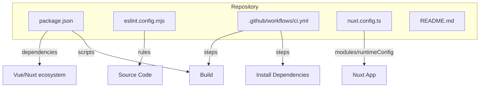
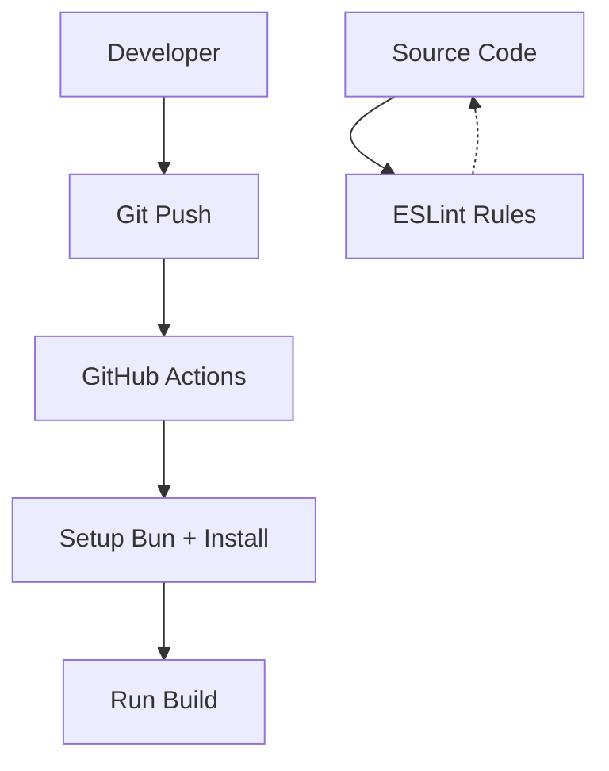
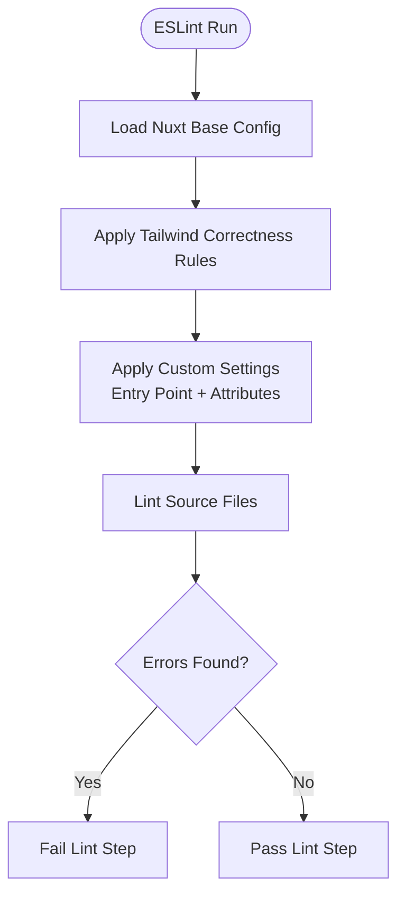
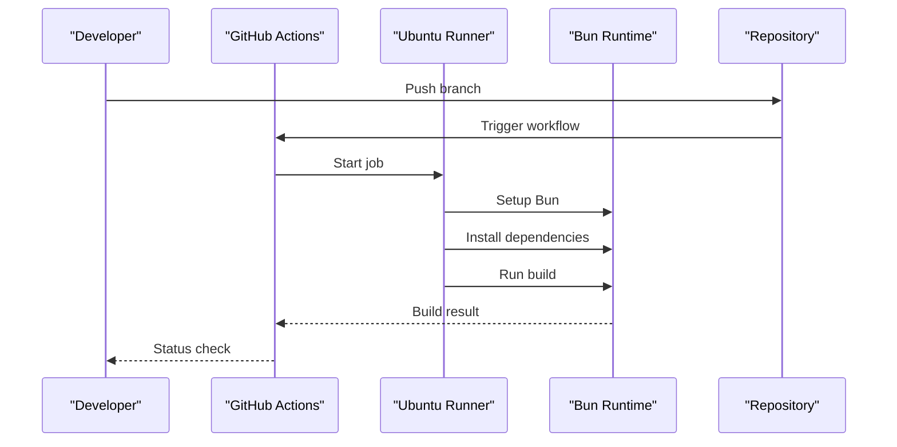
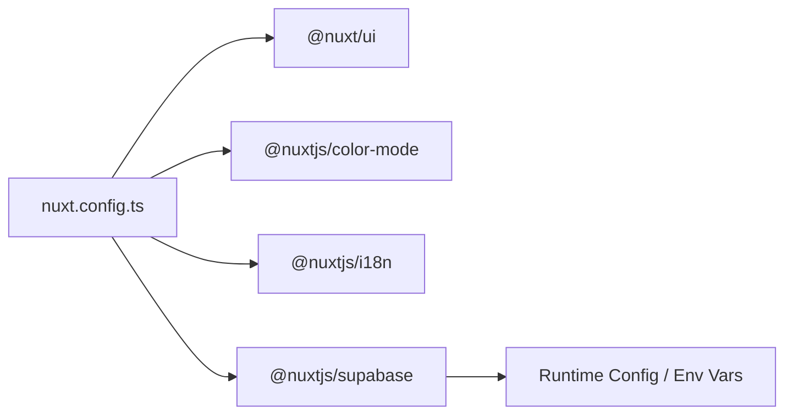
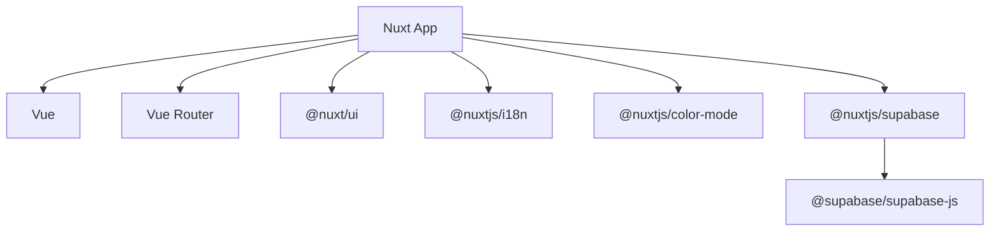

# Testing & Quality Assurance

<cite>
**Referenced Files in This Document**
- [package.json](file://package.json)
- [eslint.config.mjs](file://eslint.config.mjs)
- [.github/workflows/ci.yml](file://.github/workflows/ci.yml)
- [nuxt.config.ts](file://nuxt.config.ts)
- [README.md](file://README.md)
</cite>

## Table of Contents
1. [Introduction](#introduction)
2. [Project Structure](#project-structure)
3. [Core Components](#core-components)
4. [Architecture Overview](#architecture-overview)
5. [Detailed Component Analysis](#detailed-component-analysis)
6. [Dependency Analysis](#dependency-analysis)
7. [Performance Considerations](#performance-considerations)
8. [Troubleshooting Guide](#troubleshooting-guide)
9. [Conclusion](#conclusion)
10. [Appendices](#appendices)

## Introduction
This document defines the testing and quality assurance strategy for the project. It explains how to set up a testing framework, write unit tests for Vue components and composables, implement integration tests, enforce code quality with ESLint, and automate checks and builds in CI/CD. It also provides best practices, environment setup guidance, and troubleshooting tips for common testing issues.

## Project Structure
The repository is a Nuxt application using Bun as the package manager. At present, there are no test files or dedicated test configuration files in the workspace. The QA surface currently includes:
- Linting via ESLint with Tailwind CSS plugin
- A GitHub Actions workflow that installs dependencies and builds the app
- Nuxt configuration that wires modules and runtime config

**Diagram sources**
- [package.json:5-10](file://package.json#L5-L10)
- [eslint.config.mjs:1-20](file://eslint.config.mjs#L1-L20)
- [.github/workflows/ci.yml:1-26](file://.github/workflows/ci.yml#L1-L26)
- [nuxt.config.ts:1-52](file://nuxt.config.ts#L1-L52)

**Section sources**
- [package.json:1-26](file://package.json#L1-L26)
- [eslint.config.mjs:1-20](file://eslint.config.mjs#L1-L20)
- [.github/workflows/ci.yml:1-26](file://.github/workflows/ci.yml#L1-L26)
- [nuxt.config.ts:1-52](file://nuxt.config.ts#L1-L52)
- [README.md:1-36](file://README.md#L1-L36)

## Core Components
- Package scripts: The project exposes build, dev, generate, preview, and postinstall scripts. No test script is defined yet.
- ESLint configuration: Extends Nuxt’s ESLint setup and adds Tailwind CSS correctness rules with custom settings for the project’s CSS entry point and component attributes.
- CI pipeline: Installs dependencies with Bun and runs the build step on push.
- Nuxt configuration: Declares modules (UI, color mode, i18n, Supabase), runtime configuration, and UI theme options.

Key implications for QA:
- Add a test runner (e.g., Vitest) and define npm scripts for running tests locally and in CI.
- Extend the CI workflow to include linting and test execution before building.
- Use Nuxt’s generated ESLint configuration as a base and add any additional rules needed for your team.

**Section sources**
- [package.json:5-10](file://package.json#L5-L10)
- [eslint.config.mjs:1-20](file://eslint.config.mjs#L1-L20)
- [.github/workflows/ci.yml:1-26](file://.github/workflows/ci.yml#L1-L26)
- [nuxt.config.ts:1-52](file://nuxt.config.ts#L1-L52)

## Architecture Overview
The current QA architecture consists of:
- Linting: ESLint with Nuxt defaults and Tailwind CSS plugin
- CI: GitHub Actions job that installs dependencies and builds the app
- Application: Nuxt app configured with modules and runtime variables

**Diagram sources**
- [.github/workflows/ci.yml:1-26](file://.github/workflows/ci.yml#L1-L26)
- [eslint.config.mjs:1-20](file://eslint.config.mjs#L1-L20)

## Detailed Component Analysis

### ESLint Configuration and Code Quality Enforcement
- Base configuration: Imports Nuxt’s ESLint configuration to align with Nuxt conventions.
- Tailwind CSS validation: Uses the Tailwind CSS plugin with “correctness-error” rules to catch invalid utility usage.
- Custom settings:
  - Entry point for Tailwind styles is set to the project’s main CSS file.
  - Attribute matching is extended to support dynamic UI bindings.

Recommended enhancements:
- Add TypeScript strictness rules if not already included by the Nuxt base.
- Introduce import ordering, unused variable detection, and consistent formatting rules aligned with your team standards.
- Optionally integrate Prettier for formatting and configure it alongside ESLint.

**Diagram sources**
- [eslint.config.mjs:1-20](file://eslint.config.mjs#L1-L20)

**Section sources**
- [eslint.config.mjs:1-20](file://eslint.config.mjs#L1-L20)

### CI/CD Pipeline
- Trigger: Runs on push events.
- Environment: Ubuntu latest with Bun installed via a community action.
- Steps:
  - Checkout code
  - Install dependencies with frozen lockfile
  - Build the application

Recommendations:
- Add a lint step before build to fail fast on style or rule violations.
- Add a test step to run unit and integration tests.
- Cache dependencies to speed up subsequent runs.
- Consider matrix builds across Node/Bun versions if needed.

**Diagram sources**
- [.github/workflows/ci.yml:1-26](file://.github/workflows/ci.yml#L1-L26)

**Section sources**
- [.github/workflows/ci.yml:1-26](file://.github/workflows/ci.yml#L1-L26)

### Nuxt Configuration and External Integrations
- Modules: @nuxt/ui, color-mode, i18n, and Supabase client/server integrations.
- Runtime configuration:
  - Service role key for server-side operations
  - Public URL and anon key for client-side access
- Supabase module options: Redirect disabled, cookie-based auth settings.
- UI theme colors and color mode preferences.
- i18n locales and browser language detection.

Testing implications:
- Mock Supabase client and service key where appropriate in tests.
- Provide test-specific runtime configuration values.
- Isolate i18n and locale-dependent logic in tests.

**Diagram sources**
- [nuxt.config.ts:1-52](file://nuxt.config.ts#L1-L52)

**Section sources**
- [nuxt.config.ts:1-52](file://nuxt.config.ts#L1-L52)

### Testing Framework Setup (Recommended)
Since no test runner is currently configured, adopt Vitest for unit and integration tests with these steps:
- Install Vitest and Nuxt/Vue testing utilities as dev dependencies.
- Create a Vitest configuration file at the repository root.
- Configure environment to match Nuxt’s SSR/client expectations.
- Add test scripts to package.json:
  - test:run
  - test:watch
  - test:coverage
- Update CI to execute tests after install and before build.

Example structure:
- tests/unit/components/
- tests/unit/composables/
- tests/integration/
- tests/mocks/

Note: Replace placeholder commands with actual scripts once added to package.json.

[No sources needed since this section provides general guidance]

### Unit Testing Strategies
- Vue components:
  - Mount components in isolation.
  - Assert rendered output, event emissions, and reactive state changes.
  - Stub third-party modules (e.g., Supabase client).
- Composables:
  - Invoke composables within a test harness that simulates Vue lifecycle.
  - Verify computed values, side effects, and error handling paths.
- Business logic:
  - Test pure functions and data transformations with deterministic inputs and expected outputs.
  - Cover edge cases and boundary conditions.

Mock strategies:
- Mock external APIs and services (Supabase) to avoid network calls.
- Mock time-sensitive behavior with controlled clocks.
- Use stable fixtures for database-like responses.

[No sources needed since this section provides general guidance]

### Integration Testing Strategies
- API layer:
  - Validate request/response contracts against mocked endpoints or a test database.
  - Ensure authentication flows and authorization policies behave as expected.
- End-to-end scenarios:
  - Use a headless browser to validate critical user journeys.
  - Seed test data and reset state between scenarios.

Environment considerations:
- Use separate Supabase projects or local instances for integration tests.
- Manage secrets via environment variables or secret managers.

[No sources needed since this section provides general guidance]

### Writing Effective Tests
Guidelines:
- Keep tests small and focused on one behavior.
- Name tests descriptively to reflect the scenario under test.
- Arrange-Act-Assert pattern for clarity.
- Avoid flaky tests by mocking unstable dependencies and controlling timing.
- Maintain high coverage for critical paths while prioritizing meaningful assertions over raw percentages.

Examples (conceptual):
- Component: Render product card with correct title and stock status; assert click handlers emit events.
- Composable: Fetch catalog data; verify loading states and error handling when API fails.
- API: Submit login form; assert token issuance and redirect behavior.

[No sources needed since this section provides general guidance]

## Dependency Analysis
Current dependency surface relevant to QA:
- Nuxt ecosystem and Vue runtime
- Supabase client and server integrations
- UI and styling libraries

**Diagram sources**
- [package.json:12-24](file://package.json#L12-L24)
- [nuxt.config.ts:8-26](file://nuxt.config.ts#L8-L26)

**Section sources**
- [package.json:12-24](file://package.json#L12-L24)
- [nuxt.config.ts:8-26](file://nuxt.config.ts#L8-L26)

## Performance Considerations
- Keep test suites modular and parallelizable to reduce CI time.
- Prefer lightweight mocks over heavy integrations in unit tests.
- Cache dependencies in CI to minimize install times.
- Limit snapshot tests to stable outputs and update them intentionally.
- Use incremental builds and selective test runs where possible.

[No sources needed since this section provides general guidance]

## Troubleshooting Guide
Common issues and resolutions:
- Missing test runner:
  - Symptom: Running tests fails due to missing command.
  - Resolution: Install a test runner (e.g., Vitest) and add corresponding scripts to package.json.
- Lint failures in CI:
  - Symptom: CI fails at lint step.
  - Resolution: Fix reported ESLint errors or adjust rules to match project conventions.
- Build failures due to environment variables:
  - Symptom: Build fails because required env vars are missing.
  - Resolution: Provide necessary environment variables in CI or use .env files locally.
- Supabase integration tests failing:
  - Symptom: Network or auth errors during tests.
  - Resolution: Mock Supabase client or use a test project with known data and keys.
- Flaky tests:
  - Symptom: Intermittent failures due to timing or randomness.
  - Resolution: Control timers, mock asynchronous operations, and stabilize random data.

Debugging techniques:
- Run tests in watch mode to iterate quickly.
- Narrow down failing tests with targeted patterns.
- Add logging or console assertions in isolated environments.
- Inspect snapshots and diffs to understand rendering changes.

**Section sources**
- [.github/workflows/ci.yml:1-26](file://.github/workflows/ci.yml#L1-L26)
- [eslint.config.mjs:1-20](file://eslint.config.mjs#L1-L20)
- [nuxt.config.ts:9-26](file://nuxt.config.ts#L9-L26)

## Conclusion
The project currently enforces code quality through ESLint and automates builds via GitHub Actions. To strengthen reliability, introduce a robust testing strategy with Vitest, expand CI to include linting and tests, and adopt disciplined unit and integration testing practices. This will improve confidence in releases, accelerate feedback loops, and maintain high code quality across the codebase.

[No sources needed since this section summarizes without analyzing specific files]

## Appendices

### Environment Setup and Running Tests
- Local development:
  - Install dependencies with Bun.
  - Start the dev server.
  - Run linter and tests once implemented.
- CI:
  - Ensure all steps pass: lint, test, build.
  - Publish artifacts or deploy based on branch rules.

**Section sources**
- [README.md:5-33](file://README.md#L5-L33)
- [package.json:5-10](file://package.json#L5-L10)