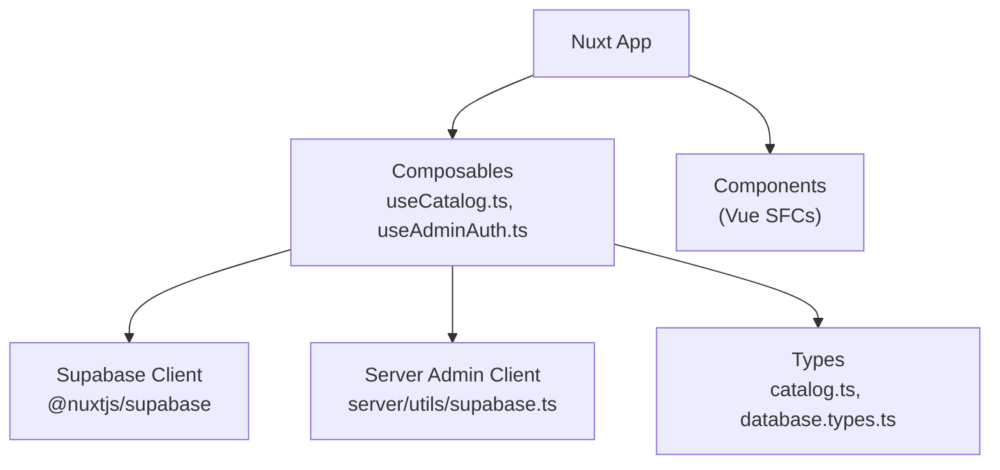
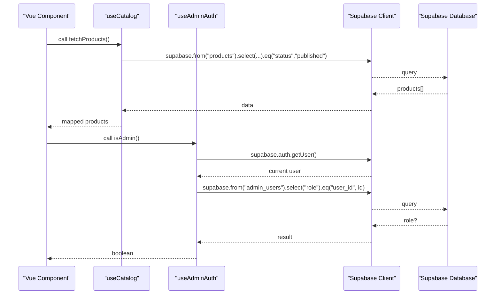
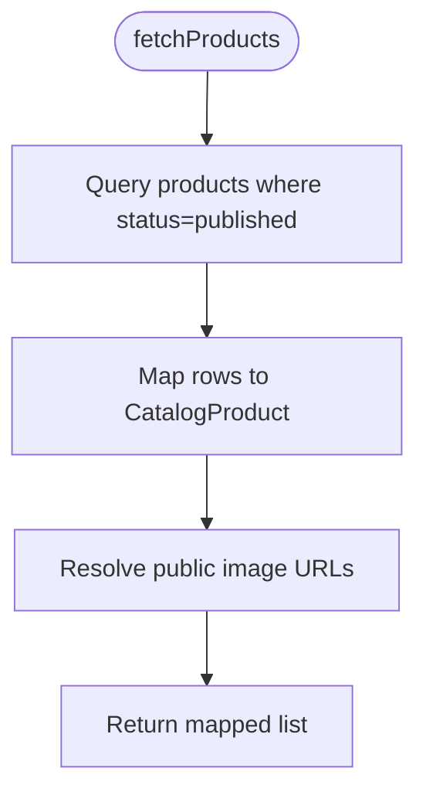
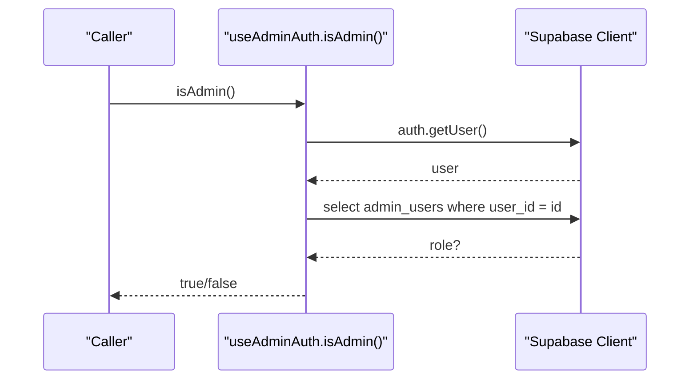
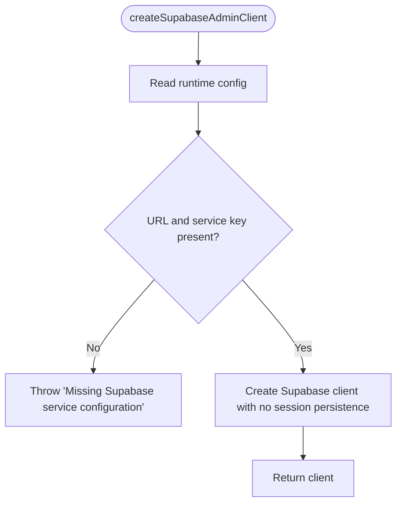
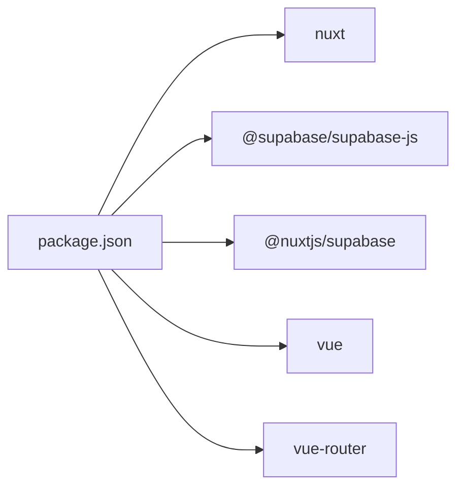

# Testing Framework & Setup

<cite>
**Referenced Files in This Document**
- [package.json](file://package.json)
- [nuxt.config.ts](file://nuxt.config.ts)
- [useCatalog.ts](file://app/composables/useCatalog.ts)
- [useAdminAuth.ts](file://app/composables/useAdminAuth.ts)
- [supabase.ts](file://server/utils/supabase.ts)
- [catalog.ts](file://app/types/catalog.ts)
- [database.types.ts](file://app/types/database.types.ts)
- [ci.yml](file://.github/workflows/ci.yml)
</cite>

## Table of Contents
1. [Introduction](#introduction)
2. [Project Structure](#project-structure)
3. [Core Components](#core-components)
4. [Architecture Overview](#architecture-overview)
5. [Detailed Component Analysis](#detailed-component-analysis)
6. [Dependency Analysis](#dependency-analysis)
7. [Performance Considerations](#performance-considerations)
8. [Troubleshooting Guide](#troubleshooting-guide)
9. [Conclusion](#conclusion)
10. [Appendices](#appendices)

## Introduction
This document explains how to set up and configure the testing framework for the Raccoon-Gear-Bin project, with a focus on:
- Test runner configuration for Nuxt.js applications
- Mocking strategies for Supabase integration (client and admin client)
- Vue component testing approaches using lifecycle hooks and reactive state
- Unit testing composables useCatalog.ts and useAdminAuth.ts
- Test organization, naming conventions, and best practices
- Running individual tests and full suites
- Common challenges specific to Nuxt.js and Supabase integrations

The repository currently does not include a dedicated test framework or scripts. The guidance below provides a practical setup path aligned with the existing codebase and dependencies.

## Project Structure
The application is a Nuxt 3 project that uses:
- @nuxtjs/supabase module for client-side Supabase integration
- Server runtime utilities for creating an admin Supabase client
- Composables for catalog data access and admin authentication
- TypeScript types for database schema and domain models

**Diagram sources**
- [nuxt.config.ts:1-52](file://nuxt.config.ts#L1-L52)
- [useCatalog.ts:1-61](file://app/composables/useCatalog.ts#L1-L61)
- [useAdminAuth.ts:1-79](file://app/composables/useAdminAuth.ts#L1-L79)
- [supabase.ts:1-20](file://server/utils/supabase.ts#L1-L20)
- [catalog.ts:1-1](file://app/types/catalog.ts#L1-L1)
- [database.types.ts:1-1](file://app/types/database.types.ts#L1-L1)

**Section sources**
- [package.json:1-26](file://package.json#L1-L26)
- [nuxt.config.ts:1-52](file://nuxt.config.ts#L1-L52)

## Core Components
Key areas relevant to testing:
- Supabase client configuration via Nuxt module and runtime config
- Composables that perform data fetching and auth checks
- Server-side admin client creation for privileged operations

Testing considerations:
- Isolate network calls by mocking Supabase client methods
- Stub i18n locale used in catalog mapping
- Provide controlled user sessions for auth flows
- Use server utils to mock admin client behavior when needed

**Section sources**
- [nuxt.config.ts:9-26](file://nuxt.config.ts#L9-L26)
- [useCatalog.ts:4-59](file://app/composables/useCatalog.ts#L4-L59)
- [useAdminAuth.ts:3-77](file://app/composables/useAdminAuth.ts#L3-L77)
- [supabase.ts:3-19](file://server/utils/supabase.ts#L3-L19)

## Architecture Overview
High-level flow for catalog and admin auth interactions with Supabase:

**Diagram sources**
- [useCatalog.ts:37-47](file://app/composables/useCatalog.ts#L37-L47)
- [useAdminAuth.ts:16-34](file://app/composables/useAdminAuth.ts#L16-L34)

## Detailed Component Analysis

### Composable: useCatalog.ts
Responsibilities:
- Fetch published products and categories from Supabase
- Map raw rows into typed domain objects
- Resolve public image URLs from storage paths
- Respect current i18n locale for translations

Testing strategy:
- Mock Supabase client methods: from().select(), .eq(), .order(), .maybeSingle()
- Mock storage.getPublicUrl() to return deterministic URLs
- Mock useI18n() locale to control translation selection
- Assert mapping logic for product and category fields

**Diagram sources**
- [useCatalog.ts:37-41](file://app/composables/useCatalog.ts#L37-L41)
- [useCatalog.ts:13-33](file://app/composables/useCatalog.ts#L13-L33)

**Section sources**
- [useCatalog.ts:1-61](file://app/composables/useCatalog.ts#L1-L61)

### Composable: useAdminAuth.ts
Responsibilities:
- Get current user from Supabase Auth
- Check admin/super-admin roles via admin_users table
- Sign in/out users

Testing strategy:
- Mock supabase.auth.getUser() to return desired user states
- Mock supabase.from("admin_users") queries to simulate roles
- Mock sign-in/sign-out flows and assert error propagation
- Validate fallback to composable user state when available

**Diagram sources**
- [useAdminAuth.ts:7-14](file://app/composables/useAdminAuth.ts#L7-L14)
- [useAdminAuth.ts:16-34](file://app/composables/useAdminAuth.ts#L16-L34)

**Section sources**
- [useAdminAuth.ts:1-79](file://app/composables/useAdminAuth.ts#L1-L79)

### Server Admin Client: server/utils/supabase.ts
Purpose:
- Create a server-side Supabase client using service role key
- Disables session persistence and token refresh for server usage

Testing strategy:
- Mock useRuntimeConfig() to provide URL and service role key
- Verify client creation and options are correct
- Ensure missing config throws an error

**Diagram sources**
- [supabase.ts:3-19](file://server/utils/supabase.ts#L3-L19)

**Section sources**
- [supabase.ts:1-20](file://server/utils/supabase.ts#L1-L20)

### Types: catalog.ts and database.types.ts
Role:
- Define domain models for catalog entities
- Provide strongly-typed database schema for Supabase queries

Testing relevance:
- Use these types to validate mapped outputs in unit tests
- Ensure mocks return structures compatible with types

**Section sources**
- [catalog.ts:1-1](file://app/types/catalog.ts#L1-L1)
- [database.types.ts:1-1](file://app/types/database.types.ts#L1-L1)

## Dependency Analysis
External dependencies relevant to testing:
- Nuxt and modules including @nuxtjs/supabase
- Supabase JS client libraries
- Vue and Vue Router for component testing

**Diagram sources**
- [package.json:12-24](file://package.json#L12-L24)

**Section sources**
- [package.json:1-26](file://package.json#L1-L26)

## Performance Considerations
- Keep Supabase mocks lightweight; avoid unnecessary deep object cloning
- Batch assertions per test case to reduce overhead
- Reuse mocked clients across tests within a suite when possible
- Avoid real network calls; ensure all Supabase methods are stubbed

[No sources needed since this section provides general guidance]

## Troubleshooting Guide
Common issues and resolutions:
- Missing environment variables for Supabase:
  - Ensure runtime config values are provided in tests via mocking or env files
  - Validate that server admin client creation receives required keys
- Locale-related mapping failures:
  - Mock useI18n() to return expected locale values during tests
- Auth state inconsistencies:
  - Mock both supabase.auth.getUser() and composable user state to cover branches
- CI pipeline without tests:
  - Add test scripts and steps to the CI workflow to run suites automatically

**Section sources**
- [nuxt.config.ts:9-26](file://nuxt.config.ts#L9-L26)
- [supabase.ts:9-11](file://server/utils/supabase.ts#L9-L11)
- [ci.yml:1-25](file://.github/workflows/ci.yml#L1-L25)

## Conclusion
To establish a robust testing framework for this Nuxt + Supabase project:
- Introduce a test runner (e.g., Vitest) with Nuxt/Vue support
- Configure Supabase client and server admin client mocks
- Write unit tests for composables focusing on data mapping and auth flows
- Add component tests for Vue SFCs exercising lifecycle hooks and reactivity
- Organize tests alongside source files with clear naming conventions
- Extend CI to execute test suites

[No sources needed since this section summarizes without analyzing specific files]

## Appendices

### Recommended Test Runner and Setup
- Choose a modern test runner compatible with Nuxt 3 and Vue 3
- Configure environment variables for Supabase in test mode
- Set up global mocks for Supabase client, i18n, and runtime config

[No sources needed since this section provides general guidance]

### Test Organization and Naming Conventions
- Place tests next to source files (e.g., useCatalog.test.ts)
- Group related tests using describe blocks
- Name tests to express behavior (e.g., should map product translations based on locale)

[No sources needed since this section provides general guidance]

### Running Tests
- Add npm/bun scripts to run individual tests and full suites
- Execute tests locally before pushing changes
- Update CI to install dependencies and run tests

**Section sources**
- [ci.yml:1-25](file://.github/workflows/ci.yml#L1-L25)